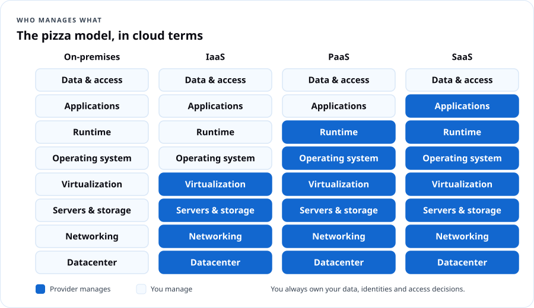
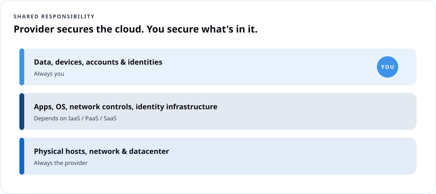
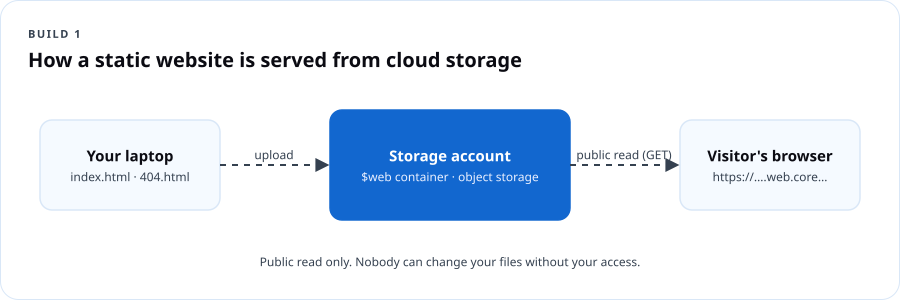

# Cloud Fundamentals 101

## Course overview

You already use the cloud. Your phone backs up pictures to it. Your bank app runs on it. The streaming show you watched last night came out of it. This course pulls back the curtain so you can **understand** it, **use** it safely, **protect** your account and your money, and **create** two real things: a public website and a virtual computer.

DCT courses follow the same four moves every time: **Understand → Use → Protect → Create.** You will see those words at the top of every module.

### What you will be able to do

By the end of this course you will be able to:

1. Explain cloud computing in plain language to a family member, a hiring manager, or a customer.
2. Tell the difference between IaaS, PaaS and SaaS and name an example of each.
3. Compare how AWS, Microsoft Azure and Google Cloud name the same core services.
4. Lock down a new cloud account with MFA, a budget alert, and a least-privilege habit.
5. Publish a static website from cloud storage.
6. Create, connect to, and delete a Linux virtual machine without leaving anything running that costs you money.
7. Read a cloud bill and explain what generated each charge.

### Who this is for

| If you are… | This course gives you… |
|---|---|
| Brand new to tech | The vocabulary, so meetings and job posts stop sounding like a foreign language |
| A career changer | A first portfolio piece (your website) and a clear next certification |
| A small-business owner | Enough knowledge to stop overpaying and to ask vendors the right questions |
| A senior or parent | Confidence about where your photos and accounts actually live, and how to keep them safe |
| A teen | A real build to show, and a head start on a cert that employers recognize |

### What you need

- A computer (Windows, Mac, Linux or a Chromebook) and an internet connection.
- An email address you control and a phone for multi-factor authentication.
- A credit or debit card for cloud sign-up. **Providers verify identity with a card. Following the cleanup steps keeps charges at or near zero, but you are responsible for what you create.**
- About 6–8 hours, spread across as many days as you like.

### How this course is built

| Module | Title | Time | Deliverable |
|---|---|---|---|
| 1 | Understand the cloud | 75 min | Cloud vocabulary card |
| 2 | Protect your account (and your wallet) | 60 min | Hardened account + budget alert |
| 3 | Build a website | 90 min | A live static website URL |
| 4 | Explore a virtual machine | 90 min | Screenshot of your VM terminal + clean deletion |
| 5 | Check your knowledge and clean up | 45 min | Final check (20 questions) + cleanup checklist |

### How you are assessed

| Item | Weight | Pass mark |
|---|---|---|
| Module knowledge checks (4) | 40% | 70% each, retakes allowed |
| Build 1: static website (URL submitted) | 20% | Site loads publicly |
| Build 2: virtual machine (screenshot + deletion proof) | 20% | Connected + deleted |
| Final check | 20% | 70% |

Earn 70% overall to receive the **DCT Cloud 101 Certificate of Completion**. This is a DCT credential, not a vendor certification.

---

## Module 1 — Understand the cloud

**Understand.** *Learning objectives:* define cloud computing; describe the five essential characteristics; compare service models (IaaS, PaaS, SaaS) and deployment models (public, private, hybrid, multi-cloud); explain shared responsibility.

### 1.1 What the cloud actually is

The cloud is **other people's computers that you rent over the internet, on demand, and pay for by usage.** Those computers sit in giant buildings called **datacenters**, owned by companies such as Amazon (AWS), Microsoft (Azure) and Google (Google Cloud).

The U.S. National Institute of Standards and Technology (NIST SP 800-145) gives the official definition. Cloud computing has **five essential characteristics**:

| Characteristic | What it means | Everyday version |
|---|---|---|
| On-demand self-service | You create resources yourself, no phone call or purchase order | Ordering on an app instead of calling the store |
| Broad network access | Reach it from any device over the network | Your email works on your phone and your laptop |
| Resource pooling | Many customers share the same physical hardware, kept separate by software | Apartment building: shared walls and plumbing, private locked units |
| Rapid elasticity | Scale up or down quickly, sometimes automatically | Adding folding tables when more cousins show up to the cookout |
| Measured service | Usage is metered and billed | The electric meter on the side of the house |

> **Dope Translation:** Owning servers is like buying a whole building to run a barbershop. You pay for the roof, the plumbing, the security, and the empty chairs on a slow Tuesday. The cloud is renting a chair by the hour. Busy Saturday? Rent ten chairs. Slow Tuesday? Rent one. You only pay for chairs with somebody in them.

### 1.2 CapEx vs. OpEx

- **Capital expenditure (CapEx):** big money up front for things you own — servers, buildings, generators. You pay before you know if the business will use it all.
- **Operational expenditure (OpEx):** pay as you go for what you use this month. Cloud is mostly OpEx.

> **Dope Translation:** CapEx is buying the car. OpEx is taking a ride share. If you drive every day, owning may win. If you drive twice a month, renting rides is smarter. Businesses do the same math with servers.

### 1.3 The service models: IaaS, PaaS, SaaS



| Model | You manage | Provider manages | Example |
|---|---|---|---|
| **IaaS** — Infrastructure as a Service | Operating system, apps, data, access | Physical hardware, network, virtualization | Azure Virtual Machines, AWS EC2, Google Compute Engine |
| **PaaS** — Platform as a Service | Your app code, data, access | Everything underneath, including OS patching | Azure App Service, AWS Elastic Beanstalk, Google App Engine |
| **SaaS** — Software as a Service | Your data and who can use it | The whole application | Microsoft 365, Gmail, Zoom, Canva |
| **Serverless / FaaS** | Just the function code | Servers, scaling, runtime | Azure Functions, AWS Lambda, Google Cloud Run functions |

> **Dope Translation — the pizza model:**
> - **On-premises:** you make pizza at home. You buy the oven, the flour, everything.
> - **IaaS:** you rent a kitchen with an oven. You bring ingredients and cook.
> - **PaaS:** you go to a make-your-own-pizza spot. They have the dough and oven; you pick the toppings.
> - **SaaS:** you order delivery. You just eat — and decide who gets a slice.

### 1.4 Deployment models

- **Public cloud:** shared provider infrastructure, available to anyone with an account. Most of this course.
- **Private cloud:** cloud-style infrastructure used by one organization only, on-premises or hosted.
- **Hybrid cloud:** public and private connected and working together. Common in government and banks.
- **Multi-cloud:** using more than one public provider (for example Azure for identity and email, AWS for a specific app).

> **Real Talk:** A county agency keeps resident records in its own datacenter because of a records law, but runs its public website and email in the public cloud. That is hybrid. When the same agency also uses Google Workspace for a youth program, it is multi-cloud too.

### 1.5 Shared responsibility — the most important idea in this course



The provider secures the **cloud itself** (buildings, hardware, the network between datacenters). You secure **what you put in the cloud** (your data, your accounts, who has access, the settings you choose). As you move from IaaS to PaaS to SaaS, the provider takes on more — **but you always own your data, your identities and your access decisions.**

> **Dope Translation:** You rent a storage unit. The company owns the fence, the gate, the cameras and the building. But if you leave your unit unlocked, or hand your code to everybody in the group chat, that's on you. Most cloud breaches aren't hackers breaking the fence. They're unlocked units.

### 1.6 The big three, side by side

| What you want | Azure | AWS | Google Cloud |
|---|---|---|---|
| A virtual computer | Virtual Machines | EC2 | Compute Engine |
| File / object storage | Blob Storage (in a Storage account) | S3 | Cloud Storage |
| A container for resources | Resource group | (Tags / CloudFormation stacks; accounts) | Project |
| Identity & sign-in | Microsoft Entra ID + Azure RBAC | IAM / IAM Identity Center | Cloud Identity + IAM |
| Private network | Virtual network (VNet) | VPC | VPC |
| Firewall rules on a network | Network security group (NSG) | Security group | VPC firewall rules |
| Run code without servers | Azure Functions | Lambda | Cloud Run functions |
| Monitoring | Azure Monitor | CloudWatch | Cloud Monitoring |
| Cost tracking | Cost Management + Budgets | Billing & Cost Management + Budgets | Billing + Budgets |
| Geographic location | Region (with availability zones) | Region (with availability zones) | Region (with zones) |

**Takeaway:** Learn the concept once. The names change; the ideas do not.

### 1.7 Regions and availability zones

- A **region** is a geographic area with one or more datacenters (for example *East US* or *us-east-1*, both in Virginia).
- An **availability zone** is a physically separate datacenter (or group) inside a region with its own power, cooling and networking.
- Put copies of important things in **more than one zone** so one building's outage does not take you down.

> **Dope Translation:** Don't keep all your money in one shoebox. A zone is a second shoebox in a different room. A second region is a shoebox at your aunt's house across town.

### Module 1 knowledge check

```quiz
Q: Which statement best describes cloud computing?
- [ ] Storing files on a USB drive
- [x] Renting computing resources over the internet on demand and paying for what you use
- [ ] Buying servers and keeping them in your office
- [ ] Using any website
E: The NIST definition centers on on-demand, network-accessible, pooled, elastic and metered resources.

Q: A bakery uses Microsoft 365 for email and documents. Which service model is that?
- [ ] IaaS
- [ ] PaaS
- [x] SaaS
- [ ] On-premises
E: Microsoft 365 is a complete application delivered over the internet — SaaS. The bakery manages only its data and users.

Q: In every cloud service model, which of these is ALWAYS the customer's responsibility?
- [ ] Physical datacenter security
- [ ] Patching the hypervisor
- [x] Data, identities and access decisions
- [ ] Replacing failed disks
E: Shared responsibility: the provider secures the cloud; you always own your information, accounts and who can get in.

Q: Which characteristic describes scaling up quickly for a holiday rush and back down after?
- [ ] Measured service
- [x] Rapid elasticity
- [ ] Broad network access
- [ ] Private cloud
E: Elasticity is growing and shrinking capacity with demand.

Q: What is the AWS name for what Azure calls Blob Storage?
- [x] Amazon S3
- [ ] Amazon EC2
- [ ] AWS Lambda
- [ ] Amazon VPC
E: S3 (Simple Storage Service) is AWS object storage, equivalent to Azure Blob Storage and Google Cloud Storage.

Q: Why spread resources across availability zones?
- [ ] It is always cheaper
- [x] So a failure in one datacenter does not take your service down
- [ ] It is required for every resource
- [ ] To use a different cloud provider
E: Zones are physically separate within a region; spreading across them improves availability.
```

---

## Module 2 — Protect your account (and your wallet)

**Protect.** *Learning objectives:* secure the root/owner account; enable MFA; create a budget alert; explain least privilege; name the three questions DCT asks before creating anything.

### 2.1 The three questions before you create anything

Every DCT build starts with these. Write them on a sticky note.

1. **Who can access it?** Check permissions. Give people and apps only what they need. Protect your sign-in with MFA.
2. **What could it cost?** Check the provider's pricing for the service and region. A budget alert *notifies* you; **it is not a spending cap.**
3. **How will I clean it up?** Keep a list of every resource you create. Delete related disks, IPs and network pieces too — they can keep charging.

> **Dope Translation:** Before you open a new spot, you ask: who has a key, what's the rent, and how do I shut it down clean if it doesn't work out. Same three questions. Every time.

### 2.2 Your first account is the master key

When you sign up, you create the most powerful identity in that cloud: the **AWS root user**, the **Azure account owner / first Global Administrator**, or the **Google Cloud organization/billing owner**. Anyone holding it can delete everything and spend unlimited money.

**Do this today:**

- Use a long, unique passphrase (four or more random words) stored in a password manager.
- Turn on **multi-factor authentication** with an authenticator app or passkey, not SMS if you can avoid it.
- For daily work, use a **separate, less-powerful identity** (AWS: an IAM Identity Center user; Azure: a user with only the roles you need; Google: a user with project-level roles).
- Never put keys or passwords in code, screenshots, or chat.

### 2.3 MFA — why it matters

MFA means proving who you are with **two or more different kinds** of evidence:

| Factor type | Example |
|---|---|
| Something you know | Password, PIN |
| Something you have | Phone with authenticator app, security key |
| Something you are | Fingerprint, face |

Microsoft has reported for years that MFA blocks the overwhelming majority of automated account-takeover attempts. Passkeys and authenticator push with number matching resist phishing much better than text codes.

> **Real Talk:** A stolen password is a copied key. MFA is the deadbolt that also needs your thumbprint. The thief can have your key all day — the door still doesn't open.

### 2.4 Least privilege

Give every person, app and script the **minimum access needed, for the minimum time.** If someone only needs to read reports, do not make them an Owner.

> **Dope Translation:** The new hire at the corner store works the register. They don't get the safe combination, the supplier's number, and the keys to your car. Access matches the job.

### 2.5 Budgets and cost alerts

Set one now, before any build. Suggested: a **$5 monthly budget** with alerts at 50%, 80% and 100% (actual) and 100% (forecasted).

- **Azure:** Portal → search *Cost Management* → *Budgets* → *Add*. Choose your subscription scope, amount, and alert recipients.
- **AWS:** Console → *Billing and Cost Management* → *Budgets* → *Create budget* → *Cost budget*.
- **Google Cloud:** Console → *Billing* → *Budgets & alerts* → *Create budget*.

> **Watch your wallet:** Budgets warn you; they do not stop spending. Billing data can lag by hours. Your real protection is the cleanup habit in Module 5.

### 2.6 Free tiers and credits

Each provider offers a free tier and/or new-account credits. The details change often, so always read the current page before you build: [Azure free account](https://azure.microsoft.com/free/), [AWS Free Tier](https://aws.amazon.com/free/), [Google Cloud Free Program](https://cloud.google.com/free). Students may qualify for Azure for Students (no card required at time of writing; check eligibility).

### Lab 2 — Harden your account (30 min)

Pick **one** provider for the rest of the course. Steps below use Azure; AWS and Google equivalents are in the comparison table.

1. Sign in at [portal.azure.com](https://portal.azure.com).
2. Top-right avatar → *View account* → *Security info* → add the **Microsoft Authenticator** app (or a passkey).
3. Search **Cost Management + Billing** → *Budgets* → **+ Add**. Name `dct-starter-budget`, amount `5`, reset monthly. Add alerts at 50% and 100% actual, 100% forecasted. Enter your email.
4. Search **Subscriptions** → your subscription → *Access control (IAM)* → *Role assignments*. Write down who has **Owner**. If it's anyone but you, ask why.
5. Screenshot your budget page. That is your Module 2 deliverable.

### Module 2 knowledge check

```quiz
Q: What does a cloud budget alert do when you hit 100%?
- [ ] Automatically deletes all resources
- [x] Sends a notification; spending can continue
- [ ] Freezes your credit card
- [ ] Moves you to the free tier
E: Budgets notify. They are not hard caps. Cleanup and monitoring keep costs under control.

Q: Which MFA method is MOST resistant to phishing?
- [ ] SMS text code
- [ ] Email code
- [x] Passkey or hardware security key
- [ ] Security questions
E: Passkeys and FIDO2 keys are bound to the real website, so a fake login page can't capture a usable credential.

Q: What is least privilege?
- [x] Giving each identity only the access it needs, for only as long as it needs it
- [ ] Giving everyone read-only access
- [ ] Using the cheapest VM size
- [ ] Removing MFA for trusted users
E: Least privilege limits the damage if an account is stolen or misused.

Q: You created a VM and deleted it, but you are still being charged. What is the most likely cause?
- [ ] The budget alert is broken
- [x] Related resources like the disk or public IP were left behind
- [ ] VMs always charge for 30 days after deletion
- [ ] MFA costs money
E: Disks, public IPs and other dependent resources can bill separately. Deleting the whole resource group avoids this in Azure.

Q: Which is the DCT question you ask about cost?
- [ ] Who can access it?
- [x] What could it cost?
- [ ] How fast is it?
- [ ] Who built it?
E: The three questions: Who can access it? What could it cost? How will I clean it up?
```

---

## Module 3 — Build a website (Build 1)

**Create.** *Learning objectives:* explain object storage; explain what a static website is; publish a site from cloud storage; describe public vs. private access; clean up.

### 3.1 What you are building

A **static website** is a set of files — HTML, CSS, images — sent to a visitor's browser exactly as stored. No database, no server code. Perfect for a portfolio, a résumé page, a small-business info page, or a church event flyer.

Cloud **object storage** (Azure Blob, AWS S3, Google Cloud Storage) holds files as *objects* inside *containers/buckets* and can serve them directly over the web.



> **Dope Translation:** Object storage is a giant storage locker with numbered bins. A static website is when you put a poster in one bin, turn the bin window to face the street, and anybody walking by can read the poster. They can look. They can't reach in and change it.

### 3.2 Starter website file

Create a folder on your computer called `my-first-site`. Inside, create `index.html` with this content (change the name and lines to yours):

```html
<!doctype html>
<html lang="en">
<head>
  <meta charset="utf-8">
  <meta name="viewport" content="width=device-width, initial-scale=1">
  <title>Jordan Lee · Cloud in Progress</title>
  <style>
    body{font-family:system-ui,sans-serif;max-width:640px;margin:3rem auto;padding:0 1rem;line-height:1.6;color:#122;background:#f6f8ff}
    h1{color:#2f6bff} .tag{display:inline-block;background:#122;color:#fff;padding:.2rem .6rem;border-radius:4px;font-size:.85rem}
  </style>
</head>
<body>
  <span class="tag">Built in the cloud</span>
  <h1>Hi, I'm Jordan.</h1>
  <p>I'm learning cloud computing with The Dope Cloud Teacher. This page is hosted on cloud object storage.</p>
  <h2>What I can do now</h2>
  <ul>
    <li>Explain IaaS, PaaS and SaaS</li>
    <li>Secure a cloud account with MFA and a budget</li>
    <li>Publish a static website</li>
  </ul>
  <p>Next up: a virtual machine.</p>
</body>
</html>
```

Also create `404.html` with a one-line message like `<h1>Page not found — but you found me.</h1>`.

### Lab 3A — Azure Storage static website (45 min)

*Official walkthrough: [Host a static website in Azure Storage](https://learn.microsoft.com/azure/storage/blobs/storage-blob-static-website-how-to).*

1. **Create a resource group.** Portal → *Resource groups* → *Create*. Name `rg-dct101-web`, region `East US` (or nearest). *Review + create.*
2. **Create a storage account.** *Storage accounts* → *Create*. Resource group `rg-dct101-web`. Name must be globally unique, lowercase, 3–24 letters/numbers (e.g. `dctjordanweb01`). Region same. Primary service: *Azure Blob Storage or Azure Data Lake Storage Gen2*. Performance **Standard**. Redundancy **LRS** (cheapest — fine for a learning site). *Review + create.*
3. Open the storage account → *Data management* → **Static website** → **Enabled**. Index document `index.html`, error document `404.html`. **Save.** Copy the **Primary endpoint** URL.
4. Go to *Containers*. A container named **`$web`** now exists. Open it → **Upload** → select both files → Upload.
5. Paste the primary endpoint into a browser. Your site is live.
6. **Submit the URL** as your Build 1 deliverable.

> **Watch your wallet:** Storage for two tiny files costs fractions of a cent per month, but data transfer and request charges exist. Delete it after grading if you don't want to keep it.

### Lab 3B — AWS S3 alternative (45 min)

*Official walkthrough: [Tutorial: Configuring a static website on Amazon S3](https://docs.aws.amazon.com/AmazonS3/latest/userguide/HostingWebsiteOnS3Setup.html).*

1. S3 → *Create bucket*. Unique name, your region.
2. Under *Block Public Access settings*, uncheck **Block all public access** and acknowledge. (This bucket is intentionally public. **Never do this for a bucket with private data.**)
3. Upload `index.html` and `404.html`.
4. *Properties* → *Static website hosting* → *Enable* → index `index.html`, error `404.html`.
5. *Permissions* → *Bucket policy* → add a policy allowing `s3:GetObject` for `arn:aws:s3:::YOUR-BUCKET/*` (copy from the AWS tutorial).
6. Open the **bucket website endpoint** from Properties.

> **Real Talk:** Misconfigured public storage buckets have exposed millions of real records — voter rolls, medical files, military documents. You just learned the exact switch that causes it. Public is for posters. Private is the default for everything else.

### 3.3 Going further (optional)

- **Custom domain + HTTPS:** Azure Front Door or Azure CDN; AWS CloudFront; Google Cloud Load Balancing. These add cost — read pricing first.
- **Azure Static Web Apps** (free plan available) and **GitHub Pages** are other low-cost ways to host static sites with HTTPS and a deploy pipeline.

### Module 3 knowledge check

```quiz
Q: What makes a website "static"?
- [ ] It never gets visitors
- [x] Files are delivered exactly as stored, with no server-side code or database
- [ ] It only uses images
- [ ] It runs on a virtual machine
E: Static sites are pre-built files served as-is.

Q: In Azure, which container serves the static website files?
- [ ] public
- [ ] www
- [x] $web
- [ ] root
E: Enabling static website on a storage account creates the special $web container.

Q: Which redundancy option did the lab use because it is the lowest-cost?
- [x] LRS — locally redundant storage
- [ ] GZRS
- [ ] RA-GRS
- [ ] ZRS
E: LRS keeps three copies in one datacenter. Fine for a learning site, not for critical data.

Q: Why is turning off S3 Block Public Access risky in general?
- [ ] It doubles the price
- [x] Anything placed in that bucket can become readable by anyone on the internet
- [ ] It disables encryption
- [ ] It deletes existing files
E: Public buckets are a leading cause of data exposure. Only static public content belongs there.
```

---

## Module 4 — Explore a virtual machine (Build 2)

**Use + Create.** *Learning objectives:* explain what a VM is; name the resources a VM depends on; create a Linux VM with secure access; connect over SSH; run basic commands; delete everything.

### 4.1 What a virtual machine is

A **virtual machine (VM)** is a full computer — CPU, memory, disk, network card, operating system — made of software running on a provider's physical server. A program called the **hypervisor** carves one big physical server into many isolated VMs.

> **Dope Translation:** One big house split into apartments. Each apartment has its own door, kitchen and lock. You rent one apartment; you don't own the house. You decide the furniture (software) and who gets a key (access). The landlord fixes the roof (hardware).

### 4.2 Everything a VM needs

When you click "Create VM", the cloud quietly creates several resources. **Each one can cost money and must be cleaned up.**

| Resource | Purpose | Bills separately? |
|---|---|---|
| VM (compute) | CPU + memory | Yes, per second/hour while running |
| OS disk | The hard drive | **Yes, even when the VM is stopped** |
| Network interface (NIC) | Connects VM to network | No (usually) |
| Virtual network + subnet | Private network | No (basic) |
| Public IP address | Reachable from internet | **Yes** (IPv4 addresses are billed) |
| Network security group | Firewall rules | No |

> **Watch your wallet:** In Azure, **Stop (deallocate)** ends compute charges, but the disk and public IP keep billing. **Delete the resource group** to remove all of it.

### 4.3 Secure access — SSH keys and firewall rules

- **SSH** (Secure Shell) is how you get a command line on a Linux machine over the network, on **port 22**.
- Use an **SSH key pair** instead of a password. The private key stays on your computer. The public key goes on the VM.
- Limit the firewall rule so port 22 is reachable only **from your own IP address**, not from the whole internet. Open SSH ports are scanned by bots within minutes of creation.

### Lab 4 — Create, connect, delete an Azure Linux VM (60 min)

*Official walkthrough: [Quickstart: Create a Linux VM in the Azure portal](https://learn.microsoft.com/azure/virtual-machines/linux/quick-create-portal).*

1. Portal → **Virtual machines** → *Create* → *Azure virtual machine*.
2. **Basics:** new resource group `rg-dct101-vm`; name `vm-dct101`; region your nearest; availability options *No infrastructure redundancy required* (learning only); image **Ubuntu Server 24.04 LTS**; size — click *See all sizes* and choose a small **B-series** size (check the hourly price shown).
3. Authentication type **SSH public key**; username `azureuser`; key source *Generate new key pair*; key name `vm-dct101_key`.
4. Inbound ports: **Allow selected ports → SSH (22)**. The portal will warn about internet exposure — you will fix that in step 7.
5. *Review + create* → *Create* → **Download private key and create resource**. Save the `.pem` file somewhere you can find it. **Never share it.**
6. When deployment finishes → *Go to resource*. Copy the **Public IP address**.
7. **Lock down SSH:** *Networking* (or *Network settings*) → the inbound rule for port 22 → change *Source* to **My IP address** → Save.
8. **Connect.** On Mac/Linux/Windows Terminal:
   ```bash
   chmod 400 ~/Downloads/vm-dct101_key.pem      # Mac/Linux only
   ssh -i ~/Downloads/vm-dct101_key.pem azureuser@YOUR_PUBLIC_IP
   ```
   Type `yes` to trust the host the first time.
9. **Explore your machine:**
   ```bash
   hostname            # the VM's name
   lsb_release -a      # which Linux
   nproc && free -h    # CPU count and memory
   df -h /             # disk size and use
   curl -s ifconfig.me # the public IP the world sees
   uptime              # how long it's been running
   ```
10. Take a screenshot of your terminal. **Deliverable part 1.**
11. Type `exit`. In the portal → **Resource groups** → `rg-dct101-vm` → **Delete resource group** → type the name → Delete.
12. Refresh after a few minutes. Screenshot the empty Resource groups list (or the deletion notification). **Deliverable part 2.**

**AWS equivalent:** EC2 → *Launch instance* → Ubuntu → small burstable type (t3/t4g family) → create key pair → security group SSH source *My IP* → connect with `ssh -i key.pem ubuntu@IP` → *Terminate instance* (and release any Elastic IP).

### Troubleshooting

| Symptom | Likely cause | Fix |
|---|---|---|
| `Permission denied (publickey)` | Wrong username or key file | Azure user is the one you set (`azureuser`); AWS Ubuntu user is `ubuntu` |
| `WARNING: UNPROTECTED PRIVATE KEY FILE` | Key file permissions too open | `chmod 400 file.pem` |
| Connection times out | Your IP changed or rule wrong | Update NSG/security-group source to *My IP* again |
| Selected size unavailable | Capacity in that region | Pick another small size or region |

### Module 4 knowledge check

```quiz
Q: A stopped (deallocated) Azure VM still generates charges for which resource?
- [ ] CPU
- [ ] Memory
- [x] The managed disk (and a static public IP, if any)
- [ ] Nothing
E: Compute stops billing when deallocated; storage and public IPs do not.

Q: Why limit the SSH rule to "My IP address"?
- [x] Bots scan the internet for open SSH ports constantly
- [ ] It makes the VM faster
- [ ] SSH only works from one IP
- [ ] It is required to download the key
E: Reducing exposure is basic attack-surface reduction.

Q: Which file must you keep private?
- [ ] The public key
- [x] The private key (.pem)
- [ ] index.html
- [ ] The VM's hostname
E: Anyone with your private key can log in as you.

Q: What is the cleanest way to remove everything from Lab 4 in Azure?
- [ ] Stop the VM
- [ ] Delete only the VM
- [x] Delete the resource group
- [ ] Remove the budget
E: The resource group contains the VM, disk, NIC, IP, NSG and VNet. Deleting it removes them all.

Q: Which software lets one physical server run many isolated VMs?
- [ ] The browser
- [x] The hypervisor
- [ ] The NSG
- [ ] SSH
E: The hypervisor virtualizes CPU, memory, storage and network for each VM.
```

---

## Module 5 — Check your knowledge and clean up

### 5.1 Cleanup checklist

- [ ] Static website: keep it (pennies) **or** delete `rg-dct101-web`.
- [ ] VM: resource group `rg-dct101-vm` deleted.
- [ ] Search *All resources* — anything you didn't intend to keep?
- [ ] Check *Cost Management → Cost analysis* for the last 7 days. Every charge has a name you recognize.
- [ ] Budget alert still active.
- [ ] MFA on; private keys stored safely or deleted.

### 5.2 Read your bill

Open **Cost analysis**, group by **Resource** or **Service name**. For each line, answer: *what created this, is it still running, and do I still need it?* That habit is worth more than any single certification question.

### 5.3 Your next step

| If you liked… | Take next |
|---|---|
| Azure in general | DCT AZ-900 Azure Fundamentals |
| The security parts | DCT Cloud Security |
| The VM and the command line | DCT AZ-104 (after AZ-900) |
| Curiosity about AI | DCT AI Fundamentals: Everyday AI |

### Final check (20 questions)

```quiz
Q: Which NIST characteristic describes paying only for what you consume?
- [ ] Resource pooling
- [x] Measured service
- [ ] Broad network access
- [ ] On-demand self-service
E: Metered usage is the measured-service characteristic.

Q: A startup deploys code to Azure App Service and never patches an OS. Which model?
- [ ] IaaS
- [x] PaaS
- [ ] SaaS
- [ ] Private cloud
E: In PaaS the provider manages the OS and runtime; you deploy code.

Q: Which is an example of IaaS?
- [x] Azure Virtual Machines
- [ ] Gmail
- [ ] Microsoft 365
- [ ] Zoom
E: VMs give you the infrastructure; you manage the OS up.

Q: Combining an on-premises datacenter with Azure is called:
- [ ] Multi-cloud
- [ ] Public cloud
- [x] Hybrid cloud
- [ ] SaaS
E: Hybrid connects private/on-premises infrastructure with public cloud.

Q: Using both AWS and Google Cloud at the same company is called:
- [x] Multi-cloud
- [ ] Hybrid
- [ ] Private cloud
- [ ] Serverless
E: Multi-cloud means more than one public provider.

Q: Moving from buying servers to paying monthly for cloud shifts spending from:
- [x] CapEx to OpEx
- [ ] OpEx to CapEx
- [ ] SaaS to IaaS
- [ ] Public to private
E: Cloud converts large up-front capital costs into operating costs.

Q: What does Google Cloud call the AWS EC2 equivalent?
- [ ] Cloud Storage
- [x] Compute Engine
- [ ] Cloud Run
- [ ] BigQuery
E: Compute Engine provides VMs on Google Cloud.

Q: What is an availability zone?
- [ ] A country
- [x] A physically separate datacenter location within a region
- [ ] A billing account
- [ ] A type of VM
E: Zones have independent power, cooling and networking.

Q: Which identity should you use for everyday cloud work?
- [ ] The root/owner account
- [x] A separate account with only the roles you need
- [ ] A shared team login
- [ ] An account without MFA
E: Protect the master key; work with least privilege.

Q: Which is NOT one of the three DCT pre-build questions?
- [ ] Who can access it?
- [ ] What could it cost?
- [ ] How will I clean it up?
- [x] Which provider is the coolest?
E: Access, cost, cleanup.

Q: A storage account's static website endpoint shows "404". What's the first thing to check?
- [x] Files were uploaded to the $web container with the exact index document name
- [ ] The VM is running
- [ ] MFA is enabled
- [ ] The budget amount
E: Wrong container or filename is the most common cause.

Q: SSH uses which default port?
- [ ] 80
- [ ] 443
- [x] 22
- [ ] 3389
E: SSH is port 22. RDP (Windows) is 3389.

Q: Which of these keeps billing after you delete only the VM itself in Azure?
- [x] An orphaned managed disk
- [ ] The resource group name
- [ ] Your budget
- [ ] The SSH command history
E: Disks can be left behind unless deleted with the VM or the resource group.

Q: What is the safest MFA choice listed?
- [ ] SMS
- [ ] Security questions
- [x] Passkey
- [ ] Email link
E: Passkeys are phishing-resistant.

Q: Under shared responsibility, who secures the physical datacenter?
- [x] The cloud provider
- [ ] The customer
- [ ] Both equally
- [ ] Nobody
E: Physical security is always the provider's.

Q: Serverless functions are billed mainly by:
- [ ] The number of VMs
- [x] Executions and the compute time/memory they use
- [ ] A flat yearly fee
- [ ] Disk size only
E: Functions charge per execution and resource consumption, often with a free monthly grant.

Q: Which Azure feature groups related resources so they can be managed and deleted together?
- [ ] Region
- [x] Resource group
- [ ] Availability zone
- [ ] Blob container
E: Resource groups are the lifecycle container in Azure.

Q: What should a public storage bucket contain?
- [ ] Customer records
- [ ] Backups
- [x] Only content you intend everyone on the internet to read
- [ ] Private keys
E: Public means public. Everything else stays private.

Q: Your budget alert fires at 80%. What does it do?
- [ ] Stops all services
- [x] Notifies you
- [ ] Deletes the subscription
- [ ] Upgrades your plan
E: Alerts notify; you act.

Q: Which DCT learning sequence does every course follow?
- [x] Understand → Use → Protect → Create
- [ ] Read → Test → Pass → Forget
- [ ] Build → Break → Buy → Bill
- [ ] Learn → Certify → Quit
E: Understand, Use, Protect, Create — every program, every module.
```

---

## Glossary

| Term | Plain meaning |
|---|---|
| Availability zone | A separate datacenter within a region |
| Budget alert | A notification when spending reaches a threshold — not a cap |
| CapEx / OpEx | Buying up front vs. paying as you go |
| Hypervisor | Software that splits one physical server into many VMs |
| IaaS / PaaS / SaaS | Rent the kitchen / use the pizza bar / order delivery |
| Least privilege | Minimum access, minimum time |
| MFA | Sign-in that needs two different kinds of proof |
| Object storage | Files stored as objects in buckets/containers, reachable over HTTP |
| Region | A geographic area containing cloud datacenters |
| Resource group | Azure folder for resources that share a lifecycle |
| Shared responsibility | Provider secures the cloud; you secure what's in it |
| SSH | Secure remote command line, port 22 |
| Static website | Pre-built files served as-is |

## Instructor notes

- **Pacing for a live 2-hour workshop version:** Module 1 (40 min) → Module 2 lab together on the projector (25 min) → Build 1 together (40 min) → Module 4 demo only, students do it at home (15 min).
- **Sign-up friction:** Expect 20–30% of a community room to hit card-verification or phone issues. Have Microsoft Learn sandbox modules ready as a no-card backup, and pair people up.
- **Seniors:** Print the comparison table and the three questions. Slow down at password managers; many will want to write passwords down — teach a locked notebook as a better option than reuse.
- **Teens:** Make the website personal (sneakers, music, a game). Challenge: add a second page and link to it.
- **Common misconception:** "Stopping the VM means free." Show the disk line on a real bill.
- **Check for understanding:** Ask the room, *"Who is responsible if a public bucket leaks a customer list?"* Right answer: the customer who made it public.

## Resources

- [NIST SP 800-145: The NIST Definition of Cloud Computing](https://csrc.nist.gov/pubs/sp/800/145/final)
- [Microsoft Learn: Describe cloud concepts](https://learn.microsoft.com/training/paths/microsoft-azure-fundamentals-describe-cloud-concepts/)
- [AWS Skill Builder: Cloud Practitioner Essentials](https://skillbuilder.aws/)
- [Google Cloud Skills Boost: Digital Leader path](https://www.cloudskillsboost.google/)
- [Azure shared responsibility](https://learn.microsoft.com/azure/security/fundamentals/shared-responsibility)
