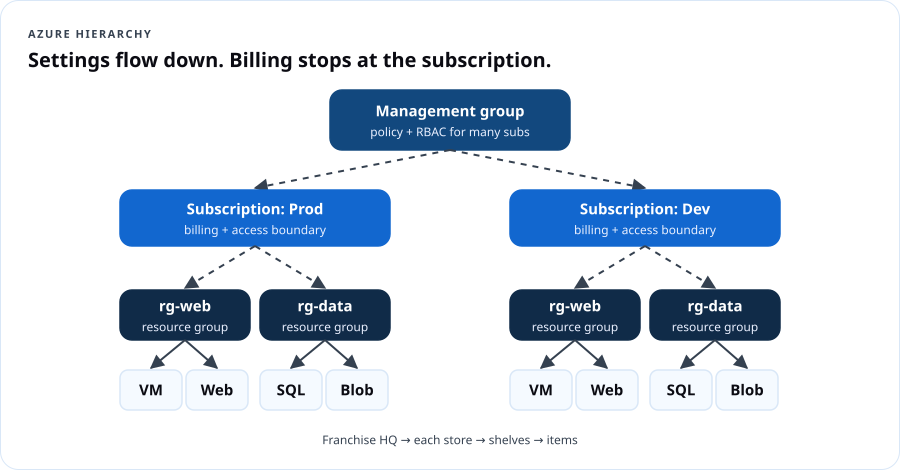
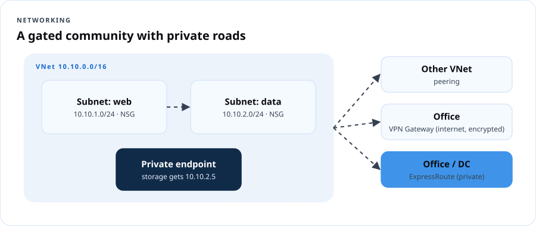
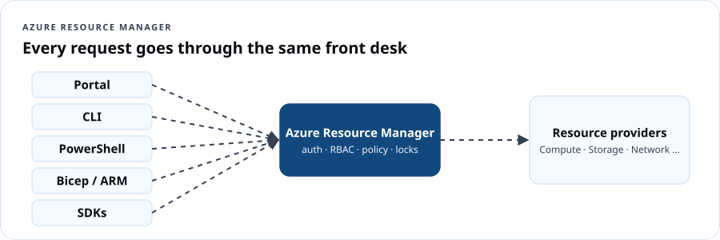

# AZ-900 Azure Fundamentals

## Course overview

AZ-900 is Microsoft's entry certification for Azure. It proves you can **describe** cloud concepts, Azure's architecture and services, and how Azure is managed and governed. You don't need to be technical to pass it, but you will leave able to talk shop with technical people.

This course follows Microsoft's **current skills outline (as of July 20, 2026)** line by line, then adds the DCT layer: plain-language translations, real scenarios, and hands-on labs so the vocabulary sticks.

### The exam at a glance

| Item | Detail |
|---|---|
| Exam | AZ-900: Microsoft Azure Fundamentals |
| Credential | Microsoft Certified: Azure Fundamentals |
| Passing score | 700 (scale 1–1000) |
| Price | $99 USD in the United States (varies by country; confirm at checkout) |
| Expiration | Fundamentals certifications do not expire |
| Domains | Cloud concepts 25–30% · Azure architecture & services 35–40% · Management & governance 30–35% |
| Free prep | [Official study guide](https://aka.ms/AZ900-StudyGuide) · [Free practice assessment](https://learn.microsoft.com/credentials/certifications/exams/az-900/practice/assessment?assessment-type=practice&assessmentId=23) · [Exam sandbox](https://aka.ms/examdemo) |

### Learning outcomes

You will be able to:

1. Describe cloud computing, shared responsibility, cloud models and the consumption-based model.
2. Explain the benefits of the cloud: availability, scalability, reliability, predictability, security, governance, manageability.
3. Classify services as IaaS, PaaS or SaaS and pick the right one for a scenario.
4. Describe Azure regions, availability zones, resource groups, subscriptions and management groups and how they nest.
5. Compare Azure compute, networking and storage options and choose between them.
6. Describe Microsoft Entra ID, authentication methods, Conditional Access, RBAC, Zero Trust, defense in depth and Defender for Cloud.
7. Describe cost factors, the pricing calculator, Cost Management and tags.
8. Describe Purview, Azure Policy, resource locks, the portal, Cloud Shell, CLI, PowerShell, Arc, IaC and ARM.
9. Describe Advisor, Service Health and Azure Monitor (Log Analytics, alerts, Application Insights).

### Syllabus

| # | Lesson | Exam domain | Time |
|---|---|---|---|
| 1 | What is cloud computing? | Cloud concepts | 90 + 30 lab |
| 2 | Benefits of the cloud and service types | Cloud concepts | 90 + 30 lab |
| 3 | Azure's core architecture | Architecture & services | 90 + 45 lab |
| 4 | Compute and application hosting | Architecture & services | 90 + 60 lab |
| 5 | Networking | Architecture & services | 90 + 45 lab |
| 6 | Storage, file movement and migration | Architecture & services | 75 + 45 lab |
| 7 | Identity, access and security | Architecture & services | 90 + 45 lab |
| 8 | Cost management | Management & governance | 75 + 30 lab |
| 9 | Governance, compliance and deployment tools | Management & governance | 75 + 45 lab |
| 10 | Monitoring + exam readiness | Management & governance | 90 (incl. practice exam) |

### Cloud From Scratch — live 6-session map

For DCT's live community cohort, the 10 lessons compress into six 2.5-hour sessions:

| Session | Covers lessons | Hands-on moment |
|---|---|---|
| 1. Welcome to the cloud | 1–2 | Pizza-model sorting game; create a budget |
| 2. How Azure is built | 3 | Build the hierarchy with sticky notes; create a resource group with tags |
| 3. Computers in the cloud | 4 | Deploy a web app (free tier) |
| 4. Roads and lockers | 5–6 | Draw a VNet; upload files to Blob Storage |
| 5. Who gets in | 7 | MFA + RBAC role assignment walkthrough |
| 6. Money, rules and the dashboard | 8–10 | Pricing calculator challenge, Azure Policy demo, practice exam |

### Assessment

| Component | Weight |
|---|---|
| 10 lesson knowledge checks | 30% |
| 6 labs (screenshots + reflection) | 30% |
| Capstone: "Azure for a Small Business" plan | 20% |
| 40-question practice exam (75% target) | 20% |

**Recommended exam readiness signal:** 80%+ on the DCT practice exam and 75%+ on Microsoft's free practice assessment, twice, on different days.

---

## Lesson 1 — What is cloud computing?

**Objectives (exam: Describe cloud computing):** define cloud computing; describe the shared responsibility model; define public, private and hybrid; identify use cases for each; describe the consumption-based model; compare pricing models; describe serverless.

### 1.1 Definition

Cloud computing is **the delivery of computing services — servers, storage, databases, networking, software, analytics and intelligence — over the internet, on demand, with pay-as-you-go pricing.** Microsoft owns and runs the datacenters; you rent capacity and pay for what you consume.

> **Dope Translation:** Owning servers is buying your own studio — mics, booth, soundproofing, the electric bill — even on days nobody records. Cloud is booking studio time by the hour. Big album drop? Book the big room for a week. Quiet month? Book an hour.

### 1.2 Shared responsibility


| Always Microsoft | Varies by service type | Always you |
|---|---|---|
| Physical datacenters, physical network, physical hosts | Operating system, network controls, applications, identity infrastructure | Information and data, devices (mobile & PC), accounts and identities |

The more you move from on-premises → IaaS → PaaS → SaaS, the more Microsoft manages. **You never hand off your data, your devices, or your accounts.**

### 1.3 Cloud models

| Model | What it is | Use when |
|---|---|---|
| **Public** | Provider-owned, shared infrastructure; you rent | Fast start, no up-front cost, variable demand |
| **Private** | Cloud-style infrastructure used by one organization (on-prem or hosted) | Strict control, legacy constraints, specific regulatory rules |
| **Hybrid** | Public and private connected and working together | Keep some data on-prem while bursting or modernizing in the cloud |

Multi-cloud (more than one public provider) is common too. **Azure Arc** (Lesson 9) helps manage hybrid and multi-cloud resources from Azure.

### 1.4 The consumption-based model and pricing models

- **Consumption-based:** no up-front cost, no buying for peak, pay for what you use, stop paying when you stop using it.
- **CapEx → OpEx:** moving from buying hardware to paying operating costs.
- **Pricing models you should recognize:**

| Model | How it works | Good for |
|---|---|---|
| Pay-as-you-go | Per second/hour/GB, no commitment | Unpredictable or short workloads |
| Reservations | Commit 1 or 3 years for a big discount | Steady, always-on workloads |
| Savings plan for compute | Commit to an hourly spend across compute services | Steady spend across changing VM types |
| Spot | Use spare capacity cheaply; can be evicted | Batch jobs, testing, interruptible work |
| Azure Hybrid Benefit | Reuse existing Windows Server/SQL licenses | Orgs that already own Microsoft licenses |

> **Dope Translation:** Pay-as-you-go is buying by the plate. Reservations are a meal plan. Spot is the end-of-night bakery discount — cheap, but they can close the door on you.

### 1.5 Serverless

**Serverless** means you write the code (or workflow) and Azure runs, scales and patches everything underneath. You're billed by executions and resources used, not for idle servers. Examples: **Azure Functions** (event-driven code) and **Azure Logic Apps** (workflow automation). There *are* servers; you just never manage them.

> **Real Talk:** A food pantry gets a spike of sign-ups the morning a donation drive is announced. A Function that writes each sign-up to storage costs almost nothing on quiet days and scales automatically on the busy one.

### Lab 1 — Your Azure starter (30 min)

1. Create a free account at [azure.microsoft.com/free](https://azure.microsoft.com/free/) (or **Azure for Students** if eligible). Turn on MFA.
2. Create a monthly **budget** of $5 with alerts at 50%, 80%, 100% (*Cost Management → Budgets*).
3. In the portal search bar, open **Subscriptions**. Write down the subscription name and ID — that's your billing boundary.

### Lesson 1 knowledge check

```quiz
Q: Under the shared responsibility model, which is ALWAYS the customer's responsibility?
- [ ] Physical network
- [ ] Physical hosts
- [x] Accounts and identities
- [ ] Datacenter power
E: Information/data, devices, and accounts/identities always stay with the customer.

Q: A company keeps sensitive records in its own datacenter while running its website in Azure, connected together. Which model?
- [ ] Public
- [ ] Private
- [x] Hybrid
- [ ] SaaS
E: Hybrid combines private and public resources that work together.

Q: Which pricing option gives the biggest discount for a VM that runs 24/7 for three years?
- [ ] Pay-as-you-go
- [ ] Spot
- [x] Reservation (3-year)
- [ ] Free tier
E: Reservations trade commitment for discount; three-year terms save the most.

Q: Which statement about serverless is correct?
- [ ] There are no servers anywhere
- [x] The provider manages the servers; you pay by execution/consumption
- [ ] You must patch the OS monthly
- [ ] It is always more expensive
E: Serverless abstracts the servers away from you.
```

---

## Lesson 2 — Benefits of the cloud and service types

**Objectives (exam: Describe the benefits of using cloud services; Describe cloud service types).**

### 2.1 Benefits

| Benefit | Means | Azure example |
|---|---|---|
| **High availability** | Service stays up with minimal downtime | SLAs, availability zones |
| **Scalability** | Handle more load. *Vertical* = bigger machine (scale up). *Horizontal* = more machines (scale out) | VM resize; scale sets |
| **Elasticity** | Scaling happens automatically with demand | Autoscale rules |
| **Reliability** | Recover from failures and keep working | Region pairs, geo-redundant storage |
| **Predictability** | Performance and cost you can forecast | Autoscale; pricing calculator; Cost Management |
| **Security** | Choose controls; provider handles physical security & patching in PaaS/SaaS | Defender for Cloud, DDoS protection |
| **Governance** | Templates and policies keep deployments compliant | Azure Policy, management groups |
| **Manageability** | Manage *of* the cloud (autoscale, alerts, templates) and *in* the cloud (portal, CLI, APIs) | Portal, Cloud Shell, ARM |

> **Dope Translation:** Scale **up** = trade the hatchback for a truck. Scale **out** = keep the hatchback, add four more hatchbacks. Elasticity = the cars show up on their own when the line gets long, and leave when it's short.

**SLA (service-level agreement):** Microsoft's written uptime commitment for a service, e.g. 99.9% or 99.99%. 99.9% allows ~43 minutes of downtime a month; 99.99% allows ~4 minutes. Combining services multiplies their SLAs (two 99.9% services in a chain ≈ 99.8%).

### 2.2 Service types


| Type | You manage | Typical scenarios |
|---|---|---|
| **IaaS** | OS and up | Lift-and-shift migration, test/dev, custom software that needs OS access |
| **PaaS** | Your app and data | Web apps and APIs, databases you don't want to patch, dev teams that want speed |
| **SaaS** | Your data, users and settings | Email, office suites, CRM, video meetings |

> **Real Talk:** A church moves its old Windows server (with a donation app on it) to an Azure VM — IaaS, fastest move. Next year, it rebuilds the app on App Service — PaaS, no more patching. Staff use Microsoft 365 for email — SaaS.

### Lab 2 — Sort it out (30 min)

Create a table and classify each: Azure Virtual Machines, Azure App Service, Microsoft 365, Azure SQL Database, Azure Functions, Dynamics 365, Azure Virtual Desktop session hosts, Azure Kubernetes Service. For each, write *who patches the OS?* (Answers in the instructor notes.)

### Lesson 2 knowledge check

```quiz
Q: Adding more VM instances to handle traffic is:
- [ ] Scaling up
- [x] Scaling out (horizontal)
- [ ] Vertical scaling
- [ ] Reliability
E: Horizontal scaling adds instances; vertical scaling makes one bigger.

Q: Which benefit describes the ability to forecast costs and performance?
- [ ] Elasticity
- [x] Predictability
- [ ] Governance
- [ ] Agility
E: Predictability covers both performance and cost forecasting.

Q: A team wants to deploy code without managing the OS. Which service type fits best?
- [ ] IaaS
- [x] PaaS
- [ ] On-premises
- [ ] Private cloud
E: PaaS handles OS and runtime.

Q: Which is a SaaS offering?
- [ ] Azure Virtual Machines
- [ ] Azure App Service
- [x] Microsoft 365
- [ ] Azure Virtual Network
E: Microsoft 365 is a fully managed application.
```

---

## Lesson 3 — Azure's core architecture

**Objectives:** regions, region pairs, sovereign regions; availability zones; datacenters; resources and resource groups; subscriptions; management groups; the hierarchy.

### 3.1 Physical layer

- **Datacenters:** buildings full of servers with independent power, cooling and networking.
- **Regions:** a geographic area with one or more datacenters connected by a low-latency network (e.g., East US, West Europe). You choose a region for every resource (some services are *global*).
- **Availability zones:** physically separate datacenter groups within a region — at least three in zone-enabled regions. Use **zonal** services (pinned to a zone) or **zone-redundant** services (replicated across zones automatically).
- **Region pairs:** many regions are paired with another region in the same geography (≥300 miles apart where possible) for prioritized recovery and some built-in replication (e.g., geo-redundant storage). Some newer regions don't have pairs and rely on availability zones instead.
- **Sovereign regions:** isolated instances of Azure for compliance — **Azure Government** (U.S. government agencies and partners) and **Azure operated by 21Vianet** (China).

> **Dope Translation:** Region = city. Datacenter = building. Availability zone = a different building across town with its own power line. Region pair = your sister city two states away that helps you rebuild if a hurricane hits.

### 3.2 Management layer



| Level | What it is | Key facts |
|---|---|---|
| **Management group** | Container for subscriptions | Apply policy and RBAC across many subscriptions; up to six levels deep (not counting root) |
| **Subscription** | Billing + access boundary | Separate by environment (dev/prod), department, or billing need |
| **Resource group** | Logical folder for resources | A resource lives in exactly one resource group; RGs can't be nested; deleting an RG deletes everything in it |
| **Resource** | The actual thing | VM, storage account, web app, database |

Settings applied higher up are **inherited** downward.

> **Dope Translation:** Management group = the franchise headquarters. Subscription = each store (its own bank account). Resource group = a shelf in the store. Resource = the item on the shelf. If HQ says "no smoking in any store," every store and shelf follows it.

### Lab 3 — Build your hierarchy (45 min)

1. Create resource group `rg-az900-labs` in your nearest region.
2. Add tags: `env=learning`, `owner=<your name>`, `course=az900`.
3. Open *Management groups* in the portal and read the root management group (you may need permissions to create one — just observe).
4. Open *Azure regions* documentation ([Azure geographies](https://azure.microsoft.com/explore/global-infrastructure/geographies/)) and find your region's pair and whether it supports availability zones.

### Lesson 3 knowledge check

```quiz
Q: What is the minimum number of availability zones in a zone-enabled region?
- [ ] 1
- [ ] 2
- [x] 3
- [ ] 6
E: Zone-enabled regions have at least three zones.

Q: Which Azure construct is a billing and access boundary?
- [ ] Resource group
- [x] Subscription
- [ ] Availability zone
- [ ] Tag
E: Subscriptions separate billing and access.

Q: Which statement about resource groups is TRUE?
- [ ] A resource can be in two resource groups
- [ ] Resource groups can be nested
- [x] Deleting a resource group deletes its resources
- [ ] Resource groups replace subscriptions
E: The resource group shares a lifecycle with its resources.

Q: Azure Government is an example of:
- [ ] A region pair
- [x] A sovereign region
- [ ] An availability zone
- [ ] A management group
E: Sovereign regions are isolated for compliance.

Q: You need one policy to apply to 12 subscriptions. Where do you assign it?
- [x] A management group containing them
- [ ] Each resource
- [ ] A tag
- [ ] A region
E: Management groups let governance flow down to many subscriptions.
```

---

## Lesson 4 — Compute and application hosting

**Objectives:** compare containers, VMs and functions; VM options (VMs, scale sets, availability sets, Azure Virtual Desktop); resources a VM needs; hosting options (web apps, containers, VMs).

### 4.1 Compute types

| Type | What you get | You manage | Best for |
|---|---|---|---|
| **Virtual machines** | Full OS | OS, patches, software | Full control, legacy apps, lift-and-shift |
| **Containers** | Packaged app + dependencies sharing the host kernel | App + container image | Microservices, consistent deploys, fast start |
| **Functions** | Code that runs on an event | Code only | Event-driven, short tasks, unpredictable traffic |

Azure container options: **Azure Container Instances** (run a container fast, no orchestration), **Azure Container Apps** (serverless containers with scaling), **Azure Kubernetes Service** (managed Kubernetes orchestration).

> **Dope Translation:** A VM is renting a whole apartment and furnishing it yourself. A container is a lunchbox — everything the meal needs packed inside, and it works in any microwave. A function is a doorbell — it only does something when somebody pushes it.

### 4.2 VM options

- **Azure Virtual Machines:** single VMs, Windows or Linux.
- **Virtual Machine Scale Sets:** a group of identical, load-balanced VMs that scale automatically.
- **Availability sets:** spread VMs across *fault domains* (separate power/network racks) and *update domains* (rebooted at different times) inside one datacenter.
- **Azure Virtual Desktop:** Windows desktops and apps delivered from Azure to any device, including multi-session Windows 11.

### 4.3 What a VM needs

Size (CPU/RAM), image (OS), **disks** (OS + data), **virtual network & subnet**, **network interface**, optional **public IP**, and a **network security group**. Each is a separate Azure resource.

### 4.4 Application hosting

| Option | Choose when |
|---|---|
| **Azure App Service (web apps)** | Websites, APIs and mobile back ends without managing servers; built-in scaling, slots, SSL |
| **Containers** (ACI, Container Apps, AKS) | You already package apps as containers |
| **Virtual machines** | You need OS-level control or unsupported software |

### Lab 4 — Deploy a free web app (60 min)

1. Portal → **App Services** → *Create* → *Web App*. RG `rg-az900-labs`. Name unique. Publish **Code**, runtime **Node 20 LTS** or **.NET 8** (whatever's listed), OS Linux, region nearby.
2. Pricing plan: create new → **Free F1** (if available in your region).
3. Create. Open the default URL (`*.azurewebsites.net`) — you'll see the placeholder page.
4. Open *Deployment Center* and read the options (GitHub, local Git, ZIP). Optional: deploy the Cloud 101 `index.html` using ZIP deploy.
5. Compare in your notes: what did you **not** have to configure that a VM would need?

### Lesson 4 knowledge check

```quiz
Q: Which service runs code in response to events and bills per execution?
- [ ] Azure Virtual Machines
- [x] Azure Functions
- [ ] Azure Virtual Desktop
- [ ] Availability sets
E: Functions are event-driven serverless compute.

Q: A group of identical VMs that automatically scale is:
- [ ] Availability set
- [x] Virtual Machine Scale Set
- [ ] Resource group
- [ ] Region pair
E: Scale sets create and manage identical load-balanced VMs.

Q: Which service delivers Windows desktops to users from Azure?
- [ ] App Service
- [x] Azure Virtual Desktop
- [ ] Azure Container Instances
- [ ] Azure DNS
E: AVD provides virtualized desktops and apps.

Q: Which is NOT a resource a VM requires?
- [ ] Network interface
- [ ] Disk
- [ ] Virtual network
- [x] Azure Policy definition
E: Policy is governance, not a VM dependency.

Q: Packaging an app with all its dependencies so it runs the same anywhere describes:
- [x] Containers
- [ ] Availability sets
- [ ] ExpressRoute
- [ ] Resource locks
E: Containers bundle the app and dependencies.
```

---

## Lesson 5 — Networking

**Objectives:** virtual networks, subnets, peering, Azure DNS, VPN Gateway, ExpressRoute; public and private endpoints.

### 5.1 Core concepts

| Concept | What it does |
|---|---|
| **Virtual network (VNet)** | Your private network in Azure; resources inside can talk to each other privately. Scoped to one region and subscription |
| **Subnet** | A slice of a VNet's address range to group and secure resources |
| **VNet peering** | Connect two VNets (same or different regions) over Microsoft's backbone, privately |
| **Azure DNS** | Hosts DNS domains (name → IP lookups) on Microsoft's infrastructure; supports public and private zones |
| **VPN Gateway** | Encrypted tunnel over the public internet between Azure and on-premises (site-to-site) or a user's device (point-to-site) |
| **ExpressRoute** | A **private** dedicated connection from on-premises to Microsoft through a connectivity provider — doesn't go over the public internet |
| **Public endpoint** | A service reachable on a public IP/URL |
| **Private endpoint** | Gives a PaaS service (e.g., a storage account) a private IP inside your VNet, so traffic stays private |



> **Dope Translation:** A VNet is a gated community. Subnets are the streets. Peering is a private bridge between two gated communities. VPN is an armored car on the public highway. ExpressRoute is your own private road. A private endpoint moves the bank teller *inside* your gate so you never walk out on the street with cash.

### Lab 5 — Draw then build (45 min)

1. On paper, draw a VNet `10.10.0.0/16` with subnets `web 10.10.1.0/24` and `data 10.10.2.0/24`.
2. Portal → **Virtual networks** → *Create* in `rg-az900-labs` with that address space and subnets.
3. Open the VNet → *Subnets*. Note there's no cost for the VNet itself.
4. Answer: how would you connect this VNet to a second VNet in another region? (Peering.) To an office? (VPN Gateway or ExpressRoute.)

### Lesson 5 knowledge check

```quiz
Q: Which connection does NOT travel over the public internet?
- [ ] Site-to-site VPN
- [ ] Point-to-site VPN
- [x] ExpressRoute
- [ ] Public endpoint
E: ExpressRoute is a private connection through a provider.

Q: Two VNets in different regions need private connectivity. Use:
- [x] VNet peering
- [ ] Azure DNS
- [ ] A resource lock
- [ ] A public IP
E: Global VNet peering connects VNets across regions privately.

Q: What gives a storage account a private IP inside your VNet?
- [ ] Public endpoint
- [x] Private endpoint
- [ ] Azure CDN
- [ ] Load balancer
E: Private endpoints bring PaaS services into your private address space.

Q: Azure DNS is used to:
- [ ] Encrypt traffic
- [x] Host domain name records that translate names to IP addresses
- [ ] Peer VNets
- [ ] Assign RBAC roles
E: DNS translates names into addresses.
```

---

## Lesson 6 — Storage, moving files, and migration

**Objectives:** compare storage services; tiers; redundancy; storage account options and types; AzCopy, Storage Explorer, Azure File Sync; Azure Migrate and Data Box.

### 6.1 Storage services

| Service | Holds | Use case |
|---|---|---|
| **Blob Storage** | Unstructured objects (images, video, backups, logs) | Media, data lakes, static sites |
| **Azure Files** | Managed file shares (SMB/NFS) | Replace on-prem file servers, lift-and-shift shared drives |
| **Queue Storage** | Messages between app components | Decoupling app parts |
| **Table Storage** | NoSQL key-attribute data | Simple structured data at scale |
| **Azure Disks** | Block storage for VMs | OS and data disks |

### 6.2 Access tiers (Blob)

| Tier | Cost to store | Cost to read | Min. retention | Use |
|---|---|---|---|---|
| **Hot** | Highest | Lowest | — | Frequently accessed |
| **Cool** | Lower | Higher | 30 days | Infrequent, ready quickly |
| **Cold** | Lower still | Higher | 90 days | Rarely accessed, still online |
| **Archive** | Lowest | Highest + rehydration hours | 180 days | Long-term, offline until rehydrated |

> **Dope Translation:** Hot = your front pocket. Cool = the closet. Cold = the attic. Archive = a storage unit across town — cheap rent, but it takes hours to drive over and get your stuff.

### 6.3 Redundancy

| Option | Copies | Protects against |
|---|---|---|
| **LRS** — locally redundant | 3 in one datacenter | Disk/rack failure |
| **ZRS** — zone-redundant | 3 across availability zones in a region | Datacenter failure |
| **GRS** — geo-redundant | LRS in primary + LRS in paired region | Regional outage |
| **GZRS** — geo-zone-redundant | ZRS in primary + LRS in secondary region | Datacenter **and** regional outage |
| **RA-GRS / RA-GZRS** | As above + read access to secondary | Read during regional outage |

### 6.4 Storage account types

**Standard general-purpose v2** (most scenarios — blob, file, queue, table), **Premium block blobs**, **Premium file shares**, **Premium page blobs**. Each account gets a globally unique name and endpoints like `https://<name>.blob.core.windows.net`.

### 6.5 Moving files and migrating

| Tool | Use |
|---|---|
| **AzCopy** | Command-line copy to/from storage; scripts and big transfers |
| **Azure Storage Explorer** | Free desktop app with a GUI for storage |
| **Azure File Sync** | Keeps Windows file servers in sync with Azure Files; caching on-prem |
| **Azure Migrate** | Hub to discover, assess and migrate servers, databases, web apps |
| **Azure Data Box** | Physical device Microsoft ships you to move huge data (terabytes) offline |

### Lab 6 — Upload and tier (45 min)

1. Create a **Standard GPv2** storage account in `rg-az900-labs`, redundancy **LRS**.
2. Create a container `class-files` (private). Upload a photo.
3. Change the blob's tier to **Cool**, then **Archive**. Note you can no longer open it — that's rehydration.
4. Install [Azure Storage Explorer](https://azure.microsoft.com/products/storage/storage-explorer/) and sign in; browse the container.

### Lesson 6 knowledge check

```quiz
Q: Which redundancy option survives both a datacenter outage and a regional outage?
- [ ] LRS
- [ ] ZRS
- [ ] GRS
- [x] GZRS
E: GZRS replicates across zones in the primary region and to a secondary region.

Q: Which tier has the lowest storage cost but requires rehydration before reading?
- [ ] Hot
- [ ] Cool
- [ ] Cold
- [x] Archive
E: Archive is offline storage.

Q: A school must move 80 TB of video with slow internet. Best option?
- [ ] AzCopy over Wi-Fi
- [x] Azure Data Box
- [ ] Storage Explorer
- [ ] Azure DNS
E: Data Box ships a physical device for large offline transfers.

Q: Which keeps an on-premises Windows file server synced with Azure Files?
- [x] Azure File Sync
- [ ] Azure Migrate
- [ ] Queue Storage
- [ ] AzCopy
E: Azure File Sync centralizes shares in Azure Files while caching on-prem.

Q: Which service replaces a traditional shared network drive?
- [ ] Blob Storage
- [x] Azure Files
- [ ] Table Storage
- [ ] Queue Storage
E: Azure Files provides SMB/NFS shares.
```

---

## Lesson 7 — Identity, access and security

**Objectives:** Microsoft Entra ID and Entra Domain Services; SSO, MFA, passwordless; external identities; Conditional Access; Azure RBAC; Zero Trust; defense in depth; Microsoft Defender for Cloud.

### 7.1 Directory services

- **Microsoft Entra ID** (formerly Azure Active Directory): Microsoft's cloud identity service — users, groups, apps, sign-in, MFA. Works for Microsoft 365, Azure and thousands of SaaS apps.
- **Microsoft Entra Domain Services:** managed *legacy* domain services (domain join, Group Policy, LDAP, Kerberos/NTLM) for older apps, without running domain controllers yourself.
- **Microsoft Entra Connect / Cloud Sync:** sync on-premises Active Directory users into Entra ID (hybrid identity).

### 7.2 Authentication vs. authorization

- **Authentication (AuthN):** *Who are you?* — proving identity.
- **Authorization (AuthZ):** *What are you allowed to do?* — permissions.

> **Dope Translation:** AuthN is the bouncer checking your ID. AuthZ is the wristband that says whether you can go to the VIP section.

### 7.3 Authentication methods

| Method | What it is |
|---|---|
| **SSO** | One identity, sign in once, use many apps |
| **MFA** | Two or more factors: know / have / are |
| **Passwordless** | Windows Hello for Business, Microsoft Authenticator, FIDO2 security keys / passkeys — more secure *and* easier |

### 7.4 External identities

**Microsoft Entra External ID** lets people outside your organization sign in: **B2B collaboration** (partners use their own work/social identity as guests) and customer-facing (CIAM) apps for consumers.

### 7.5 Conditional Access

An **if-then policy engine**: *IF* a sign-in has these signals (user/group, location, device state, app, risk) *THEN* allow, block, or require more (MFA, compliant device).

> **Real Talk:** "If anyone signs in to the payroll app from outside the U.S., block. If an admin signs in from anywhere, require MFA and a compliant device."

### 7.6 Azure RBAC

Role-based access control assigns a **role** (a set of permissions) to a **security principal** (user, group, service principal, managed identity) at a **scope** (management group, subscription, resource group, resource). Permissions **inherit** down.

Built-in roles to know: **Owner** (everything + manage access), **Contributor** (everything except access), **Reader** (view only), **User Access Administrator** (manage access).

### 7.7 Zero Trust and defense in depth


**Zero Trust** principles: **verify explicitly**, **use least-privilege access**, **assume breach**. No network location is trusted by default.

**Defense in depth** layers (outside in): physical security → identity & access → perimeter → network → compute → application → data. Each layer slows attackers so one failure doesn't expose everything.

> **Dope Translation:** Zero Trust is the corner store that cards *everybody*, even regulars. Defense in depth is the store having a gate, a camera, a locked register, *and* a safe — rob one, you still don't get the safe.

### 7.8 Microsoft Defender for Cloud

A **cloud security posture management (CSPM)** and **workload protection (CWP)** tool. It continuously assesses your resources, gives a **secure score**, recommends fixes, and protects Azure, hybrid, AWS and GCP workloads. Foundational CSPM is free; enhanced plans cost extra.

### Lab 7 — Identity tour (45 min)

1. Portal → **Microsoft Entra ID** → *Users* → create a test user `learner1`.
2. *Groups* → create `az900-readers`; add `learner1`.
3. Resource group `rg-az900-labs` → *Access control (IAM)* → *Add role assignment* → **Reader** → assign to `az900-readers`.
4. Use *Check access* to confirm what `learner1` can do.
5. Open **Microsoft Defender for Cloud** → read your secure score and top three recommendations. Screenshot.

### Lesson 7 knowledge check

```quiz
Q: Which Zero Trust principle says to design as though attackers are already inside?
- [ ] Verify explicitly
- [ ] Least privilege
- [x] Assume breach
- [ ] Defense in depth
E: Assume breach drives segmentation and monitoring.

Q: A user needs to view resources but change nothing. Which built-in role?
- [ ] Owner
- [ ] Contributor
- [x] Reader
- [ ] User Access Administrator
E: Reader is view-only.

Q: Which service provides managed domain join and Group Policy for legacy apps?
- [ ] Microsoft Entra ID
- [x] Microsoft Entra Domain Services
- [ ] Defender for Cloud
- [ ] Azure Policy
E: Entra Domain Services offers managed legacy domain features.

Q: "Require MFA when signing in from an unknown location" is configured with:
- [ ] RBAC
- [x] Conditional Access
- [ ] Resource locks
- [ ] Azure Advisor
E: Conditional Access evaluates signals and enforces access requirements.

Q: Authorization answers which question?
- [ ] Who are you?
- [x] What are you allowed to do?
- [ ] Where are you?
- [ ] How much does it cost?
E: AuthN = identity; AuthZ = permissions.

Q: Which tool gives a secure score and security recommendations across Azure, AWS and GCP?
- [ ] Azure Monitor
- [x] Microsoft Defender for Cloud
- [ ] Azure Service Health
- [ ] Azure Migrate
E: Defender for Cloud is CSPM + workload protection.
```

---

## Lesson 8 — Cost management

**Objectives:** factors that affect cost; the pricing calculator; Cost Management capabilities; tags.

### 8.1 What drives cost

- **Resource type and size** (a bigger VM costs more).
- **Consumption** (hours running, GB stored, transactions).
- **Region** (same service can cost differently in different regions).
- **Bandwidth** — inbound data transfer is generally free; **outbound (egress)** and cross-region traffic is charged.
- **Pricing model** (reservations, savings plans, spot, Hybrid Benefit).
- **Maintenance/sprawl** — forgotten resources keep billing.
- **Marketplace** third-party items may carry their own charges.

> **Dope Translation:** Rent depends on the size of the apartment, the neighborhood, how many utilities you run, and whether you signed a one-year lease. Moving your stuff *out* costs a moving fee (egress). And paying rent on an apartment you forgot about is how people go broke.

### 8.2 Tools

| Tool | Purpose |
|---|---|
| **Pricing calculator** | Estimate the cost of services *before* you deploy |
| **Cost Management** | Analyze actual and forecast spend, create **budgets** and **alerts**, see recommendations |
| **Azure Advisor (cost)** | Find idle/underused resources and savings |
| **Tags** | Name-value labels (`dept=finance`) to organize and report costs by team, project, environment |

Tags are **not inherited** from resource groups by default; use Azure Policy to require or inherit them.

### Lab 8 — Pricing calculator challenge (30 min)

Use the [Azure pricing calculator](https://azure.microsoft.com/pricing/calculator/) to estimate a small nonprofit's monthly bill:
- 1 Linux VM (small B-series) running 730 hours in East US
- 1 App Service Basic plan
- 100 GB Hot blob storage (LRS)

Then change the VM to a 1-year reservation and the region to another U.S. region. Record how the total changes and **why**. Export the estimate.

### Lesson 8 knowledge check

```quiz
Q: Which tool estimates costs BEFORE deploying?
- [x] Pricing calculator
- [ ] Cost Management
- [ ] Azure Monitor
- [ ] Service Health
E: The pricing calculator is for planning; Cost Management tracks actual spend.

Q: Which data transfer is typically free?
- [x] Inbound data into Azure
- [ ] Outbound data to the internet
- [ ] Cross-region transfer
- [ ] All transfer is always free
E: Ingress is generally free; egress is charged.

Q: Finance wants costs broken down by department. What should you apply?
- [ ] Resource locks
- [x] Tags
- [ ] Availability zones
- [ ] Private endpoints
E: Tags enable cost reporting by any dimension.

Q: Are tags on a resource group automatically inherited by its resources?
- [ ] Yes, always
- [x] No, not by default (Azure Policy can enforce/inherit them)
- [ ] Only for VMs
- [ ] Only in the US
E: Tags don't inherit by default.
```

---

## Lesson 9 — Governance, compliance and deployment tools

**Objectives:** Microsoft Purview; Azure Policy; resource locks; Azure portal; Cloud Shell, CLI, PowerShell; Azure Arc; infrastructure as code; Azure Resource Manager and ARM templates.

### 9.1 Governance and compliance

| Tool | What it does | Example |
|---|---|---|
| **Microsoft Purview** | Data governance, risk and compliance: discover, classify and map data across on-prem, multicloud and SaaS; manage compliance | Find every place SSNs are stored |
| **Azure Policy** | Create, assign and evaluate rules on resources; can **deny**, **audit**, **modify** or **deploy-if-not-exists**; initiatives group policies | "Only East US and West US 2 allowed"; "every RG must have a `dept` tag" |
| **Resource locks** | Prevent accidental changes. **CanNotDelete** (can modify, can't delete) or **ReadOnly** (can't modify or delete) | Lock the production database |

Locks override permissions — even an Owner must remove the lock first.

> **Dope Translation:** Azure Policy is the house rules posted on the fridge, enforced automatically. A resource lock is the child-safety cap on the medicine bottle — even grown folks have to take an extra step.

### 9.2 Managing and deploying

| Tool | What it is |
|---|---|
| **Azure portal** | Web-based GUI for everything |
| **Azure Cloud Shell** | Browser-based shell (Bash or PowerShell) with CLI and tools preinstalled |
| **Azure CLI** | Cross-platform command line (`az ...`) |
| **Azure PowerShell** | PowerShell modules (`New-AzVM ...`) |
| **Azure Arc** | Extends Azure management (policy, RBAC, monitoring) to servers, Kubernetes and data services **outside** Azure — on-prem or other clouds |
| **Infrastructure as code (IaC)** | Define infrastructure in files so deployments are repeatable, reviewable and version-controlled |
| **Azure Resource Manager (ARM)** | The deployment and management service behind every Azure request — portal, CLI, PowerShell, SDKs all go through ARM |
| **ARM templates / Bicep** | Declarative JSON (ARM) or simpler Bicep files describing what to deploy; ARM makes it happen, in parallel, idempotently |



### Lab 9 — Policy, lock, and code (45 min)

1. **Policy:** *Policy* → *Definitions* → search **"Allowed locations"** → *Assign* at `rg-az900-labs` scope → allow only your region. Try creating a storage account in another region — watch it fail.
2. **Lock:** Add a **CanNotDelete** lock to `rg-az900-labs`. Try to delete the resource group. Remove the lock afterward.
3. **Cloud Shell:** open it (top bar `>_`), choose Bash, run:
   ```bash
   az group list -o table
   az resource list -g rg-az900-labs -o table
   ```
4. **IaC peek:** on any resource → *Export template* (under Automation). Read the JSON — that's ARM.

### Lesson 9 knowledge check

```quiz
Q: Which lock allows modification but prevents deletion?
- [x] CanNotDelete
- [ ] ReadOnly
- [ ] Azure Policy deny
- [ ] RBAC Reader
E: CanNotDelete blocks deletes only; ReadOnly blocks changes too.

Q: Which service can deny creating resources outside approved regions?
- [ ] Resource locks
- [x] Azure Policy
- [ ] Microsoft Purview
- [ ] Azure Advisor
E: Policy enforces rules at deployment and evaluation time.

Q: You want to manage on-premises Linux servers with Azure Policy and Azure Monitor. Use:
- [ ] ExpressRoute
- [x] Azure Arc
- [ ] Azure Migrate
- [ ] Data Box
E: Arc projects non-Azure resources into Azure management.

Q: Which is the deployment and management layer that every Azure request passes through?
- [ ] Azure Arc
- [x] Azure Resource Manager
- [ ] Cloud Shell
- [ ] Microsoft Purview
E: ARM authenticates, authorizes and processes all requests.

Q: Which tool discovers and classifies sensitive data across your estate?
- [x] Microsoft Purview
- [ ] Azure Policy
- [ ] Defender for Cloud
- [ ] Azure DNS
E: Purview handles data governance and compliance.
```

---

## Lesson 10 — Monitoring and exam readiness

**Objectives:** Azure Advisor; Azure Service Health; Azure Monitor including Log Analytics, alerts and Application Insights.

### 10.1 Monitoring tools

| Tool | Answers the question |
|---|---|
| **Azure Advisor** | *How can I improve?* Personalized recommendations across **reliability, security, performance, cost, operational excellence** |
| **Azure Service Health** | *Is Azure itself having a problem that affects me?* Azure status (global), Service Health (your services/regions), Resource Health (your specific resources); planned maintenance and health advisories |
| **Azure Monitor** | *What is happening in my resources?* Collects metrics and logs from Azure, on-prem and other clouds |
| ↳ **Log Analytics** | Query logs with Kusto Query Language (KQL) |
| ↳ **Azure Monitor alerts** | Notify or act when metrics/logs/activity cross a condition |
| ↳ **Application Insights** | Application performance monitoring: requests, failures, response times, dependencies |

> **Dope Translation:** Advisor is your coach with notes after the game. Service Health is the weather report for Azure itself. Azure Monitor is the security camera and the dashboard in your car. Application Insights is the mechanic plugged into your engine while it runs.

### 10.2 Exam strategy

- Read every word of the scenario. Look for *before deployment* (pricing calculator) vs. *after* (Cost Management), *prevent* (Policy, locks) vs. *detect* (Monitor, Defender).
- Answer every question; there's no penalty for guessing.
- Flag and return. Watch time (expect around 45 minutes of seat time for questions; check the exam page).
- Take the [Microsoft practice assessment](https://learn.microsoft.com/credentials/certifications/exams/az-900/practice/assessment?assessment-type=practice&assessmentId=23) twice; review every explanation.
- Try the [exam sandbox](https://aka.ms/examdemo) so the interface isn't a surprise.

### 10.3 Cleanup

Delete `rg-az900-labs` (remove any lock first). Check *Cost analysis* for leftover spend.

### Capstone — Azure for a Small Business

You're advising **Corner Plate**, a family restaurant with two locations, 14 staff, a website, online ordering, and a shared drive on an old office PC. Write a 2-page plan (or a 6-slide deck) that answers:

1. Which cloud model and which service types (IaaS/PaaS/SaaS) for: email, website, ordering app, shared files, and the old PC's inventory software?
2. Draw the hierarchy: management group (optional), subscription(s), resource groups, key resources.
3. Choose storage redundancy for menu photos vs. financial records. Justify.
4. Identity: MFA plan, who gets which RBAC role, one Conditional Access policy.
5. Governance: two Azure Policies, one lock, a tagging scheme.
6. Cost: a pricing-calculator estimate and one way to cut it.
7. Monitoring: what Advisor, Service Health and Monitor will each tell the owner.

**Rubric:** accuracy of service choices (30), justification (25), security & governance (20), cost realism (15), clarity for a non-technical owner (10).

### Practice exam (40 questions)

```quiz
Q: Which cloud benefit lets you pay only for resources you use?
- [x] Consumption-based model
- [ ] CapEx
- [ ] Private cloud
- [ ] Defense in depth
E: Pay for what you consume, no up-front purchase.

Q: Which is a characteristic of a private cloud?
- [ ] Shared among many organizations
- [x] Used exclusively by one organization
- [ ] Always cheaper than public
- [ ] Cannot be on-premises
E: Private cloud serves a single organization.

Q: Which Azure compute service lets you run containers without managing servers or orchestration?
- [x] Azure Container Instances
- [ ] Azure Virtual Desktop
- [ ] Availability sets
- [ ] Azure Arc
E: ACI runs containers directly, serverless.

Q: Which component is customer-managed in IaaS but provider-managed in PaaS?
- [x] Operating system
- [ ] Data
- [ ] Physical host
- [ ] Accounts
E: OS patching moves to the provider in PaaS.

Q: Which provides a written uptime commitment for an Azure service?
- [ ] Azure Advisor
- [x] Service-level agreement (SLA)
- [ ] Azure Policy
- [ ] Resource lock
E: SLAs define availability commitments.

Q: An app must survive the loss of a single datacenter in a region. Deploy across:
- [ ] Two resource groups
- [x] Availability zones
- [ ] Two subscriptions
- [ ] Two tags
E: Zones are separate datacenters.

Q: Which is the correct hierarchy from largest to smallest?
- [x] Management group → subscription → resource group → resource
- [ ] Subscription → management group → resource → resource group
- [ ] Resource group → subscription → management group → resource
- [ ] Region → tag → subscription → resource
E: Management groups contain subscriptions, which contain resource groups, which contain resources.

Q: Which service gives users a Windows desktop from any device?
- [ ] App Service
- [x] Azure Virtual Desktop
- [ ] Azure Functions
- [ ] Azure Files
E: AVD delivers virtual desktops.

Q: Which networking option uses an encrypted tunnel over the public internet?
- [x] VPN Gateway
- [ ] ExpressRoute
- [ ] VNet peering
- [ ] Private endpoint
E: VPN Gateway encrypts traffic across the internet.

Q: What is a subnet?
- [ ] A separate subscription
- [x] A segment of a virtual network's address space
- [ ] A DNS zone
- [ ] A storage tier
E: Subnets divide VNets.

Q: Which storage service is best for unstructured data like videos and images?
- [x] Blob Storage
- [ ] Queue Storage
- [ ] Table Storage
- [ ] Azure Files
E: Blob is for unstructured objects.

Q: Which redundancy keeps three copies across zones in one region?
- [ ] LRS
- [x] ZRS
- [ ] GRS
- [ ] RA-GRS
E: ZRS replicates across availability zones.

Q: Which tool is a free desktop GUI for managing storage?
- [ ] AzCopy
- [x] Azure Storage Explorer
- [ ] Azure Data Box
- [ ] Azure Migrate
E: Storage Explorer is the GUI; AzCopy is command-line.

Q: Which service assesses on-premises servers for migration to Azure?
- [x] Azure Migrate
- [ ] Azure Arc
- [ ] Azure Advisor
- [ ] Azure File Sync
E: Azure Migrate discovers, assesses and migrates.

Q: Microsoft Entra ID is primarily:
- [ ] A firewall
- [x] A cloud identity and access management service
- [ ] A storage account
- [ ] A cost tool
E: Entra ID manages identities and sign-in.

Q: Signing in once to access many apps is:
- [x] Single sign-on
- [ ] MFA
- [ ] RBAC
- [ ] Conditional Access
E: SSO = one sign-in, many apps.

Q: Which is a passwordless method?
- [ ] Password + SMS code
- [x] Windows Hello for Business
- [ ] Security questions
- [ ] Shared account
E: Windows Hello, Authenticator passwordless sign-in and FIDO2 keys are passwordless.

Q: A partner company's employees need access to your SharePoint using their own work accounts. Use:
- [x] Microsoft Entra External ID (B2B collaboration)
- [ ] Entra Domain Services
- [ ] Azure Arc
- [ ] ExpressRoute
E: B2B lets external users sign in with their own identities.

Q: Which RBAC role can manage resources but NOT grant access to others?
- [ ] Owner
- [x] Contributor
- [ ] Reader
- [ ] User Access Administrator
E: Contributor can't manage role assignments.

Q: The layered approach of physical, identity, perimeter, network, compute, application and data security is:
- [ ] Zero Trust
- [x] Defense in depth
- [ ] Shared responsibility
- [ ] Least privilege
E: Defense in depth stacks layers.

Q: Which factor does NOT typically affect Azure cost?
- [ ] Region
- [ ] Resource size
- [ ] Outbound bandwidth
- [x] The number of tags on a resource
E: Tags are free labels.

Q: You need actual spend analysis and budgets. Use:
- [ ] Pricing calculator
- [x] Microsoft Cost Management
- [ ] Azure Arc
- [ ] Service Health
E: Cost Management tracks actuals, forecasts and budgets.

Q: Which Azure Policy effect blocks a non-compliant deployment?
- [x] Deny
- [ ] Audit
- [ ] Append
- [ ] Disabled
E: Deny prevents creation; Audit only reports.

Q: A ReadOnly lock on a resource group means:
- [ ] Resources can be modified but not deleted
- [x] Resources can't be modified or deleted
- [ ] Only Owners can read
- [ ] Costs are frozen
E: ReadOnly blocks changes and deletes.

Q: Which browser-based tool has Azure CLI and PowerShell ready to use?
- [ ] Azure Advisor
- [x] Azure Cloud Shell
- [ ] Azure Arc
- [ ] Storage Explorer
E: Cloud Shell runs in the browser.

Q: Which describes infrastructure as code?
- [x] Defining infrastructure in files to deploy it consistently and repeatably
- [ ] Writing apps in Python
- [ ] Clicking in the portal
- [ ] Buying hardware
E: IaC makes infrastructure declarative and versionable.

Q: ARM templates are written in:
- [ ] YAML
- [x] JSON
- [ ] SQL
- [ ] Python
E: ARM templates are JSON; Bicep is a simpler language that compiles to ARM.

Q: Which tool tells you about an Azure outage affecting your region?
- [ ] Azure Advisor
- [x] Azure Service Health
- [ ] Log Analytics
- [ ] Cost Management
E: Service Health reports Azure incidents and maintenance affecting you.

Q: Which feature monitors an application's response times and failures?
- [x] Application Insights
- [ ] Azure Policy
- [ ] Microsoft Purview
- [ ] Azure DNS
E: Application Insights is APM within Azure Monitor.

Q: Which tool recommends resizing an underused VM to save money?
- [ ] Service Health
- [x] Azure Advisor
- [ ] Resource locks
- [ ] Entra ID
E: Advisor gives cost recommendations.

Q: Log Analytics queries are written in:
- [ ] SQL
- [x] Kusto Query Language (KQL)
- [ ] JSON
- [ ] Bicep
E: Azure Monitor Logs use KQL.

Q: Which can manage Kubernetes clusters running in another cloud from Azure?
- [x] Azure Arc
- [ ] Azure Migrate
- [ ] App Service
- [ ] Data Box
E: Arc-enabled Kubernetes.

Q: Which describes a public endpoint?
- [x] A service reachable through a public IP address or URL
- [ ] A private IP in your VNet
- [ ] An ExpressRoute circuit
- [ ] A management group
E: Public endpoints are internet-reachable.

Q: Spot VMs are best for:
- [ ] Production databases
- [x] Interruptible workloads like batch processing
- [ ] Domain controllers
- [ ] Payment systems
E: Spot capacity can be evicted.

Q: Which identity element checks signals like location and device before granting access?
- [ ] RBAC
- [x] Conditional Access
- [ ] Tags
- [ ] Locks
E: Conditional Access is signal-based.

Q: Which is TRUE about region pairs?
- [x] They help with disaster recovery and prioritized recovery during broad outages
- [ ] Every region is paired
- [ ] They are in different geographies
- [ ] They replace availability zones
E: Pairs are in the same geography; some newer regions are unpaired.

Q: What is Azure Hybrid Benefit?
- [ ] Free networking
- [x] Using existing Windows Server/SQL Server licenses to lower Azure costs
- [ ] A hybrid cloud model
- [ ] A backup service
E: Hybrid Benefit reuses eligible licenses.

Q: Which compute option offers the most OS control?
- [x] Virtual machines
- [ ] Functions
- [ ] App Service
- [ ] Logic Apps
E: VMs give full OS access.

Q: Microsoft Defender for Cloud's secure score measures:
- [ ] Cost efficiency
- [x] Your security posture against recommendations
- [ ] App performance
- [ ] Exam readiness
E: Secure score reflects posture.

Q: Which Azure storage service passes messages between application components?
- [ ] Table
- [x] Queue
- [ ] Files
- [ ] Disks
E: Queue Storage decouples components.
```

---

## Glossary

| Term | Plain meaning |
|---|---|
| ARM | Azure Resource Manager — the front desk every request goes through |
| Availability set | Spread VMs over fault and update domains in one datacenter |
| Azure Arc | Manage non-Azure servers and clusters as if they were in Azure |
| Bicep | Friendlier language for writing ARM templates |
| Conditional Access | If-then sign-in rules |
| Egress | Data leaving Azure — usually billed |
| Entra ID | Microsoft's cloud identity service |
| ExpressRoute | Private dedicated connection to Microsoft |
| KQL | Kusto Query Language, for searching logs |
| Management group | Container for subscriptions |
| Private endpoint | A private IP for a PaaS service inside your VNet |
| Purview | Data governance and compliance |
| RBAC | Role + principal + scope = access |
| Region pair | Two regions in one geography that back each other up |
| SLA | Uptime promise in writing |
| Tag | Name=value label for organizing and costing |
| Zero Trust | Verify explicitly, least privilege, assume breach |

## Instructor notes

- **Lab 2 answers:** VMs IaaS (you patch); App Service PaaS (Microsoft patches); M365 SaaS; Azure SQL Database PaaS; Functions serverless/PaaS; Dynamics 365 SaaS; AVD session hosts are VMs (you patch); AKS — Microsoft manages the control plane, you patch/upgrade node pools (shared).
- **Removed from the July 2026 outline / don't over-teach:** Azure Blueprints (deprecated; use template specs and deployment stacks), the TCO calculator, Sentinel. Mention Sentinel as "next level" in Cloud Security.
- **Common traps:** pricing calculator vs. Cost Management; Advisor vs. Service Health; Policy vs. RBAC (Policy controls *what* can exist, RBAC controls *who* can act); locks vs. RBAC; GRS vs. GZRS.
- **Live cohort tip:** Run the hierarchy with physical props — a shoebox (subscription), envelopes (resource groups), index cards (resources). Put a "no deleting" sticker (lock) on one envelope.
- **Voucher/discount:** Microsoft periodically offers free or discounted Fundamentals exams through Microsoft Virtual Training Days — check [Microsoft events](https://events.microsoft.com/) before learners pay.

## Resources

- [Official AZ-900 study guide](https://aka.ms/AZ900-StudyGuide)
- [Microsoft Learn: Azure Fundamentals learning paths](https://learn.microsoft.com/credentials/certifications/azure-fundamentals/)
- [Azure Architecture Center](https://learn.microsoft.com/azure/architecture/)
- [Azure pricing calculator](https://azure.microsoft.com/pricing/calculator/)
- [Microsoft Zero Trust guidance](https://learn.microsoft.com/security/zero-trust/)
