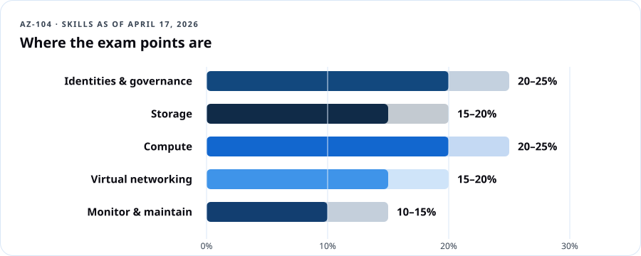
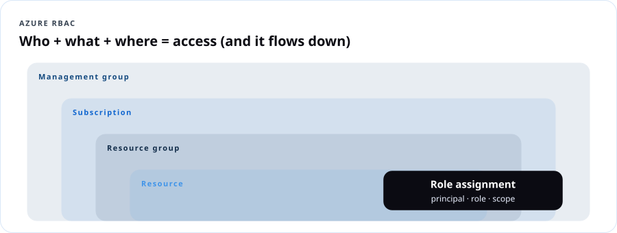
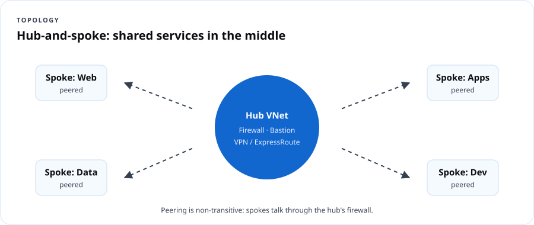
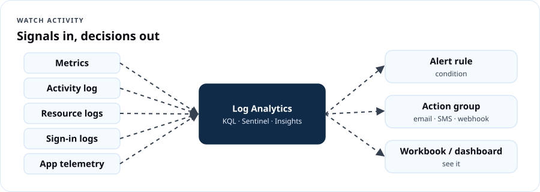

# AZ-104 Azure Administrator

## Course overview

If AZ-900 taught you the language, AZ-104 teaches you to **run the building.** Azure administrators create identities, assign access, enforce policy, build networks, deploy compute, protect storage, watch everything and recover when it breaks. This course follows Microsoft's **skills outline as of April 17, 2026** and puts a keyboard in your hands for every objective — portal *and* command line *and* Bicep.

### The exam at a glance

| Item | Detail |
|---|---|
| Exam | AZ-104: Microsoft Azure Administrator |
| Credential | Microsoft Certified: Azure Administrator Associate |
| Passing score | 700 |
| Price | $165 USD in the U.S. (varies by country) |
| Renewal | Annually, by a **free** online assessment on Microsoft Learn |
| Recommended background | OS, networking, servers, virtualization; PowerShell, Azure CLI, the portal, ARM templates or Bicep, Microsoft Entra ID |
| Free prep | [Study guide](https://aka.ms/AZ104-StudyGuide) · [Practice assessment](https://learn.microsoft.com/credentials/certifications/exams/az-104/practice/assessment?assessment-type=practice&assessmentId=21) · [Exam sandbox](https://aka.ms/examdemo) |

### Exam weights (current)

| Domain | Weight | DCT lessons |
|---|---|---|
| Manage Azure identities and governance | 20–25% | 1, 2, 3 |
| Implement and manage storage | 15–20% | 4, 5 |
| Deploy and manage Azure compute resources | 20–25% | 6, 7 |
| Implement and manage virtual networking | 15–20% | 8, 9 |
| Monitor and maintain Azure resources | 10–15% | 10 |



### Learning outcomes

1. Manage Entra users, groups, licenses, guests and SSPR.
2. Assign and interpret Azure RBAC at every scope.
3. Govern subscriptions with Policy, locks, tags, management groups and budgets.
4. Secure and configure storage accounts, SAS, keys, redundancy, replication and encryption.
5. Operate Blob Storage and Azure Files: tiers, soft delete, snapshots, lifecycle, versioning.
6. Read, modify and deploy ARM templates and Bicep files.
7. Build and manage VMs, disks, zones, scale sets, containers and App Service.
8. Build VNets, peering, routes, NSGs/ASGs, Bastion, service and private endpoints, DNS and load balancers — and troubleshoot them.
9. Monitor with metrics, logs (KQL), alerts, Insights and Network Watcher.
10. Back up and recover with Recovery Services vaults, Backup vaults and Site Recovery.

### Lab environment

- Your own Azure subscription (pay-as-you-go with a **$25 budget**, or Azure for Students). Every lab ends with a **teardown** step. Budget ~$10–20 total if you tear down promptly.
- Tools: Azure portal, **Cloud Shell** (Bash), optionally local [Azure CLI](https://learn.microsoft.com/cli/azure/install-azure-cli) and VS Code with the Bicep extension.
- Naming convention used: `rg-104-<lesson>`, region `eastus` (swap for yours).
- Microsoft's free official lab repo: [AZ-104 labs on GitHub](https://github.com/MicrosoftLearning/AZ-104-MicrosoftAzureAdministrator).

> **Watch your wallet:** Bastion, VPN gateways, Application Gateway, Site Recovery and premium SKUs bill by the hour whether you use them or not. Labs that create these tell you to delete them the same day.

### Assessment

| Component | Weight |
|---|---|
| Lesson knowledge checks (10) | 20% |
| Labs with evidence (10) | 40% |
| Capstone: build and defend "Ward 7 Community Health" environment | 25% |
| 50-question practice exam | 15% |

---

## Lesson 1 — Microsoft Entra users and groups

**Exam objectives:** create users and groups; manage user and group properties; manage licenses in Entra ID; manage external users; configure SSPR.

### 1.1 Identities you'll manage

| Object | Notes |
|---|---|
| **Member users** | Cloud-only or synced from on-prem AD (Entra Connect / Cloud Sync) |
| **Guest (external) users** | B2B collaboration; `UserType = Guest`; invited by email; sign in with their own identity |
| **Security groups** | Grant access to resources and apps |
| **Microsoft 365 groups** | Collaboration (shared mailbox, Teams, SharePoint) |
| **Assigned vs. dynamic membership** | Dynamic groups use rules like `(user.department -eq "Finance")` — requires Entra ID P1 |

> **Dope Translation:** You're running HR and the front desk at the same time. Users are employees. Guests are vendors with a visitor badge. Groups are crews — give the crew the key once instead of cutting 40 separate keys.

### 1.2 Licenses

Licenses (Microsoft 365, Entra ID P1/P2) are assigned to users **or groups** (group-based licensing). A user needs a **usage location** set before a license can be assigned. Group-based licensing is the admin-efficient answer on the exam.

### 1.3 Self-service password reset (SSPR)

- Scope: **None / Selected (one group) / All**.
- Authentication methods required: 1 or 2 (admins always need 2).
- Methods: mobile app notification/code, email, mobile phone, office phone, security questions (not for admins).
- Registration can be required at next sign-in; re-confirm every N days.
- **Password writeback** (for synced users) requires Entra Connect/Cloud Sync and P1.

### 1.4 Beyond the exam — but your job

Privileged Identity Management (PIM): just-in-time, time-bound admin roles with approval (Entra ID P2). Not in the AZ-104 outline; it's covered in DCT Cloud Security and SC-500.

### Lab 1 — Identity operations (60 min)

```bash
# Create a user
DOMAIN=$(az ad signed-in-user show --query userPrincipalName -o tsv | cut -d@ -f2)
az ad user create --display-name "Kai Brooks" \
  --user-principal-name kai.brooks@$DOMAIN \
  --password "Use-A-Long-Passphrase-2026!" --force-change-password-next-sign-in true

# Create a security group and add the user
az ad group create --display-name "sg-helpdesk" --mail-nickname sg-helpdesk
az ad group member add --group sg-helpdesk \
  --member-id $(az ad user show --id kai.brooks@$DOMAIN --query id -o tsv)
```

Portal tasks:
1. Set Kai's **usage location** and **department = IT**.
2. *Users → New user → Invite external user*: invite a personal email address as a guest. Accept it from that inbox.
3. *Password reset → Properties*: enable SSPR for **Selected → sg-helpdesk**, 2 methods.
4. If you have a P1 trial: create a **dynamic** group `dg-it` with rule `user.department -eq "IT"` and watch Kai appear.

**Evidence:** screenshots of group membership, guest user (UserType Guest), SSPR settings. **Teardown:** delete test users and guest.

### Lesson 1 knowledge check

```quiz
Q: You need all members of the Finance department to automatically join a group. What do you configure?
- [ ] Assigned membership
- [x] Dynamic membership rule based on department
- [ ] Group-based licensing
- [ ] SSPR
E: Dynamic groups evaluate user attributes (requires Entra ID P1).

Q: A license assignment fails for a new user. What property must be set first?
- [ ] Job title
- [x] Usage location
- [ ] Manager
- [ ] Department
E: Usage location is required for license assignment.

Q: Which SSPR method is NOT available to administrators?
- [ ] Mobile app
- [ ] Email
- [x] Security questions
- [ ] Mobile phone
E: Admins must use stronger methods; security questions aren't allowed.

Q: A vendor needs to access a SharePoint site with their own corporate account. You should:
- [x] Invite them as a B2B guest user
- [ ] Create a member account with a new password
- [ ] Share your password
- [ ] Add them to Entra Domain Services
E: External users are invited as guests.
```

---

## Lesson 2 — Manage access to Azure resources (RBAC)

**Exam objectives:** manage built-in Azure roles; assign roles at different scopes; interpret access assignments.

### 2.1 The RBAC formula

**Security principal** (who) + **role definition** (what) + **scope** (where) = **role assignment.**



| Scope | Inherits to |
|---|---|
| Management group | All child MGs, subscriptions, RGs, resources |
| Subscription | All RGs and resources |
| Resource group | All resources in it |
| Resource | Only that resource |

Key built-ins: **Owner**, **Contributor**, **Reader**, **User Access Administrator**, **Role Based Access Control Administrator** (can assign roles, with optional conditions limiting which roles), and service roles like **Virtual Machine Contributor**, **Storage Blob Data Reader/Contributor**, **Network Contributor**.

### 2.2 Interpreting access

- RBAC is **additive**: effective permissions = union of all assignments.
- **Deny assignments** (created by Azure, e.g., managed apps/deployment stacks) override allows.
- Role definitions split **Actions** (control plane: manage the resource) and **DataActions** (data plane: read the blob). **Owner on a storage account does not automatically let you read blob data with Entra auth** — you need a *Storage Blob Data* role.
- Azure RBAC roles ≠ Entra roles (Global Administrator manages the directory, not Azure resources — though a Global Admin can elevate to User Access Administrator at root).

> **Dope Translation:** Owning the building (Owner) doesn't mean you can read the mail inside tenant mailboxes (DataActions). Different key. Microsoft did that on purpose.

### Lab 2 — Assign and prove (45 min)

```bash
az group create -n rg-104-rbac -l eastus
GID=$(az ad group show --group sg-helpdesk --query id -o tsv)
az role assignment create --assignee-object-id $GID --assignee-principal-type Group \
  --role "Virtual Machine Contributor" --resource-group rg-104-rbac
az role assignment list -g rg-104-rbac -o table
```
1. Portal → `rg-104-rbac` → *Access control (IAM)* → **Check access** for Kai. Note inherited vs. direct assignments.
2. Open the role definition JSON for *Virtual Machine Contributor*. Can it manage the VNet the VM's NIC connects to? (Read the Actions to answer.)
3. **Teardown:** remove the assignment.

### Lesson 2 knowledge check

```quiz
Q: A user has Reader at the subscription and Contributor on one resource group. What can they do in that resource group?
- [ ] Only read
- [x] Manage resources (Contributor), because RBAC is additive
- [ ] Nothing — the assignments conflict
- [ ] Assign roles to others
E: Effective permissions are the union of assignments.

Q: Which role lets someone manage resources but not grant access?
- [ ] Owner
- [x] Contributor
- [ ] User Access Administrator
- [ ] Role Based Access Control Administrator
E: Contributor excludes Microsoft.Authorization write actions.

Q: An Owner of a storage account can't read blobs when using Entra ID authentication. Why?
- [x] Blob reading is a DataAction; they need a Storage Blob Data role
- [ ] Owners are read-only
- [ ] The storage firewall is off
- [ ] SAS is required for all access
E: Control-plane and data-plane permissions are separate.

Q: Where do you assign a role so it applies to every subscription in a department?
- [ ] Each resource
- [ ] A tag
- [x] The department's management group
- [ ] Entra ID group properties
E: Management-group assignments inherit to all child subscriptions.
```

---

## Lesson 3 — Subscriptions and governance

**Exam objectives:** implement and manage Azure Policy; configure resource locks; apply and manage tags; manage resource groups; manage subscriptions; manage costs with alerts, budgets and Advisor; configure management groups.

### 3.1 Azure Policy

| Concept | Meaning |
|---|---|
| **Definition** | One rule (JSON) with an **effect** |
| **Initiative** (policy set) | A bundle of definitions — e.g., *Microsoft cloud security benchmark*, *NIST SP 800-53 Rev. 5*, *FedRAMP High* |
| **Assignment** | Definition/initiative applied at a scope, with parameters and **exclusions** |
| **Effects** | `Deny`, `Audit`, `Append`, `Modify`, `AuditIfNotExists`, `DeployIfNotExists`, `Disabled`, `DenyAction`, `Manual` |
| **Remediation** | For `Modify`/`DeployIfNotExists`, a remediation task fixes *existing* resources using a **managed identity** |
| **Compliance** | Evaluated on create/update and on a periodic cycle; trigger on demand with `az policy state trigger-scan` |

> **Dope Translation:** RBAC decides *who* can walk in the kitchen. Policy decides *what's allowed to be cooked*. Even the head chef can't put shellfish on the menu if the policy says no shellfish.

### 3.2 Locks, tags, resource groups, subscriptions, management groups

- **Locks:** `CanNotDelete` / `ReadOnly`; inherit downward; override RBAC. ReadOnly can have side effects (e.g., listing storage keys is a POST and gets blocked).
- **Tags:** up to 50 per resource; **not inherited** — use the built-in *Inherit a tag from the resource group* policy (Modify effect).
- **Moving resources:** between RGs/subscriptions — source and target RGs are locked during the move; not every resource type supports moves; the resource's region doesn't change.
- **Subscriptions:** transfer billing ownership, change the directory, rename, cancel; subscription-level budgets.
- **Management groups:** root MG per tenant, up to 6 levels deep (excluding root), each subscription in exactly one MG.

### 3.3 Cost controls

**Budgets** (actual/forecast alerts, action groups), **cost alerts**, **Advisor** cost recommendations (resize/shut down idle VMs, buy reservations), **reservations** and **savings plans**.

### Lab 3 — Governance build (60 min)

```bash
az group create -n rg-104-gov -l eastus --tags env=lab dept=it
# Require a 'dept' tag on resource groups (built-in definition)
DEF=$(az policy definition list --query "[?displayName=='Require a tag on resource groups'].name" -o tsv)
az policy assignment create --name require-dept-tag --policy $DEF \
  --scope /subscriptions/$(az account show --query id -o tsv) \
  --params '{"tagName":{"value":"dept"}}'
# Try to break it
az group create -n rg-104-notag -l eastus   # should be denied
# Lock
az lock create --name nodelete --lock-type CanNotDelete --resource-group rg-104-gov
az group delete -n rg-104-gov --yes        # should fail
```
Then: create a $10 **budget** on `rg-104-gov` with an **action group** that emails you; open **Advisor → Cost**.
**Teardown:** remove the lock, delete the policy assignment, delete the RG.

### Lesson 3 knowledge check

```quiz
Q: Existing storage accounts lack a required tag. Which policy capability fixes them?
- [ ] Deny effect
- [x] A Modify policy with a remediation task
- [ ] A resource lock
- [ ] An RBAC assignment
E: Remediation tasks apply Modify/DeployIfNotExists to existing resources using a managed identity.

Q: Which lock blocks updates AND deletions?
- [ ] CanNotDelete
- [x] ReadOnly
- [ ] Deny assignment
- [ ] Audit
E: ReadOnly blocks both.

Q: Tags applied to a resource group are inherited by its resources by default.
- [ ] True
- [x] False
E: Use the "Inherit a tag from the resource group" policy to propagate tags.

Q: You need to exclude one dev subscription from a policy assigned at a management group. Use:
- [x] An exclusion on the assignment
- [ ] A ReadOnly lock
- [ ] A new tenant
- [ ] Reader role
E: Assignments support exclusions (or exemptions).

Q: During a resource move between resource groups:
- [ ] The resource changes region
- [x] Both source and target resource groups are locked for changes until the move completes
- [ ] All tags are deleted
- [ ] The resource gets a new resource ID only if it's a VM
E: RGs are locked during moves; region is unchanged; the resource ID changes because the path changes.
```

---

## Lesson 4 — Storage access and storage accounts

**Exam objectives:** storage firewalls and virtual networks; SAS tokens; stored access policies; access keys; identity-based access for Azure Files; create/configure accounts; redundancy; object replication; encryption; Storage Explorer and AzCopy.

### 4.1 Ways in, from strongest to weakest

| Method | Notes |
|---|---|
| **Entra ID + RBAC** (data roles) | Preferred. No secrets. Audit-friendly |
| **User delegation SAS** | SAS signed with Entra credentials; Blob only; max 7 days |
| **Service SAS** | Access to one service's resources; can reference a **stored access policy** |
| **Account SAS** | Multiple services; powerful; signed with account key |
| **Access keys** | Two keys = full control. Rotate (key1/key2 swap) or store in Key Vault. Consider **disabling shared key access** |
| **Anonymous public read** | Off by default; keep it off at the account level unless hosting public content |

**Stored access policy:** defines start/expiry/permissions on a container/share/queue/table; SAS tokens that reference it can be **revoked** by changing or deleting the policy (up to 5 per container).

> **Dope Translation:** Access keys are the landlord's master key — lose it, rekey the whole building. A SAS is a valet ticket: one car, one night, one parking deck. A stored access policy is the valet stand's list — scratch your name off and every ticket under it stops working.

### 4.2 Network rules

Storage **firewall**: allow selected VNets/subnets (service endpoints), IP ranges, resource instances and trusted Microsoft services; or disable public access and use **private endpoints**.

### 4.3 Account configuration

- **Kind/performance:** Standard GPv2; Premium block blob, file, page blob.
- **Redundancy:** LRS, ZRS, GRS, RA-GRS, GZRS, RA-GZRS; change via portal (some conversions need a request or migration).
- **Object replication:** async copy of block blobs between accounts; requires **blob versioning** on both accounts and **change feed** on source.
- **Encryption:** always on (AES-256) with Microsoft-managed keys by default; **customer-managed keys** in Key Vault; **infrastructure (double) encryption** set at creation; **encryption scopes** per container/blob.
- **Azure Files identity-based access:** on-prem AD DS, Microsoft Entra Domain Services, or **Microsoft Entra Kerberos** (for hybrid identities); share-level RBAC (*Storage File Data SMB Share Reader/Contributor/Elevated Contributor*) + NTFS permissions.

### 4.4 Data movement

**AzCopy** (`azcopy login`, `azcopy copy`, `azcopy sync`) and **Storage Explorer**.

### Lab 4 — Lock down a storage account (75 min)

```bash
RG=rg-104-stor; LOC=eastus; SA=st104$RANDOM
az group create -n $RG -l $LOC --tags dept=it
az storage account create -n $SA -g $RG -l $LOC --sku Standard_ZRS --kind StorageV2 \
  --min-tls-version TLS1_2 --allow-blob-public-access false
ME=$(az ad signed-in-user show --query id -o tsv)
az role assignment create --assignee $ME --role "Storage Blob Data Contributor" \
  --scope $(az storage account show -n $SA -g $RG --query id -o tsv)
az storage container create --account-name $SA -n reports --auth-mode login
echo "Q3 attendance: 412" > report.txt
az storage blob upload --account-name $SA -c reports -n report.txt -f report.txt --auth-mode login
# User delegation SAS, read-only, 1 hour
END=$(date -u -d "+1 hour" '+%Y-%m-%dT%H:%MZ')
az storage blob generate-sas --account-name $SA -c reports -n report.txt \
  --permissions r --expiry $END --auth-mode login --as-user --full-uri
```
1. Open the SAS URL in a browser (works). Wait for expiry or regenerate with a past `--start` to see failure.
2. *Networking* → **Enabled from selected virtual networks and IP addresses** → add only your client IP. Test from Cloud Shell (blocked unless its IP is added).
3. *Access keys* → rotate key1. *Configuration* → set **Allow storage account key access = Disabled** and observe what breaks.
4. Use **Storage Explorer** with your Entra account to browse the container.
**Teardown:** delete `rg-104-stor`.

### Lesson 4 knowledge check

```quiz
Q: You must be able to revoke a set of SAS tokens without rotating account keys. Use:
- [ ] Account SAS
- [x] A service SAS tied to a stored access policy
- [ ] A ReadOnly lock
- [ ] Anonymous access
E: Changing or deleting the stored access policy revokes associated SAS tokens.

Q: Object replication requires which settings?
- [x] Blob versioning on source and destination, and change feed on source
- [ ] GRS on both accounts
- [ ] A private endpoint
- [ ] Premium performance
E: These are the prerequisites for object replication.

Q: Which SAS type is signed with Microsoft Entra credentials?
- [ ] Account SAS
- [ ] Service SAS
- [x] User delegation SAS
- [ ] Stored access policy
E: User delegation SAS uses a user delegation key from Entra ID.

Q: Hybrid users need Kerberos access to Azure Files without domain controllers in Azure. Use:
- [x] Microsoft Entra Kerberos for hybrid identities
- [ ] Shared key only
- [ ] Anonymous access
- [ ] Account SAS
E: Entra Kerberos supports identity-based access for hybrid users.

Q: Infrastructure (double) encryption for a storage account must be enabled:
- [x] When the account is created
- [ ] Any time later
- [ ] Only with LRS
- [ ] Only for Azure Files
E: Infrastructure encryption is a create-time setting.
```

---

## Lesson 5 — Azure Files and Blob Storage operations

**Exam objectives:** file shares; blob containers; storage tiers; soft delete for blobs and containers; snapshots and soft delete for Azure Files; blob lifecycle management; blob versioning.

### 5.1 Data protection features

| Feature | Protects against | Notes |
|---|---|---|
| **Blob soft delete** | Deleted/overwritten blobs | Retention 1–365 days |
| **Container soft delete** | Deleted containers | Retention 1–365 days |
| **Blob versioning** | Overwrites — keeps prior versions automatically | Pairs with soft delete; adds storage cost |
| **Point-in-time restore** | Restore block blobs to an earlier state | Requires versioning, change feed, soft delete |
| **Azure Files share snapshots** | Accidental changes to files | Read-only, incremental, up to 200 per share |
| **Azure Files soft delete** | Deleted shares | 1–365 days |

### 5.2 Tiers and lifecycle

Online tiers: **Hot, Cool (30-day min), Cold (90-day min)**; offline **Archive (180-day min)**, rehydrate with *Standard* or *High* priority. **Lifecycle management** rules move or delete blobs based on days since creation, modification or last access (last-access tracking must be enabled).

```json
{
  "rules": [{
    "name": "age-out-reports",
    "enabled": true,
    "type": "Lifecycle",
    "definition": {
      "filters": { "blobTypes": ["blockBlob"], "prefixMatch": ["reports/"] },
      "actions": { "baseBlob": {
        "tierToCool":   { "daysAfterModificationGreaterThan": 30 },
        "tierToArchive":{ "daysAfterModificationGreaterThan": 180 },
        "delete":       { "daysAfterModificationGreaterThan": 2555 }
      }}
    }
  }]
}
```

> **Dope Translation:** Lifecycle management is the rule in grandma's house: if you haven't worn it in a month it goes to the closet, six months it goes to the attic, seven years it goes to Goodwill. Nobody has to remember — the house does it.

### Lab 5 — Protect and age data (60 min)

1. New account (`Standard_LRS`). *Data protection*: enable blob soft delete (7 days), container soft delete (7 days), **versioning**.
2. Upload `notes.txt`, overwrite it twice, then delete it. Use *Show deleted blobs* and *Versions* to restore the first version.
3. Save the JSON above as `policy.json` and apply:
   ```bash
   az storage account management-policy create --account-name $SA -g $RG --policy @policy.json
   ```
4. Create an Azure Files share `teamshare` (Transaction optimized), upload a file, take a **snapshot**, edit the file, restore from snapshot.
**Teardown:** delete the RG.

### Lesson 5 knowledge check

```quiz
Q: A user overwrote a critical blob 2 hours ago. Which feature lets you retrieve the earlier content most directly?
- [x] Blob versioning
- [ ] Container soft delete
- [ ] Lifecycle management
- [ ] Archive tier
E: Versioning keeps prior versions on overwrite.

Q: What is the maximum number of snapshots per Azure file share?
- [ ] 50
- [ ] 100
- [x] 200
- [ ] Unlimited
E: Azure Files supports up to 200 share snapshots.

Q: Which tier has a 90-day minimum retention?
- [ ] Hot
- [ ] Cool
- [x] Cold
- [ ] Archive
E: Cool 30 days, Cold 90, Archive 180.

Q: To tier blobs based on last access time you must first:
- [ ] Enable GRS
- [x] Enable last access time tracking
- [ ] Disable versioning
- [ ] Use Premium storage
E: Access-time-based rules require tracking to be enabled.
```

---

## Lesson 6 — ARM templates, Bicep and virtual machines

**Exam objectives:** interpret, modify and deploy ARM templates and Bicep files; export a deployment / convert ARM to Bicep; create VMs; encryption at host; move VMs; sizes; disks; availability zones and sets; Virtual Machine Scale Sets.

### 6.1 Reading infrastructure as code

ARM template sections: `$schema`, `contentVersion`, `parameters`, `variables`, `resources`, `outputs` (plus `functions`). Bicep is the same thing, readable:

```bicep
@description('Storage account name')
param name string = 'st${uniqueString(resourceGroup().id)}'
param location string = resourceGroup().location
@allowed(['Standard_LRS','Standard_ZRS'])
param sku string = 'Standard_LRS'

resource sa 'Microsoft.Storage/storageAccounts@2023-05-01' = {
  name: name
  location: location
  sku: { name: sku }
  kind: 'StorageV2'
  properties: {
    minimumTlsVersion: 'TLS1_2'
    allowBlobPublicAccess: false
  }
}
output endpoint string = sa.properties.primaryEndpoints.blob
```

Deploy and convert:

```bash
az deployment group create -g rg-104-iac --template-file main.bicep --parameters sku=Standard_ZRS
az deployment group what-if -g rg-104-iac --template-file main.bicep   # preview changes
az bicep decompile --file exported-template.json                        # ARM → Bicep
```
Deployment **modes**: *Incremental* (default — adds/updates, leaves others) vs. *Complete* (deletes resources in the RG not in the template).

> **Dope Translation:** A Bicep file is the recipe card. ARM is the kitchen that cooks it exactly the same every time. `what-if` is tasting the sauce before you serve it.

### 6.2 Virtual machines — admin essentials

| Task | Key facts |
|---|---|
| **Sizes** | Families: B (burstable), D (general), E (memory), F (compute), L (storage), N (GPU). Resize may need a deallocate if the size isn't on the current hardware cluster |
| **Disks** | OS disk, data disks, temporary disk (non-persistent!). Types: Standard HDD, Standard SSD, Premium SSD, Premium SSD v2, Ultra. Expand size; attach/detach; snapshots |
| **Encryption at host** | Encrypts temp disk and caches at the host; register the `EncryptionAtHost` feature; set at create or while deallocated. (Azure Disk Encryption is on a retirement path — prefer encryption at host) |
| **Availability** | **Availability set**: fault domains + update domains in one datacenter (99.95% SLA). **Availability zones**: separate datacenters (99.99% with 2+ zones) |
| **Scale sets (VMSS)** | Flexible orchestration (recommended) vs. Uniform; autoscale on metrics or schedule; span zones |
| **Move** | To another RG/subscription via *Move*; to another region via **Azure Resource Mover** or Site Recovery |

### Lab 6 — Code it, build it, resize it (90 min)

```bash
az group create -n rg-104-vm -l eastus --tags dept=it
az feature register --namespace Microsoft.Compute --name EncryptionAtHost   # one-time
az vm create -g rg-104-vm -n vm-web1 --image Ubuntu2404 --size Standard_B2s \
  --admin-username azureuser --generate-ssh-keys --zone 1 \
  --public-ip-sku Standard --encryption-at-host true --nsg-rule NONE
az vm disk attach -g rg-104-vm --vm-name vm-web1 --name vm-web1-data --new --size-gb 32 --sku StandardSSD_LRS
az vm list-vm-resize-options -g rg-104-vm -n vm-web1 -o table
az vm resize -g rg-104-vm -n vm-web1 --size Standard_B2ms
az vmss create -g rg-104-vm -n vmss-web --image Ubuntu2404 --instance-count 2 \
  --zones 1 2 3 --orchestration-mode Flexible --admin-username azureuser --generate-ssh-keys
```
Then deploy the Bicep storage file above into `rg-104-iac`, run `what-if` after changing the SKU, and export the VM's template from the portal and `decompile` it.
**Teardown:** delete `rg-104-vm` and `rg-104-iac` today.

### Lesson 6 knowledge check

```quiz
Q: Which deployment mode removes resources in the resource group that are not in the template?
- [ ] Incremental
- [x] Complete
- [ ] What-if
- [ ] Validate
E: Complete mode deletes resources not defined in the template.

Q: Which disk loses its data when a VM is deallocated or moved to new hardware?
- [ ] OS disk
- [ ] Data disk
- [x] Temporary disk
- [ ] Premium SSD v2
E: The temp disk is non-persistent.

Q: For the highest VM SLA in a region, deploy two or more VMs across:
- [ ] An availability set
- [x] Availability zones
- [ ] Two resource groups
- [ ] Two subscriptions
E: Zone deployments offer 99.99%.

Q: Which command previews what a Bicep deployment will change?
- [ ] az bicep build
- [x] az deployment group what-if
- [ ] az group export
- [ ] az vm list
E: What-if shows creates, modifies and deletes before deployment.

Q: You need to move a VM to another Azure region. Which tool is designed for this?
- [ ] Resource lock
- [x] Azure Resource Mover (or Site Recovery)
- [ ] Azure Policy
- [ ] AzCopy
E: Moves between RGs/subscriptions don't change region; Resource Mover handles region moves.
```

---

## Lesson 7 — Containers and App Service

**Exam objectives:** Azure Container Registry; ACI; Azure Container Apps; container sizing and scaling; App Service plans and scaling; create App Service; TLS/certificates; custom DNS; backup; networking; deployment slots.

### 7.1 Containers

| Service | Use | Scaling |
|---|---|---|
| **Azure Container Registry (ACR)** | Private image registry; SKUs Basic/Standard/Premium (geo-replication, private link) | — |
| **Azure Container Instances (ACI)** | Single containers/groups, fast, per-second billing | Manual; set CPU/memory per container group |
| **Azure Container Apps** | Serverless containers on managed Kubernetes (KEDA-based) | Autoscale on HTTP, events, CPU; **scale to zero** |

### 7.2 App Service

- **Plan** = the compute (tier + instance count). Tiers: Free/Shared → Basic → Standard → Premium v3 → Isolated v2. Slots, autoscale and daily backups start at **Standard**; Basic supports manual scale out.
- **Scale up** (bigger tier) vs. **scale out** (more instances, manual or autoscale rules).
- **Custom domains:** verify with a TXT record (`asuid.<subdomain>`) plus CNAME (subdomain) or A record (apex). **TLS:** free App Service managed certificate, imported cert, or Key Vault cert; enforce **HTTPS only** and minimum TLS 1.2.
- **Backup:** automatic backups (supported tiers) or custom backups to a storage account.
- **Networking:** *inbound* — access restrictions, private endpoints; *outbound* — **VNet integration** to reach private resources.
- **Deployment slots:** staging slot → warm up → **swap** (zero-downtime); slot-specific ("sticky") settings stay with the slot.

> **Dope Translation:** A deployment slot is the dressing room. The new outfit gets checked in the mirror backstage. When it's right, swap — the crowd sees you walk out already dressed. Something's off? Swap back.

### Lab 7 — Ship it with zero downtime (75 min)

```bash
RG=rg-104-app; az group create -n $RG -l eastus --tags dept=it
az acr create -g $RG -n acr104$RANDOM --sku Basic
az container create -g $RG -n aci-hello --image mcr.microsoft.com/azuredocs/aci-helloworld \
  --os-type Linux --cpu 1 --memory 1.5 --ports 80 --dns-name-label aci104$RANDOM
az containerapp up -g $RG -n ca-hello --image mcr.microsoft.com/k8se/quickstart:latest \
  --ingress external --target-port 80
az appservice plan create -g $RG -n plan104 --sku S1 --is-linux
APP=web104$RANDOM
az webapp create -g $RG -p plan104 -n $APP --runtime "NODE:20-lts"
az webapp update -g $RG -n $APP --https-only true
az webapp deployment slot create -g $RG -n $APP --slot staging
az webapp deployment slot swap -g $RG -n $APP --slot staging --target-slot production
```
In the portal: add an **autoscale** rule on the plan (CPU > 70% → +1 instance, max 3), set an app setting as **deployment slot setting**, and review *Networking* → access restrictions.
**Teardown:** delete `rg-104-app` (the S1 plan bills hourly).

### Lesson 7 knowledge check

```quiz
Q: Which App Service tier is the minimum for deployment slots?
- [ ] Free
- [ ] Basic
- [x] Standard
- [ ] Shared
E: Slots and autoscale start at Standard.

Q: Which container service can scale to zero based on HTTP traffic or events?
- [ ] ACI
- [x] Azure Container Apps
- [ ] ACR
- [ ] App Service Free tier
E: Container Apps uses KEDA-based autoscaling, including to zero.

Q: To verify a custom domain on App Service you add:
- [x] A TXT record (asuid) plus a CNAME or A record
- [ ] An MX record
- [ ] A private endpoint
- [ ] An NSG rule
E: Domain verification uses asuid TXT records.

Q: A web app must reach a database in a private VNet. Configure:
- [ ] Access restrictions
- [x] VNet integration
- [ ] A deployment slot
- [ ] A custom domain
E: VNet integration handles outbound traffic into a VNet.
```

---

## Lesson 8 — Virtual networks and secure access

**Exam objectives:** VNets and subnets; peering; public IPs; user-defined routes; troubleshoot connectivity; NSGs and ASGs; effective security rules; Azure Bastion; service endpoints; private endpoints.

### 8.1 Address planning

CIDR refresher: `/16` = 65,536 addresses; `/24` = 256; `/26` = 64; `/27` = 32. **Azure reserves 5 IPs per subnet** (first four and last). Address spaces in peered VNets **must not overlap.**



### 8.2 Connectivity

- **Peering:** non-transitive (A↔B and B↔C does **not** give A↔C); configure both directions; options: allow forwarded traffic, gateway transit, use remote gateways.
- **Public IPs:** Standard SKU (zone-redundant, secure by default, static) — Basic SKU was retired September 30, 2025.
- **User-defined routes (UDRs):** route tables on subnets to override system routes — e.g., `0.0.0.0/0 → VirtualAppliance 10.0.0.4` (a firewall).

### 8.3 Filtering

- **NSG rules:** priority 100–4096, **lower number wins**, first match stops processing; 5-tuple (source, source port, destination, destination port, protocol); default rules (65000+) allow VNet and load balancer traffic, deny the rest inbound.
- NSG on **subnet and NIC**: inbound traffic is evaluated by the subnet NSG then the NIC NSG; both must allow.
- **Application security groups (ASGs):** group NICs by role (`asg-web`, `asg-db`) and write rules against them instead of IPs.
- **Effective security rules:** the merged view per NIC — your first stop when troubleshooting.

> **Dope Translation:** NSG rules are the bouncer's list read top to bottom. The first line that matches your name decides — in or out — and he stops reading. Lower number = higher on the list.

### 8.4 Secure admin access and PaaS access

- **Azure Bastion:** browser-based RDP/SSH over TLS without public IPs on VMs. Needs a subnet named **`AzureBastionSubnet`** (/26 or larger for Basic/Standard). SKUs: Developer (free, limited), Basic, Standard, Premium.
- **Service endpoints:** extend a subnet's identity to a PaaS service; traffic uses the Azure backbone; the service still has a public endpoint.
- **Private endpoints:** a NIC with a private IP from your subnet for a specific PaaS resource; needs **private DNS** (`privatelink.blob.core.windows.net`) to resolve correctly.

### Lab 8 — Hub, spoke, and lockdown (120 min — delete the same day)

```bash
RG=rg-104-net; L=eastus; az group create -n $RG -l $L --tags dept=it
az network vnet create -g $RG -n vnet-hub --address-prefixes 10.0.0.0/16 \
  --subnet-name AzureBastionSubnet --subnet-prefixes 10.0.1.0/26
az network vnet create -g $RG -n vnet-spoke1 --address-prefixes 10.1.0.0/16 \
  --subnet-name web --subnet-prefixes 10.1.1.0/24
az network vnet peering create -g $RG -n hub-to-spoke1 --vnet-name vnet-hub \
  --remote-vnet vnet-spoke1 --allow-vnet-access
az network vnet peering create -g $RG -n spoke1-to-hub --vnet-name vnet-spoke1 \
  --remote-vnet vnet-hub --allow-vnet-access
az network asg create -g $RG -n asg-web
az network nsg create -g $RG -n nsg-web
az network nsg rule create -g $RG --nsg-name nsg-web -n allow-http --priority 100 \
  --direction Inbound --access Allow --protocol Tcp --destination-port-ranges 80 \
  --destination-asgs asg-web
az network vnet subnet update -g $RG --vnet-name vnet-spoke1 -n web --network-security-group nsg-web
az vm create -g $RG -n vm-spoke1 --image Ubuntu2404 --size Standard_B1s \
  --vnet-name vnet-spoke1 --subnet web --public-ip-address "" --nsg "" \
  --asgs asg-web --admin-username azureuser --generate-ssh-keys
```
1. Deploy **Bastion (Basic)** into the hub; connect to `vm-spoke1` over SSH in the browser through peering.
2. NIC → **Effective security rules**. Explain each line.
3. Create a storage account; add a **private endpoint** in `web` with private DNS integration; from the VM, `nslookup <account>.blob.core.windows.net` returns a 10.x address.
4. Create a route table with `0.0.0.0/0 → VirtualAppliance 10.0.0.4`, associate to `web`, and observe broken internet egress in **Network Watcher → Next hop**. Remove it.
**Teardown:** delete `rg-104-net` today (Bastion bills hourly).

### Lesson 8 knowledge check

```quiz
Q: VNet A is peered with B, and B with C. Can A reach C by default?
- [ ] Yes, peering is transitive
- [x] No, peering is non-transitive
- [ ] Only over IPv6
- [ ] Only if all VNets are in the same region
E: Use a hub NVA/firewall, Virtual WAN, or direct A–C peering.

Q: Two NSG rules match: priority 200 Deny and priority 300 Allow. Result?
- [x] Denied — the lower number is processed first
- [ ] Allowed — Allow always wins
- [ ] Both apply
- [ ] Error
E: Lowest priority number wins; processing stops at the first match.

Q: What subnet name does Azure Bastion require?
- [ ] BastionSubnet
- [ ] GatewaySubnet
- [x] AzureBastionSubnet
- [ ] AzureFirewallSubnet
E: The name is mandatory.

Q: How many IP addresses does Azure reserve in each subnet?
- [ ] 2
- [ ] 3
- [ ] 4
- [x] 5
E: The first four and the last address are reserved.

Q: A private endpoint resolves to a public IP from your VM. What's most likely missing?
- [ ] A service endpoint
- [x] Private DNS zone integration
- [ ] A public IP
- [ ] A UDR
E: Private endpoints need privatelink DNS records.

Q: You want NSG rules that target "all web servers" without listing IPs. Use:
- [x] Application security groups
- [ ] Service tags only
- [ ] Route tables
- [ ] Peering
E: ASGs group NICs logically.
```

---

## Lesson 9 — Name resolution and load balancing

**Exam objectives:** configure Azure DNS; configure an internal or public load balancer; troubleshoot load balancing.

### 9.1 Azure DNS

- **Public DNS zones:** host your domain's records (A, AAAA, CNAME, MX, TXT, SRV, CAA, NS); delegate by updating NS records at your registrar. **Alias records** point at Azure resources (public IP, Front Door, Traffic Manager) and update automatically.
- **Private DNS zones:** name resolution inside VNets; **virtual network links** with optional **auto-registration** of VM records.
- **Azure DNS Private Resolver:** conditional forwarding between on-prem and Azure private zones.

### 9.2 Azure Load Balancer (Layer 4)

| Part | Purpose |
|---|---|
| Frontend IP | Public (internet-facing) or private (internal) |
| Backend pool | VMs/VMSS instances (by NIC or IP) |
| Health probe | TCP/HTTP/HTTPS check; unhealthy instances removed |
| Load-balancing rule | Frontend port → backend port; distribution (5-tuple hash default, or session persistence by client IP) |
| Inbound NAT rule | Port-forward to a specific VM |
| Outbound rule | SNAT for backend internet egress |

**Standard SKU** only (Basic retired Sept 30, 2025): zone-redundant, secure by default — **backends need an NSG that allows the traffic.**

### 9.3 Troubleshooting checklist

1. Health probe status (Insights / metrics *Health Probe Status*). Is the app listening on the probe port/path?
2. NSG on backend allows traffic from the client **and** from the `AzureLoadBalancer` service tag (probe source 168.63.129.16).
3. Backend in the right pool, VM running, guest firewall open.
4. Rule ports correct; floating IP settings match the app design.
5. Use **Network Watcher** (IP flow verify, connection troubleshoot).

### Beyond the exam: choosing a load balancer

| Service | Layer | Scope | Use |
|---|---|---|---|
| Load Balancer | 4 | Regional | TCP/UDP for VMs |
| Application Gateway (+ WAF) | 7 | Regional | HTTP routing by path/host, TLS termination, WAF |
| Front Door | 7 | Global | Global HTTP acceleration, CDN, WAF |
| Traffic Manager | DNS | Global | DNS-based routing (priority, performance, geographic) |

> **Dope Translation:** Load Balancer is the host at the door sending each party to the next open table. App Gateway reads your reservation and sends you to the right room. Front Door is the host stand in every city. Traffic Manager is the phone directory telling you which city to drive to.

### Lab 9 — Balance it and break it (75 min)

1. Create two Ubuntu VMs in a backend subnet with `cloud-init` installing nginx (`apt-get install -y nginx` and write the hostname into `index.html`).
2. Create a **Standard public Load Balancer**: frontend IP, backend pool (both VMs), HTTP probe on `/`, rule 80→80.
3. Refresh the frontend IP — watch both hostnames appear.
4. **Break it:** stop nginx on one VM → probe marks it down → traffic shifts. Then remove the NSG allow rule → everything fails. Fix it with the checklist.
5. Create a **private DNS zone** `corp.dct` linked to the VNet with auto-registration; `nslookup vm1.corp.dct` from the other VM.
**Teardown:** delete the RG.

### Lesson 9 knowledge check

```quiz
Q: A Standard Load Balancer's backends receive no traffic. NSGs allow port 80 from the internet only. What's missing?
- [x] An allow rule for the AzureLoadBalancer service tag so health probes succeed
- [ ] A Basic SKU public IP
- [ ] An MX record
- [ ] A deployment slot
E: Probes come from 168.63.129.16 (AzureLoadBalancer); if probes fail, instances are removed.

Q: Which record type lets an apex domain point directly at an Azure public IP resource and update automatically?
- [ ] CNAME
- [x] Alias record
- [ ] MX
- [ ] SRV
E: Alias records reference Azure resources.

Q: VMs should register their own names in a private zone automatically. Enable:
- [x] Auto-registration on the virtual network link
- [ ] Public zone delegation
- [ ] An outbound rule
- [ ] Session persistence
E: Auto-registration creates A records for VMs in the linked VNet.

Q: Which load balancer operates at Layer 4?
- [x] Azure Load Balancer
- [ ] Application Gateway
- [ ] Front Door
- [ ] Traffic Manager
E: Load Balancer works on TCP/UDP.
```

---

## Lesson 10 — Monitor and maintain

**Exam objectives:** interpret metrics; configure log settings; query and analyze logs; alert rules, action groups and alert processing rules; Insights for VMs, storage and networks; Network Watcher and Connection monitor; Recovery Services vault; Backup vault; backup policies; backup and restore; Site Recovery; failover; backup reports and alerts.

### 10.1 Azure Monitor building blocks



| Piece | Admin action |
|---|---|
| **Metrics** | Numeric time series (CPU %, requests); Metrics Explorer; near-real-time |
| **Activity log** | Who did what at the control plane (create/delete); 90 days by default |
| **Resource logs** | Per-resource detailed logs; need a **diagnostic setting** to send to Log Analytics, storage or Event Hubs |
| **Log Analytics workspace** | Central log store queried with **KQL** |
| **Azure Monitor Agent + data collection rules** | Collect guest OS logs/perf from VMs |
| **Alert rules** | Metric, log search, activity log, resource health, service health |
| **Action groups** | *Who/what* gets notified (email, SMS, webhook, Logic App, Function, ITSM) |
| **Alert processing rules** | Suppress (e.g., during maintenance) or add action groups at scale |
| **Insights** | VM insights, Storage insights, Network insights — prebuilt workbooks |
| **Network Watcher** | IP flow verify, next hop, connection troubleshoot, **Connection monitor**, packet capture, flow logs |

KQL you should be able to read:

```kusto
// VMs that stopped sending heartbeats in the last 15 minutes
Heartbeat
| summarize LastBeat = max(TimeGenerated) by Computer
| where LastBeat < ago(15m)

// Who deleted resources today
AzureActivity
| where TimeGenerated > startofday(now())
| where OperationNameValue endswith "DELETE" and ActivityStatusValue == "Success"
| project TimeGenerated, Caller, ResourceGroup, _ResourceId
```

> **Dope Translation:** Metrics are the dashboard gauges. Logs are the receipts. KQL is how you search the shoebox of receipts in two seconds. Action groups are who gets the phone call when the alarm goes off.

### 10.2 Backup and disaster recovery

| | Recovery Services vault | Backup vault |
|---|---|---|
| Protects | Azure VMs, SQL/SAP HANA in VMs, Azure Files, on-prem (MARS/MABS) | Azure Disks, Blobs, Azure Database for PostgreSQL, AKS |
| Also hosts | **Azure Site Recovery** | — |

- **Backup policy:** schedule (daily/hourly enhanced), retention (daily/weekly/monthly/yearly), instant restore snapshots.
- **Restore options (VM):** create new VM, restore disks, replace existing disk, **file-level recovery**, cross-region restore (GRS vault).
- **Soft delete for backups** (14 days default) and **immutable vaults** protect against ransomware.
- **Azure Site Recovery:** replicate VMs to a secondary region; **test failover** (isolated network, no impact), **failover**, **commit**, **re-protect**, **failback**. RPO = how much data you can lose; RTO = how long until you're back.
- **Backup reports** (Log Analytics + Backup center/Business Continuity Center) and built-in Azure Monitor alerts for job failures.

### Lab 10 — Watch, alert, back up, fail over (120 min)

1. Create a Log Analytics workspace. On a lab VM, enable **VM insights** (installs Azure Monitor Agent + DCR).
2. Add a **diagnostic setting** on a storage account → send `StorageRead/Write/Delete` to the workspace. Run the KQL above.
3. Create an action group (your email) and a **metric alert**: CPU > 80% for 5 min. Run `stress` (`sudo apt install stress && stress --cpu 2 --timeout 600`) and get the email. Then create an **alert processing rule** that suppresses it for one hour.
4. **Network Watcher → Connection troubleshoot** from the VM to `www.microsoft.com:443`.
5. Create a **Recovery Services vault**; back up the VM with the default policy; **Backup now**; perform **file recovery** of one file.
6. Enable **Site Recovery** replication of the VM to a paired region; run a **test failover**; clean up the test failover.
**Teardown:** stop protection and delete backup data (soft delete may hold it 14 days), disable replication, delete RGs.

### Lesson 10 knowledge check

```quiz
Q: Which component determines who is notified when an alert fires?
- [ ] Alert processing rule
- [x] Action group
- [ ] Diagnostic setting
- [ ] Data collection rule
E: Action groups define notifications and actions.

Q: You must silence alerts during Saturday maintenance without editing every rule. Use:
- [x] An alert processing rule with suppression
- [ ] Delete the action group
- [ ] A resource lock
- [ ] Disable the workspace
E: Alert processing rules apply at scale and on schedules.

Q: Which vault type is required for Azure Site Recovery?
- [x] Recovery Services vault
- [ ] Backup vault
- [ ] Key Vault
- [ ] Storage account
E: ASR lives in Recovery Services vaults.

Q: Which Site Recovery action validates DR without affecting production?
- [ ] Failover
- [x] Test failover
- [ ] Commit
- [ ] Re-protect
E: Test failover uses an isolated network.

Q: Resource logs aren't in Log Analytics. What's missing?
- [ ] An action group
- [x] A diagnostic setting on the resource
- [ ] Backup policy
- [ ] An NSG
E: Resource logs require diagnostic settings to be routed.

Q: Which Network Watcher tool shows where a VM's traffic to a destination will be routed?
- [ ] Packet capture
- [x] Next hop
- [ ] Connection monitor
- [ ] Flow logs
E: Next hop reveals the effective route.
```

---

## Capstone — Ward 7 Community Health

A nonprofit clinic network in Washington, DC is moving to Azure. Build it, document it, and defend it in a 10-minute walkthrough.

**Requirements**

1. **Identity & governance:** groups `clinic-admins`, `front-desk`, `it-contractors (guests)`; SSPR for staff; RBAC at RG scope; management group with an *Allowed locations* policy (two U.S. regions) and *Require tag `dept`*; CanNotDelete lock on data RG; $50 budget with action group.
2. **Storage:** patient-intake files in a private-endpoint-only storage account (GZRS), versioning + soft delete, lifecycle to Cool at 30 days and Archive at 365, no shared key access; staff share in Azure Files with snapshots.
3. **Compute:** intake web app on App Service (Standard) with staging slot and VNet integration; a Linux VMSS (2 instances, zones) behind an internal Standard Load Balancer for a legacy scheduling API; one container job on Container Apps.
4. **Network:** hub (Bastion) + two spokes, peering, NSGs with ASGs, private DNS zone, UDR to a (simulated) firewall IP in the hub.
5. **Operations:** Log Analytics + VM insights, CPU and backup-failure alerts, Recovery Services vault backing up VMs daily (30-day retention), ASR test failover documented with RPO/RTO.
6. **IaC:** at least the storage and network layers in Bicep, deployed with `what-if` output captured.

**Rubric:** working build & evidence 40 · security & least privilege 20 · IaC quality 15 · operations & recovery 15 · explanation to a non-technical director 10.

**Cost note:** build, record evidence, and tear down in one sitting. Estimated cost if deleted same day: under $10.

## Practice exam (50 questions)

```quiz
Q: You need to give 300 users the same Microsoft 365 license with the least admin effort.
- [x] Group-based licensing
- [ ] Assign licenses individually
- [ ] SSPR
- [ ] Dynamic DNS
E: Assign the license to a group.

Q: Guest users show UserType:
- [ ] Member
- [x] Guest
- [ ] External
- [ ] Partner
E: B2B users are UserType Guest.

Q: A help-desk group should be able to reset passwords themselves. You configure SSPR scope as:
- [ ] All
- [x] Selected, targeting the group
- [ ] None
- [ ] Dynamic
E: Selected scopes SSPR to one group.

Q: Which role assigns roles to others, optionally constrained to a list of roles?
- [ ] Contributor
- [x] Role Based Access Control Administrator
- [ ] Reader
- [ ] Virtual Machine Contributor
E: RBAC Administrator supports conditions limiting assignable roles.

Q: Where is an RBAC assignment at a resource group inherited?
- [x] To all resources in that group
- [ ] To the subscription
- [ ] To the management group
- [ ] Nowhere
E: Inheritance flows down only.

Q: Which policy effect deploys a missing diagnostic setting?
- [ ] Audit
- [ ] Deny
- [x] DeployIfNotExists
- [ ] Append
E: DINE deploys related resources when absent.

Q: Which is TRUE about resource locks?
- [ ] Owners bypass them
- [x] They apply to all users including Owners until removed
- [ ] They're inherited upward
- [ ] They only apply to VMs
E: Locks override RBAC.

Q: Maximum management group depth (excluding root):
- [ ] 3
- [ ] 4
- [x] 6
- [ ] 10
E: Six levels below root.

Q: Which tool recommends shutting down an idle VM?
- [x] Azure Advisor
- [ ] Network Watcher
- [ ] Service Health
- [ ] Azure Policy
E: Advisor cost recommendations.

Q: You need tags copied from resource groups onto resources automatically.
- [ ] Tags inherit by default
- [x] Assign the "Inherit a tag from the resource group" policy
- [ ] Use a ReadOnly lock
- [ ] Use RBAC
E: A Modify policy propagates tags.

Q: A partner needs read access to one blob for 2 hours, without an Entra account. Best option?
- [ ] Share the account key
- [x] A SAS token with read permission and 2-hour expiry
- [ ] Make the container public
- [ ] Add them as Owner
E: SAS grants scoped, time-limited access.

Q: Which storage setting blocks requests signed with account keys?
- [x] Allow storage account key access = Disabled
- [ ] Minimum TLS 1.2
- [ ] Soft delete
- [ ] Versioning
E: Disabling shared key forces Entra authorization.

Q: Which redundancy should you choose for read access to data during a regional outage, with zone protection in the primary?
- [ ] GRS
- [ ] ZRS
- [x] RA-GZRS
- [ ] LRS
E: RA-GZRS combines zone + geo + read access to secondary.

Q: AzCopy authenticates with Entra ID by running:
- [x] azcopy login
- [ ] azcopy sas
- [ ] az storage login
- [ ] azcopy key
E: azcopy login uses Entra ID.

Q: Archive-tier blobs must be ___ before reading.
- [ ] Deleted
- [x] Rehydrated to an online tier
- [ ] Encrypted
- [ ] Snapshotted
E: Archive is offline.

Q: Which feature protects deleted containers?
- [ ] Blob versioning
- [x] Container soft delete
- [ ] Lifecycle management
- [ ] Object replication
E: Container soft delete retains deleted containers.

Q: Azure Files snapshots are:
- [x] Read-only and incremental
- [ ] Writable copies
- [ ] Full copies each time
- [ ] Only for Premium
E: Share snapshots are incremental and read-only.

Q: An ARM template section that holds values supplied at deployment time:
- [ ] variables
- [x] parameters
- [ ] outputs
- [ ] resources
E: Parameters are inputs.

Q: Convert an exported ARM JSON template to Bicep with:
- [ ] az bicep build
- [x] az bicep decompile
- [ ] az deployment export
- [ ] az group convert
E: Decompile converts ARM JSON to Bicep.

Q: VM resize fails because the size isn't available on the current cluster. You should:
- [x] Deallocate the VM, then resize
- [ ] Delete the OS disk
- [ ] Change the region
- [ ] Add a lock
E: Deallocating allows moving to hardware that supports the size.

Q: Which encrypts the VM temp disk and disk caches at the host?
- [ ] Storage Service Encryption only
- [x] Encryption at host
- [ ] TLS 1.2
- [ ] SAS
E: Encryption at host covers temp disk and caches.

Q: Availability sets protect against:
- [x] Rack/hardware failures and planned maintenance within a datacenter
- [ ] Regional outages
- [ ] Zone failures
- [ ] Accidental deletion
E: Fault and update domains.

Q: Which VMSS orchestration mode is recommended for new deployments?
- [ ] Uniform
- [x] Flexible
- [ ] Classic
- [ ] Spot
E: Flexible orchestration is recommended.

Q: Which service stores private container images?
- [ ] ACI
- [x] Azure Container Registry
- [ ] Container Apps
- [ ] App Service
E: ACR is the registry.

Q: ACI is billed:
- [x] Per second for CPU and memory allocated
- [ ] Monthly flat fee
- [ ] Per HTTP request only
- [ ] Not at all
E: Per-second billing for container group resources.

Q: Which App Service feature lets an app setting stay with the slot during swap?
- [x] Deployment slot setting (sticky)
- [ ] Autoscale
- [ ] VNet integration
- [ ] Backup
E: Sticky settings don't swap.

Q: App Service must be reachable only from a private network. Configure:
- [ ] VNet integration
- [x] A private endpoint (and disable public access)
- [ ] A deployment slot
- [ ] Autoscale
E: Private endpoints handle inbound privately; VNet integration is outbound.

Q: Scaling an App Service plan from S1 to P1v3 is:
- [x] Scale up
- [ ] Scale out
- [ ] Autoscale
- [ ] Slot swap
E: Changing tier is vertical.

Q: VNets 10.0.0.0/16 and 10.0.5.0/24 cannot be peered because:
- [x] Address spaces overlap
- [ ] They're in different regions
- [ ] Peering requires VPN
- [ ] /24 is too small
E: Overlapping address spaces block peering.

Q: How many usable addresses in a /27 subnet in Azure?
- [ ] 32
- [ ] 30
- [x] 27
- [ ] 16
E: 32 minus 5 reserved = 27.

Q: Which forces subnet traffic through a firewall appliance?
- [ ] NSG
- [x] User-defined route with next hop VirtualAppliance
- [ ] Service endpoint
- [ ] ASG
E: UDRs override system routes.

Q: An NSG on a subnet allows 443; the NIC's NSG has no allow for 443. Inbound 443 is:
- [ ] Allowed
- [x] Denied
- [ ] Allowed only from the VNet
- [ ] Redirected
E: Both NSGs must allow inbound traffic.

Q: Service endpoints differ from private endpoints because service endpoints:
- [x] Keep the PaaS service on its public endpoint but restrict access to your subnet
- [ ] Give the service a private IP
- [ ] Require private DNS zones
- [ ] Cost per hour
E: Private endpoints give a private IP; service endpoints don't.

Q: Which Bastion SKU is free with limited features?
- [x] Developer
- [ ] Basic
- [ ] Standard
- [ ] Premium
E: Developer SKU is free (shared infrastructure, limited).

Q: Public IP SKU for new deployments:
- [ ] Basic
- [x] Standard
- [ ] Classic
- [ ] Dynamic only
E: Basic public IPs retired Sept 30, 2025.

Q: Which DNS feature resolves on-premises names from Azure without custom DNS VMs?
- [x] Azure DNS Private Resolver
- [ ] Alias records
- [ ] Public DNS zone
- [ ] Traffic Manager
E: Private Resolver provides inbound/outbound forwarding.

Q: Health probes for Azure Load Balancer originate from:
- [ ] The client IP
- [x] 168.63.129.16 (AzureLoadBalancer tag)
- [ ] 10.0.0.1
- [ ] The VNet gateway
E: Allow the AzureLoadBalancer tag.

Q: To RDP to one specific VM behind a public load balancer on port 50001, configure:
- [ ] A load-balancing rule
- [x] An inbound NAT rule
- [ ] An outbound rule
- [ ] A health probe
E: Inbound NAT maps a frontend port to one backend.

Q: Which log shows who deleted a VM?
- [x] Activity log
- [ ] VM metrics
- [ ] Guest OS logs
- [ ] Application Insights
E: Control-plane operations are in the Activity log.

Q: To query storage read operations in KQL, first:
- [ ] Enable versioning
- [x] Create a diagnostic setting sending storage logs to Log Analytics
- [ ] Turn on SFTP
- [ ] Add a lock
E: Resource logs need diagnostic settings.

Q: Which tool continuously tests connectivity between a VM and an endpoint and reports latency?
- [ ] IP flow verify
- [x] Connection monitor
- [ ] Next hop
- [ ] Effective routes
E: Connection monitor provides ongoing monitoring.

Q: Which vault protects Azure Blobs with operational/vaulted backup?
- [ ] Recovery Services vault
- [x] Backup vault
- [ ] Key Vault
- [ ] Storage account
E: Backup vaults handle blobs, disks, PostgreSQL, AKS.

Q: A deleted VM backup can be recovered for how long by default with soft delete?
- [ ] 7 days
- [x] 14 days
- [ ] 30 days
- [ ] 365 days
E: Default soft delete retention is 14 days.

Q: Restore one accidentally deleted file from a VM backup without restoring the VM:
- [x] File recovery
- [ ] Replace existing disk
- [ ] Cross-region restore
- [ ] Test failover
E: File recovery mounts recovery points.

Q: After a real ASR failover, which step finalizes the recovery point?
- [ ] Test failover
- [x] Commit
- [ ] Re-protect
- [ ] Cleanup
E: Commit finalizes the failover.

Q: RPO measures:
- [x] Maximum acceptable data loss (time)
- [ ] Time to restore service
- [ ] Cost of recovery
- [ ] Number of replicas
E: RPO = data loss tolerance; RTO = downtime tolerance.

Q: Which alert type notifies when Azure has an incident in your region?
- [ ] Metric alert
- [x] Service Health alert
- [ ] Log search alert
- [ ] Budget alert
E: Service Health alerts.

Q: VM insights requires which agent?
- [x] Azure Monitor Agent with a data collection rule
- [ ] Log Analytics (MMA) agent only
- [ ] No agent
- [ ] Bastion
E: AMA + DCR is the current agent model.

Q: Which ARM deployment command validates changes without deploying?
- [x] az deployment group what-if
- [ ] az deployment group create
- [ ] az vm create
- [ ] az group delete
E: What-if previews.

Q: You need blobs in "logs/" deleted after 90 days automatically.
- [x] Lifecycle management rule with prefix "logs/"
- [ ] Soft delete for 90 days
- [ ] Archive tier
- [ ] Object replication
E: Lifecycle rules can delete by age and prefix.
```

---

## Glossary

| Term | Plain meaning |
|---|---|
| Action group | The call list for alerts |
| ASG | A nametag for NICs you can write NSG rules against |
| Bastion | Browser SSH/RDP without public IPs |
| Bicep | Readable infrastructure-as-code for Azure |
| DataActions | Permissions on the data inside a resource |
| DINE | DeployIfNotExists policy effect |
| Effective rules | The merged NSG view on a NIC |
| KQL | Kusto Query Language |
| Peering | Private VNet-to-VNet link, non-transitive |
| RPO / RTO | Data you can lose / time you can be down |
| SAS | Time- and scope-limited access token |
| SSPR | Self-service password reset |
| UDR | Custom route that overrides Azure's defaults |

## Instructor notes

- **Correct our own website:** domain weights changed; networking is 15–20% and monitoring 10–15%. Identity & governance is 20–25%. PIM, Traffic Manager and Front Door are *beyond* the exam outline — teach them as career context.
- **Teardown discipline:** start every session by having learners run `az group list -o table` and delete anything left from last week. Show a real bill line from an orphaned Bastion.
- **Veterans:** map RBAC scope to a chain of command and NSG priority to an ROE card read top-down.
- **Teach the "control plane vs. data plane" split early.** It explains RBAC, locks (ReadOnly breaking key listing), and storage access.
- **Exam style:** expect scenario case studies and some lab-like question formats. Drill reading CLI/Bicep snippets.

## Resources

- [Official AZ-104 study guide](https://aka.ms/AZ104-StudyGuide)
- [Microsoft AZ-104 lab repository](https://github.com/MicrosoftLearning/AZ-104-MicrosoftAzureAdministrator)
- [Azure CLI reference](https://learn.microsoft.com/cli/azure/)
- [Bicep documentation](https://learn.microsoft.com/azure/azure-resource-manager/bicep/)
- [Azure Monitor KQL quick reference](https://learn.microsoft.com/azure/data-explorer/kql-quick-reference)
