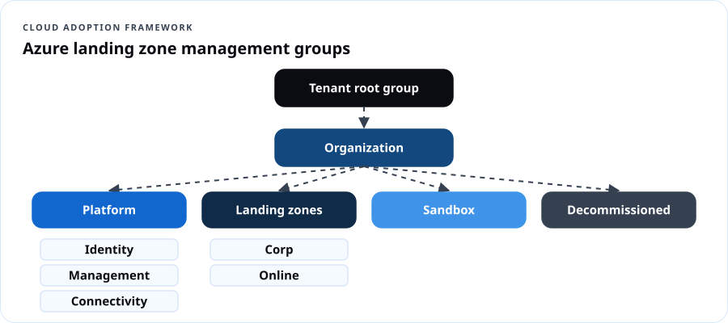
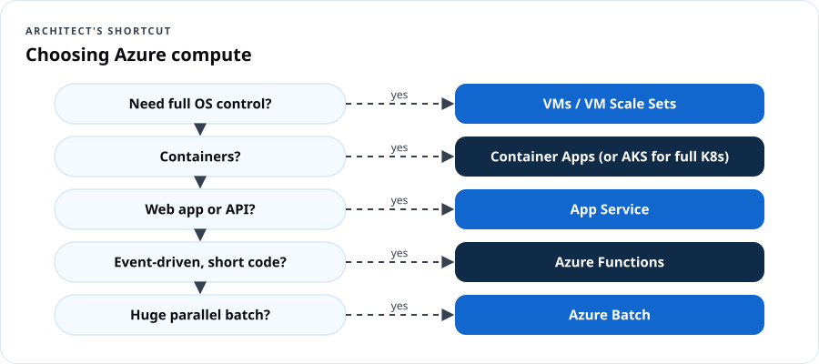
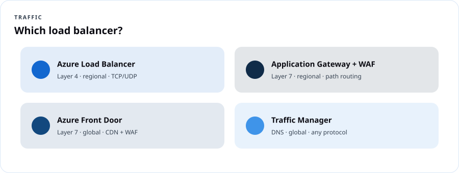

# AZ-305 Azure Solutions Architect

## Course overview

Administrators build what's on the ticket. Architects decide **what should be on the ticket.** AZ-305 tests whether you can read requirements — uptime, budget, compliance, latency, team skills — and recommend the Azure design that satisfies them, with trade-offs stated out loud. This course uses Microsoft's **skills outline as of April 17, 2026**, the **Azure Well-Architected Framework (WAF)** and the **Cloud Adoption Framework (CAF)**.

### Credential path

| Requirement | Detail |
|---|---|
| Prerequisite certification | **Azure Administrator Associate (AZ-104)** must be held to be awarded the Expert certification |
| Exam | AZ-305: Designing Microsoft Azure Infrastructure Solutions |
| Passing score | 700 |
| Price | $165 USD in the U.S. |
| Renewal | Annual free online assessment |
| Weights | Identity, governance & monitoring 25–30% · Data storage 20–25% · Business continuity 15–20% · Infrastructure 30–35% |

### The architect's habit: requirement → constraint → option → trade-off → decision

Every DCT design answer is written in this shape:

> *Requirement:* Patient files must survive a regional outage with read access. *Constraint:* Budget-sensitive, nonprofit. *Options:* GRS, RA-GRS, RA-GZRS, object replication. *Trade-off:* RA-GZRS adds zone resilience at higher cost. *Decision:* RA-GRS for documents; revisit if a zone outage is unacceptable.

> **Dope Translation:** An admin is the contractor who builds the house to the blueprint. The architect is the one who asks how many kids you have, whether grandma's moving in, what the flood zone is, and what you can afford — *then* draws the blueprint. And when the inspector asks "why'd you do it like that?", the architect has an answer.

### The Well-Architected pillars (your design checklist)

| Pillar | Ask |
|---|---|
| **Reliability** | What fails, and how do we keep going or recover? |
| **Security** | Who can get in, and how do we limit the blast radius? |
| **Cost Optimization** | Are we paying only for value? |
| **Operational Excellence** | Can we deploy, observe and fix it repeatably? |
| **Performance Efficiency** | Does it scale to demand at acceptable latency? |

### Syllabus

| # | Lesson | Domain |
|---|---|---|
| 1 | Logging and monitoring design | Identity, governance & monitoring |
| 2 | Authentication, authorization, secrets | Identity, governance & monitoring |
| 3 | Governance design and landing zones | Identity, governance & monitoring |
| 4 | Relational, semi-structured and unstructured data | Data storage |
| 5 | Data integration and analysis | Data storage |
| 6 | Backup, DR and high availability | Business continuity |
| 7 | Compute and application architecture | Infrastructure |
| 8 | Migrations and network design | Infrastructure |

### Assessment

Design studio submissions (8) 40% · Capstone architecture + defense 35% · Knowledge checks 10% · Practice exam 15%.

---

## Lesson 1 — Design logging and monitoring

**Objectives:** recommend a logging solution; a solution for routing logs; a monitoring solution.

### Decision guide

| Need | Recommend |
|---|---|
| Central query of logs across subscriptions | **Log Analytics workspace(s)** — design count by data residency, access control and cost (one central workspace is common; split for sovereignty or chargeback) |
| Route platform/resource logs | **Diagnostic settings** → Log Analytics (query/alert), Storage (cheap archive/compliance), **Event Hubs** (stream to SIEM/third parties) |
| Guest OS + VM performance | **Azure Monitor Agent** with **data collection rules** |
| App performance, distributed tracing | **Application Insights** (workspace-based), OpenTelemetry |
| Security analytics / SIEM | **Microsoft Sentinel** on the workspace |
| Cost control for logs | Table plans (Analytics vs. Basic vs. Auxiliary), retention tiers, commitment tiers, DCR transformations to drop noise |
| Dashboards | Azure Workbooks, Azure Managed Grafana |
| At-scale governance of diagnostics | Azure Policy *DeployIfNotExists* for diagnostic settings |

> **Real Talk:** A county IT office must keep audit logs for 7 years but only query the last 90 days. Design: diagnostic settings to a workspace with 90-day interactive retention and long-term retention up to 7 years (or archive to immutable storage), Sentinel for security events, Policy to enforce diagnostics on every new resource.

### Design studio 1

Design the observability for a 3-tier web app in two regions used by a state agency: what goes where, retention, who can query what (resource-context RBAC vs. workspace RBAC), and the monthly cost levers.

```quiz
Q: Logs must be streamed to a third-party SIEM in near real time. Route them to:
- [ ] A storage account
- [x] Event Hubs
- [ ] Azure Files
- [ ] Recovery Services vault
E: Event Hubs is the streaming destination for diagnostic settings.

Q: Every new resource must automatically send logs to the central workspace. Recommend:
- [x] Azure Policy with DeployIfNotExists diagnostic settings
- [ ] Manual configuration
- [ ] Resource locks
- [ ] Azure Advisor
E: DINE policies enforce diagnostics at scale.

Q: Which provides distributed tracing for microservices?
- [ ] Activity log
- [x] Application Insights
- [ ] Service Health
- [ ] Network Watcher
E: Application Insights supports distributed tracing.
```

---

## Lesson 2 — Authentication, authorization and secrets

**Objectives:** recommend authentication, identity management, authorization for Azure and on-prem resources; manage secrets, certificates and keys.

| Requirement | Recommend |
|---|---|
| Employees, SSO to SaaS and Azure | **Microsoft Entra ID**, Conditional Access, MFA, passwordless |
| Hybrid AD users | **Entra Cloud Sync** (lightweight) or **Entra Connect Sync** (advanced) with password hash sync (+ Seamless SSO); pass-through auth or federation only when required |
| Partners | **Entra External ID B2B** with cross-tenant access settings |
| Consumers | **Entra External ID** for customers (CIAM) |
| App → Azure resource, no secrets | **Managed identities** (system- or user-assigned) |
| Admin elevation | **PIM** (just-in-time, approval, time-bound), access reviews |
| Lifecycle (joiners/movers/leavers) | **Entra ID Governance**: entitlement management, access packages, lifecycle workflows |
| On-prem apps for remote users | **Entra Application Proxy** or **Global Secure Access (Private Access)** |
| Azure resources | **Azure RBAC** at the right scope + ABAC conditions for storage |
| On-prem resources | Entra Kerberos, Entra Domain Services, Azure Arc + RBAC for servers |
| Secrets, keys, certificates | **Azure Key Vault** (RBAC model, soft delete + purge protection, private endpoint), **Managed HSM** for FIPS 140-3 Level 3 single-tenant keys |

> **Dope Translation:** Managed identity is the ID badge the building prints for the robot — no password on a sticky note, nothing to steal from the code. Key Vault is the safe. PIM is the safe that only opens for an hour, with a manager's sign-off, and logs who opened it.

### Design studio 2

A city's 311 app runs on App Service, reads Azure SQL and Blob, and calls a vendor API with a secret. Remove every stored credential and justify each choice.

```quiz
Q: An App Service app must access Azure SQL without storing credentials. Recommend:
- [x] A managed identity with Entra authentication to Azure SQL
- [ ] A connection string in app settings
- [ ] A SAS token
- [ ] A shared admin account
E: Managed identities eliminate stored secrets.

Q: Admins should hold Owner only when needed, with approval and expiry. Recommend:
- [ ] Permanent Owner assignment
- [x] Privileged Identity Management
- [ ] A ReadOnly lock
- [ ] Azure Policy
E: PIM provides just-in-time elevation.

Q: Keys must be in a single-tenant, FIPS 140-3 Level 3 HSM. Recommend:
- [ ] Key Vault Standard
- [x] Azure Key Vault Managed HSM
- [ ] Storage account encryption only
- [ ] App settings
E: Managed HSM is single-tenant and FIPS 140-3 Level 3 validated.
```

---

## Lesson 3 — Design governance

**Objectives:** recommend management group, subscription and resource group structure and a tagging strategy; managing compliance; identity governance.

### Azure landing zones (CAF)



A typical CAF hierarchy: **Tenant root → Organization MG → Platform (Identity, Management, Connectivity) + Landing zones (Corp, Online) + Sandbox + Decommissioned.** Subscriptions are the unit of scale and isolation ("subscription democratization"). Policy and RBAC are assigned at MGs; workloads get their own subscriptions.

### Tagging strategy

Mandatory: `costCenter`, `owner`, `environment`, `dataClassification`, `app`. Enforce with Policy (Deny on RGs, Modify/inherit on resources). Keep values in a controlled vocabulary.

### Compliance

Built-in **regulatory compliance initiatives** in Azure Policy and Defender for Cloud (e.g., NIST SP 800-53 Rev. 5, FedRAMP High, CIS, PCI DSS); **Microsoft Purview** for data governance; **Azure Government** when a workload requires it. Exemptions are documented and time-bound.

> **Real Talk:** A DMV-area agency needs NIST 800-53 alignment. Design: assign the NIST SP 800-53 Rev. 5 initiative at the Landing Zones MG in *Audit*, track in Defender for Cloud regulatory compliance, then flip high-impact controls (allowed locations, no public IPs in Corp, TLS minimums) to *Deny* after a remediation sprint.

### Design studio 3

Design the MG/subscription/RG structure and tags for an organization with three programs (Youth, Seniors, Workforce), separate dev/prod, a shared networking team, and grant-funded chargeback.

```quiz
Q: In the CAF landing zone model, shared networking (hubs, firewalls) lives under:
- [ ] Sandbox
- [x] Platform → Connectivity
- [ ] Decommissioned
- [ ] Corp landing zone
E: Connectivity is a platform subscription.

Q: Which is the primary unit of scale and isolation for workloads in CAF?
- [ ] Resource group
- [x] Subscription
- [ ] Tag
- [ ] Region
E: Subscriptions isolate workloads, billing and quotas.

Q: Contractors should get time-limited access packages with automatic expiry and approvals. Recommend:
- [x] Entra ID Governance entitlement management
- [ ] Guest accounts with permanent Owner
- [ ] Resource locks
- [ ] Azure Arc
E: Access packages handle request, approval, expiry.
```

---

## Lesson 4 — Data storage: relational, semi-structured, unstructured

**Objectives:** relational storage, service and compute tiers, scalability, data protection; semi-structured and unstructured storage; balance features, performance, cost; protection and durability.

### Relational decision table

| Need | Recommend |
|---|---|
| Lift-and-shift SQL Server with near-100% compatibility (SQL Agent, cross-db queries, CLR) | **Azure SQL Managed Instance** |
| Full OS/SQL control, third-party agents | **SQL Server on Azure VMs** |
| New cloud app, minimal management | **Azure SQL Database** (single or elastic pool) |
| Many small databases with spiky usage | **Elastic pool** |
| Large DB, fast scale, up to 128 TB | **Hyperscale** tier |
| Intermittent/dev workloads, auto-pause | **Serverless** compute tier |
| Open source | **Azure Database for PostgreSQL / MySQL – Flexible Server** |

Purchasing models: **vCore** (choose cores, memory, storage; Azure Hybrid Benefit) vs. **DTU** (bundled). Service tiers: **General Purpose, Business Critical** (local SSD, built-in readable replica, highest resilience), **Hyperscale**.

Scalability: scale up/down, read scale-out, **elastic pools**, sharding (elastic database tools), Hyperscale named replicas.

Protection: TDE (default), Always Encrypted (data protected even from DBAs), dynamic data masking, auditing, Defender for SQL, private endpoints, automated backups with PITR, long-term retention.

### Semi-structured and unstructured

| Need | Recommend |
|---|---|
| Global, low-latency JSON at any scale; multi-region writes | **Azure Cosmos DB** (choose API: NoSQL, MongoDB, PostgreSQL, Cassandra, Gremlin, Table; consistency from Strong → Eventual) |
| Simple key-value at low cost | Azure Table Storage or Cosmos DB for Table |
| Files, images, video, backups | **Blob Storage** (tiers, lifecycle, immutability) |
| Big-data analytics files | **Data Lake Storage** (hierarchical namespace on Blob) |
| SMB/NFS shares | **Azure Files** / **Azure NetApp Files** (high-performance) |

Cosmos DB consistency levels: **Strong, Bounded staleness, Session (default), Consistent prefix, Eventual.**

> **Dope Translation:** SQL is a ledger with strict columns — accountants love it. Cosmos DB is a filing cabinet that takes any folder shape and has copies in every city. Blob is the warehouse for boxes. Pick by the shape of the stuff and how fast you need it.

```quiz
Q: A legacy app uses SQL Agent jobs and cross-database queries; the team wants PaaS. Recommend:
- [ ] Azure SQL Database single database
- [x] Azure SQL Managed Instance
- [ ] Cosmos DB
- [ ] Table Storage
E: Managed Instance supports instance-scoped features.

Q: A dev database is used a few hours a week. Minimize compute cost with:
- [x] Azure SQL Database serverless with auto-pause
- [ ] Business Critical
- [ ] Hyperscale with 4 replicas
- [ ] SQL on a VM running 24/7
E: Serverless auto-pauses and bills per use.

Q: A global app needs multi-region writes and single-digit millisecond reads. Recommend:
- [ ] Azure SQL Database
- [x] Azure Cosmos DB
- [ ] Azure Files
- [ ] SQL Managed Instance
E: Cosmos DB supports multi-region writes and global distribution.

Q: Sensitive columns must stay encrypted even from database administrators. Recommend:
- [ ] TDE
- [x] Always Encrypted
- [ ] Dynamic data masking
- [ ] Firewall rules
E: Always Encrypted keeps keys on the client side.
```

---

## Lesson 5 — Data integration and analysis

**Objectives:** recommend a data integration solution; recommend a data analysis solution.

| Need | Recommend |
|---|---|
| Orchestrate ETL/ELT across 90+ connectors | **Azure Data Factory** (or Data Factory in Fabric) |
| Unified analytics SaaS: lakehouse, warehouse, pipelines, Power BI | **Microsoft Fabric** (OneLake) |
| Spark-based data engineering/ML | **Azure Databricks** |
| Real-time stream ingestion | **Event Hubs** → Stream Analytics / Fabric Real-Time Intelligence |
| Log/telemetry analytics at scale | **Azure Data Explorer** (KQL) |
| Business dashboards | **Power BI** |
| Hybrid data movement from on-prem | Self-hosted integration runtime (ADF) or on-premises data gateway (Fabric/Power BI) |

> **Real Talk:** A workforce program wants weekly outcomes dashboards from three systems (a CRM, an LMS, spreadsheets). Design: Fabric pipelines into a lakehouse, medallion layers (bronze/silver/gold), Power BI semantic model with row-level security by site.

```quiz
Q: Which service orchestrates data movement and transformation pipelines with many connectors?
- [x] Azure Data Factory
- [ ] Azure Policy
- [ ] Application Gateway
- [ ] Azure Bastion
E: ADF is the integration/orchestration service.

Q: A team wants one SaaS platform for lakehouse, warehouse, pipelines and Power BI. Recommend:
- [ ] Azure Files
- [x] Microsoft Fabric
- [ ] Azure Arc
- [ ] VM Scale Sets
E: Fabric unifies analytics in OneLake.
```

---

## Lesson 6 — Business continuity: backup, DR and HA

**Objectives:** recommend recovery solutions meeting RPO/RTO for Azure and hybrid; backup/recovery for compute, databases, unstructured data; HA for compute, relational, semi-/unstructured data.

### Define the numbers first

| Term | Meaning |
|---|---|
| **RPO** | Maximum tolerable data loss, in time |
| **RTO** | Maximum tolerable downtime |
| **SLA / SLO** | Promised / targeted availability |
| **Composite SLA** | Multiply dependent services' SLAs |

### Pattern table

| Workload | HA (in-region) | DR (cross-region) | Backup |
|---|---|---|---|
| VMs | Availability zones + LB / VMSS | **Azure Site Recovery** | Azure Backup (Recovery Services vault), cross-region restore |
| App Service / Container Apps | Zone redundancy, multiple instances | Secondary region + Front Door/Traffic Manager | App backups, IaC redeploy |
| Azure SQL Database | Zone-redundant config, Business Critical replicas | **Failover groups** / active geo-replication | Automated backups (PITR), LTR, geo-restore |
| SQL Managed Instance | Zone redundancy | Failover groups | Automated backups, LTR |
| Cosmos DB | Zone redundancy | Multi-region (service-managed failover) | Continuous or periodic backup |
| Blob | ZRS | GRS/GZRS (+customer-managed failover), object replication | Soft delete, versioning, point-in-time restore, vaulted backup |
| Hybrid servers | — | ASR from on-prem/VMware/Hyper-V | MARS agent / MABS |

Patterns: **active-passive (warm/cold standby), active-active, pilot light**. The tighter the RPO/RTO, the higher the cost.

> **Dope Translation:** Backup is the photo of your stuff in a fireproof box — you can rebuild, but it takes time. DR is a fully furnished second apartment across town with a spare key. HA is two roommates in the same apartment — if one gets sick, the other still pays rent. Know which one the client is actually paying for.

### Design studio 6

A food bank's ordering system: RTO 4 hours, RPO 15 minutes, budget-limited. A hospital scheduling system: RTO 15 minutes, RPO near zero. Design both and price the gap.

```quiz
Q: An Azure SQL Database must fail over to another region automatically with a single connection endpoint. Recommend:
- [ ] Long-term retention
- [x] Auto-failover group
- [ ] Geo-restore only
- [ ] Read scale-out
E: Failover groups provide listener endpoints and automatic failover.

Q: Which metric describes how much data you can afford to lose?
- [x] RPO
- [ ] RTO
- [ ] SLA
- [ ] MTTR
E: Recovery point objective.

Q: Two services in series each have 99.9% SLA. The composite SLA is approximately:
- [ ] 99.99%
- [ ] 99.9%
- [x] 99.8%
- [ ] 99.0%
E: 0.999 × 0.999 ≈ 0.998.

Q: Replicate on-premises VMware VMs to Azure for DR. Recommend:
- [ ] Azure Backup only
- [x] Azure Site Recovery
- [ ] AzCopy
- [ ] Azure File Sync
E: ASR supports VMware/Hyper-V/physical to Azure.
```

---

## Lesson 7 — Compute and application architecture

**Objectives:** compute components by workload; VM-based, container-based, serverless and batch solutions; messaging, event-driven, API integration, caching, configuration management, automated deployment.

### Compute decision flow



| Scenario | Recommend |
|---|---|
| Full OS control, legacy | **VMs / VMSS** |
| Web apps & APIs, minimal ops | **App Service** |
| Containerized microservices, serverless scaling | **Azure Container Apps** |
| Full Kubernetes control, complex orchestration | **AKS** |
| Event-driven short code | **Azure Functions** (Flex Consumption / Premium) |
| Large-scale parallel HPC/batch | **Azure Batch** |
| Low-code workflows | **Logic Apps** |

### Application architecture

| Need | Recommend |
|---|---|
| Reliable enterprise messaging, ordering, transactions, dead-lettering | **Service Bus** (queues/topics) |
| Simple, cheap queue | **Storage Queues** |
| React to events (blob created, resource changed) — push, pub/sub | **Event Grid** |
| High-throughput telemetry streams | **Event Hubs** |
| Publish, secure, throttle and version APIs | **API Management** |
| Cache hot data / session state | **Azure Managed Redis** (successor to Azure Cache for Redis) |
| Centralized configuration and feature flags | **Azure App Configuration** + Key Vault references |
| Automated deployment | **GitHub Actions** or **Azure Pipelines** with Bicep/Terraform; deployment stacks; blue-green via slots/revisions |

> **Dope Translation:** Service Bus is certified mail — signed for, in order, returned if undeliverable. Event Grid is the group text — "hey, the package arrived." Event Hubs is the firehose of a stadium's ticket scanners. Redis is the stuff you keep on the counter instead of walking to the pantry.

```quiz
Q: Orders must be processed exactly in order with dead-letter support. Recommend:
- [x] Service Bus sessions/queues
- [ ] Event Grid
- [ ] Storage Queues
- [ ] Event Hubs
E: Service Bus supports FIFO via sessions and dead-lettering.

Q: Trigger a function whenever a blob is uploaded, with push delivery. Recommend:
- [ ] Service Bus
- [x] Event Grid
- [ ] API Management
- [ ] Redis
E: Event Grid delivers resource events.

Q: Expose internal APIs to partners with keys, rate limits and versioning. Recommend:
- [ ] Application Gateway alone
- [x] Azure API Management
- [ ] Front Door alone
- [ ] Logic Apps
E: APIM handles API publishing and policies.

Q: Containerized microservices need autoscaling including scale-to-zero, without managing Kubernetes. Recommend:
- [ ] AKS
- [x] Azure Container Apps
- [ ] VMSS
- [ ] Azure Batch
E: Container Apps abstracts Kubernetes.
```

---

## Lesson 8 — Migrations and network design

**Objectives:** evaluate migrations with CAF; evaluate on-prem servers, data and apps; migrate to IaaS/PaaS; migrate databases and unstructured data; connectivity to internet and on-prem; optimize network performance and security; load balancing and routing.

### Migration (CAF: Strategy → Plan → Ready → Adopt → Govern/Secure/Manage)

The **"R" strategies:** retire, retain, rehost, replatform, refactor, rearchitect, rebuild, replace.

| Need | Tool |
|---|---|
| Discover, assess, migrate servers/VMs/web apps | **Azure Migrate** |
| Migrate SQL Server | **Azure Database Migration Service**, Azure SQL Migration extension (Azure Data Studio is retiring — use the Azure portal / Azure Arc–based migration experiences) |
| Large offline data | **Azure Data Box** family |
| Online file migration | **AzCopy**, **Azure Storage Mover**, Azure File Sync |

### Network design

| Need | Recommend |
|---|---|
| Hub-and-spoke at scale, many branches | **Azure Virtual WAN** |
| Encrypted site-to-site | **VPN Gateway** (zone-redundant SKUs) |
| Private, predictable bandwidth | **ExpressRoute** (+ VPN as backup; ExpressRoute Global Reach for site-to-site via Microsoft) |
| Centralized egress filtering, threat intel | **Azure Firewall** (Premium for TLS inspection, IDPS) |
| Web app protection | **WAF** on Application Gateway or Front Door |
| DDoS | **Azure DDoS Protection** (Network or IP) |
| PaaS privacy | **Private Link / private endpoints** + private DNS |
| Global HTTP acceleration + CDN | **Azure Front Door** |
| Regional L7 | **Application Gateway** |
| Regional L4 | **Load Balancer** (Gateway LB for NVAs) |
| DNS-based global routing | **Traffic Manager** |
| Performance | Accelerated networking, proximity placement groups, ExpressRoute FastPath, caching/CDN |



```quiz
Q: A retailer has 200 branch offices needing any-to-any connectivity to Azure. Recommend:
- [ ] One VPN gateway per VNet
- [x] Azure Virtual WAN
- [ ] VNet peering only
- [ ] Traffic Manager
E: Virtual WAN scales branch connectivity with a managed hub.

Q: A global web app needs WAF, TLS offload, caching and fastest-region routing. Recommend:
- [x] Azure Front Door Premium with WAF
- [ ] Azure Load Balancer
- [ ] Traffic Manager alone
- [ ] Application Gateway in one region
E: Front Door is global L7 with CDN and WAF.

Q: Which CAF "R" means moving a VM as-is to Azure IaaS?
- [x] Rehost
- [ ] Refactor
- [ ] Retire
- [ ] Rebuild
E: Rehost = lift and shift.

Q: Outbound traffic from all spokes must be inspected with IDPS and TLS inspection. Recommend:
- [ ] NSGs only
- [x] Azure Firewall Premium in the hub with UDRs
- [ ] Service endpoints
- [ ] Traffic Manager
E: Firewall Premium provides IDPS and TLS inspection.
```

---

## Capstone — "DMV Workforce Connect" architecture

The regional workforce board is building a platform for job seekers, employers and case managers across DC, Maryland and Virginia.

**Requirements:** 99.95% availability for the public portal; RPO 15 min / RTO 1 hour for case records; PII and some CJIS-adjacent data; three agencies with separate billing; case managers sign in with their own agency Entra tenants; employers and job seekers sign up with email or social; analytics dashboards weekly; budget ceiling $9,000/month.

**Deliverables:**
1. Architecture diagram (draw.io, Visio or Excalidraw) — identity, network, compute, data, monitoring.
2. Decision log: at least 12 entries in *requirement → constraint → options → trade-off → decision* format.
3. WAF pillar review table.
4. Cost estimate from the pricing calculator with two cost-down alternatives.
5. 10-minute defense to a panel playing CIO, CISO and CFO.

**Rubric:** requirements coverage 30 · justified trade-offs 25 · security & compliance 20 · resilience 15 · cost realism 10.

## Practice exam (30 questions)

```quiz
Q: You need to retain security logs 2 years at the lowest cost while querying the last 30 days interactively. Recommend:
- [x] Log Analytics with 30-day interactive retention and long-term retention for the rest
- [ ] Keep everything in Analytics tier for 2 years
- [ ] Delete after 30 days
- [ ] Store in Redis
E: Long-term retention is far cheaper than interactive retention.

Q: Which design best removes secrets from application code?
- [x] Managed identities + Key Vault references
- [ ] Encrypted connection strings in Git
- [ ] Environment variables in the Dockerfile
- [ ] Shared service accounts
E: Managed identities avoid storing credentials.

Q: Hybrid users need SSO to cloud apps with the simplest, most resilient auth. Recommend:
- [x] Password hash synchronization with Seamless SSO
- [ ] AD FS federation
- [ ] Separate cloud passwords
- [ ] Pass-through authentication with one agent
E: PHS is Microsoft's recommended default for resilience.

Q: Which structure applies policies consistently to all production subscriptions?
- [x] A management group for production with policy assignments
- [ ] Tags on each resource
- [ ] One resource group per subscription
- [ ] Individual RBAC assignments
E: Management groups provide inheritance.

Q: A workload must be evaluated against NIST SP 800-53 Rev. 5. Use:
- [x] The built-in regulatory compliance initiative in Azure Policy / Defender for Cloud
- [ ] Azure Advisor alone
- [ ] Resource locks
- [ ] Service Health
E: Built-in initiatives map controls to policies.

Q: Many small tenant databases with unpredictable, non-overlapping peaks. Recommend:
- [x] Azure SQL Database elastic pool
- [ ] One Business Critical database per tenant
- [ ] Cosmos DB
- [ ] SQL on VMs
E: Elastic pools share resources across databases.

Q: Database up to 100 TB with fast backups and rapid scale. Recommend:
- [ ] General Purpose
- [x] Hyperscale
- [ ] Basic DTU
- [ ] Table Storage
E: Hyperscale supports very large databases.

Q: Cosmos DB default consistency level:
- [ ] Strong
- [x] Session
- [ ] Eventual
- [ ] Bounded staleness
E: Session is the default.

Q: Data scientists need a hierarchical namespace for big-data files. Recommend:
- [x] Azure Data Lake Storage (Blob with hierarchical namespace)
- [ ] Azure Files Standard
- [ ] Queue Storage
- [ ] Table Storage
E: ADLS adds hierarchical namespace and POSIX ACLs.

Q: Weekly analytics combining several sources into dashboards with minimal infrastructure. Recommend:
- [x] Microsoft Fabric with Power BI
- [ ] VMs running SQL Server Reporting Services
- [ ] Azure Batch
- [ ] Event Grid
E: Fabric is SaaS analytics.

Q: Blob data must be immutable for 7 years for compliance. Recommend:
- [x] Immutable storage with time-based retention policy
- [ ] Soft delete for 7 years
- [ ] Archive tier only
- [ ] ReadOnly lock on the account
E: WORM immutability policies meet regulatory retention.

Q: RTO 1 hour, RPO 15 minutes for Azure VMs across regions. Recommend:
- [x] Azure Site Recovery
- [ ] Daily Azure Backup only
- [ ] Availability set
- [ ] Manual redeploy
E: ASR provides continuous replication with low RPO.

Q: In-region HA for VMs with 99.99% SLA:
- [x] Two or more VMs across availability zones
- [ ] One VM with Premium SSD
- [ ] Availability set
- [ ] Two VMs in one zone
E: Zones provide the highest in-region SLA.

Q: Unstructured data must survive a regional outage AND a zone outage in the primary region. Recommend:
- [ ] LRS
- [ ] ZRS
- [ ] GRS
- [x] GZRS
E: GZRS covers zone and region.

Q: Which compute suits an HPC rendering job of 10,000 parallel tasks?
- [ ] App Service
- [x] Azure Batch
- [ ] Logic Apps
- [ ] Functions Consumption
E: Batch schedules large-scale parallel jobs.

Q: Which service delivers high-throughput telemetry ingestion with partitioned consumers?
- [ ] Service Bus
- [ ] Event Grid
- [x] Event Hubs
- [ ] Storage Queues
E: Event Hubs is a streaming platform.

Q: Feature flags and centralized app settings across microservices:
- [x] Azure App Configuration
- [ ] Azure Policy
- [ ] Tags
- [ ] Key Vault alone
E: App Configuration manages settings and flags.

Q: Reduce database load for frequently read product catalogs. Recommend:
- [x] Azure Managed Redis cache
- [ ] More DTUs only
- [ ] Event Grid
- [ ] Azure Backup
E: Caching offloads reads.

Q: Repeatable, reviewable infrastructure deployments across environments. Recommend:
- [x] Bicep or Terraform in a CI/CD pipeline
- [ ] Portal clicks documented in Word
- [ ] Resource locks
- [ ] Manual scripts on a laptop
E: IaC + pipelines = consistency.

Q: Assess 400 on-prem servers for Azure readiness and sizing. Recommend:
- [x] Azure Migrate
- [ ] Azure Arc alone
- [ ] Data Box
- [ ] Advisor
E: Azure Migrate discovers and assesses.

Q: Migrate SQL Server with minimal downtime (online). Recommend:
- [x] Azure Database Migration Service (online mode)
- [ ] Backup to USB
- [ ] Data Box Heavy
- [ ] Storage Explorer
E: DMS supports online migrations.

Q: Private, predictable connectivity with consistent latency to Azure. Recommend:
- [x] ExpressRoute
- [ ] Site-to-site VPN
- [ ] Public internet
- [ ] Traffic Manager
E: ExpressRoute uses a private circuit.

Q: Regional web app needs path-based routing and WAF. Recommend:
- [x] Application Gateway with WAF
- [ ] Load Balancer
- [ ] Traffic Manager
- [ ] VPN Gateway
E: App Gateway is regional L7.

Q: Protect public IPs from volumetric attacks with cost protection and rapid response support. Recommend:
- [x] Azure DDoS Network Protection
- [ ] NSGs
- [ ] Azure Policy
- [ ] Private endpoints
E: DDoS Network Protection adds mitigation, telemetry, cost protection and rapid response.

Q: Which design reduces latency between tightly coupled VMs?
- [x] Proximity placement group with accelerated networking
- [ ] Spread VMs across regions
- [ ] Use Traffic Manager
- [ ] Use Basic SKUs
E: PPGs co-locate VMs.

Q: DNS-based failover between two regions for a non-HTTP service. Recommend:
- [ ] Front Door
- [x] Traffic Manager (priority routing)
- [ ] Application Gateway
- [ ] Internal Load Balancer
E: Traffic Manager routes at the DNS level for any protocol.

Q: Which WAF pillar focuses on deploying and observing workloads repeatably?
- [ ] Reliability
- [ ] Security
- [x] Operational Excellence
- [ ] Performance Efficiency
E: Operational Excellence covers DevOps, IaC, monitoring.

Q: Customers (not employees) need sign-up with social accounts for a public portal. Recommend:
- [x] Microsoft Entra External ID for customers
- [ ] B2B guest invitations
- [ ] Entra Domain Services
- [ ] Local accounts in SQL
E: External ID handles CIAM.

Q: Grant on-prem servers Azure RBAC, Policy and Defender for Cloud coverage. Recommend:
- [x] Azure Arc-enabled servers
- [ ] ExpressRoute
- [ ] Azure Migrate
- [ ] Bastion
E: Arc projects servers into Azure.

Q: Which is NOT a valid Cosmos DB consistency level?
- [ ] Strong
- [ ] Consistent prefix
- [ ] Bounded staleness
- [x] Immediate replication
E: The five levels are Strong, Bounded staleness, Session, Consistent prefix, Eventual.
```

## Instructor notes

- **AZ-305 is a reading exam.** Teach learners to underline requirements ("minimize cost", "minimize administrative effort", "no downtime") — those words pick the answer.
- **Service-name drift is real:** Azure Managed Redis, Microsoft Foundry, Entra External ID, Fabric. Re-check names against Microsoft Learn before each cohort.
- **Run critiques like a design review board.** Peers play CFO/CISO. Every decision needs a stated trade-off.

## Resources

- [Official AZ-305 study guide](https://learn.microsoft.com/credentials/certifications/resources/study-guides/az-305)
- [Azure Well-Architected Framework](https://learn.microsoft.com/azure/well-architected/)
- [Cloud Adoption Framework](https://learn.microsoft.com/azure/cloud-adoption-framework/)
- [Azure Architecture Center](https://learn.microsoft.com/azure/architecture/)
- [Azure landing zones](https://learn.microsoft.com/azure/cloud-adoption-framework/ready/landing-zone/)
