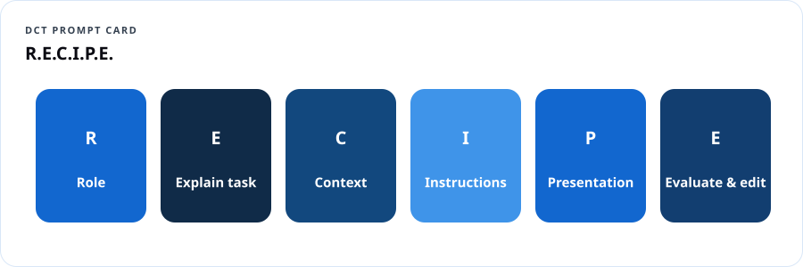
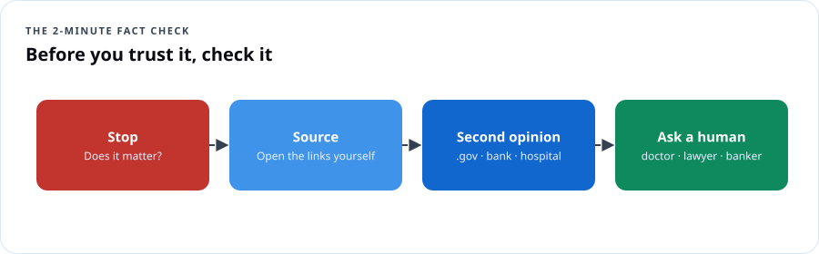

# AI Fundamentals — Everyday AI

## Course overview

You've heard about ChatGPT, Copilot, Gemini and Claude. Maybe you've tried one. Maybe a grandchild set it up for you, or your boss told you to "use AI" with no instructions. This workshop gives you four things in four sessions:

1. **Understand** what AI is and how it comes up with answers.
2. **Use** it with prompts that actually work.
3. **Protect** your private information and check what AI gets wrong.
4. **Create** something useful you'll keep using.

No coding. No jargon you won't get a translation for. Bring a phone, tablet or laptop.

### Learning outcomes

- Explain in your own words how a chatbot produces an answer and why it can be confidently wrong.
- Write prompts using the **R.E.C.I.P.E.** method.
- Name five kinds of information you should never paste into an AI tool.
- Fact-check an AI answer in under two minutes.
- Spot AI-powered scams: voice clones, fake videos, fake "AI investment" pitches.
- Build a personal "AI toolkit": three prompts you'll use every week.

### Session plan

| Session | Theme | You leave with |
|---|---|---|
| 1 | **Understand:** What AI is and how it answers | Your first conversation with an AI tool + a "what AI is / isn't" card |
| 2 | **Use:** Prompts that work | The R.E.C.I.P.E. card + 3 saved prompts |
| 3 | **Protect:** Privacy, accuracy and scams | The "Never paste" list + the 2-minute fact check |
| 4 | **Create:** Make something useful | A finished project (letter, plan, flyer, budget, study guide) |

### Tools we use

Any free general AI assistant works: **Microsoft Copilot**, **ChatGPT**, **Google Gemini**, **Claude** or **Meta AI**. Facilitators should check each tool's current age requirements and terms before class; many require users to be 13+ (and some 18+, or 13–17 with parental permission). If a school or agency provides an approved tool, use that.

---

## Session 1 — Understand: what AI is and how it answers

### 1.1 Warm-up (10 min)

Ask the room: *"Where did you already use AI this week without calling it AI?"* Collect answers: phone autocorrect, face unlock, Netflix suggestions, spam filters, GPS traffic, bank fraud alerts, smart speakers.

> **Dope Translation:** AI has been in your pocket for years. Autocorrect is AI. "Recommended for you" is AI. The new chatbots are just the version that talks back.

### 1.2 What AI is

**Artificial intelligence** is software that learns patterns from lots of examples so it can make predictions or create things — instead of following only rules a person typed in by hand.

| Kind | What it does | Example |
|---|---|---|
| Predictive AI | Guesses what's likely | Fraud alert from your bank |
| Recognition AI | Identifies things | Face unlock, voice assistants |
| **Generative AI** | Creates new text, images, audio, video | Chatbots, image makers |
| **Agentic AI** | Takes steps and actions for you | An assistant that books an appointment |

### 1.3 How a chatbot answers


1. It learned from enormous amounts of text.
2. Your question gets broken into pieces (tokens).
3. It predicts, one piece at a time, what words most likely come next.
4. It doesn't "look up the truth" unless it's connected to search or documents — it **predicts**.

> **Dope Translation:** Picture the friend who's been on every group chat in the city for twenty years. Start a sentence and they can finish it — smooth, confident, in your style. But sometimes they're just making it sound right. That's AI. Great at sounding right. Your job is checking if it *is* right.

### 1.4 What AI is — and isn't

| AI is | AI isn't |
|---|---|
| Fast at drafting, summarizing, explaining, brainstorming | A person, a friend, or a professional with a license |
| Good with patterns in language | Always correct, current or fair |
| A tool you direct | Responsible for decisions — you are |

### 1.5 Hands-on (40 min)

1. Open your AI tool. Type: *"Explain what you are in three sentences, like I'm 12."*
2. Ask: *"What's one thing you're bad at?"*
3. Ask it something you already know well — your neighborhood, your job, your favorite team's 2023 season. **Grade it.** Where was it wrong?
4. Share one surprising right answer and one wrong answer with your table.

### Session 1 check

```quiz
Q: How does a chatbot usually produce an answer?
- [ ] It phones an expert
- [x] It predicts likely next words based on patterns it learned
- [ ] It always searches the web first
- [ ] It reads your mind
E: Unless connected to search or documents, it predicts text.

Q: Which is an example of AI you may already use?
- [ ] A paper calendar
- [x] Your bank's fraud alert texts
- [ ] A light switch
- [ ] A printed map
E: Fraud detection is predictive AI.

Q: Who is responsible for decisions you make using AI's answer?
- [ ] The AI
- [ ] The company that made it
- [x] You
- [ ] Nobody
E: AI is a tool; people stay accountable.
```

---

## Session 2 — Use: prompts that work

### 2.1 The R.E.C.I.P.E. method



| Letter | Means | Example |
|---|---|---|
| **R** — Role | Who should the AI act like? | "Act as a patient computer teacher…" |
| **E** — Explain the task | What do you want? | "…explain how to set up a passkey…" |
| **C** — Context | Who's it for? What's the situation? | "…for my 74-year-old dad who uses an iPhone…" |
| **I** — Instructions & limits | Rules, length, tone, what to avoid | "…in 5 short numbered steps, no tech words…" |
| **P** — Presentation | Format | "…as a list I can print in large type." |
| **E** — Evaluate & edit | Ask follow-ups to improve it | "Make step 3 simpler." / "What could go wrong?" |

> **Dope Translation:** Walking into a barbershop and saying "cut it" gets you a haircut. Walking in and saying "low taper, keep the length on top, line it up, no part" gets you *your* haircut. Prompts work the same way.

### 2.2 Before and after

| Weak prompt | R.E.C.I.P.E. prompt |
|---|---|
| "Write a resume." | "Act as a career coach. Write a one-page resume summary for a U.S. Army veteran (MOS 25B, IT specialist, 6 years) applying for a help-desk job. Use 4 bullet points with numbers where possible. Plain, confident tone." |
| "Healthy meals." | "Act as a budget-minded home cook. Give me 5 dinners under $10 each for a family of 4, using ingredients from a regular grocery store. Include a shopping list grouped by aisle." |
| "Explain the cloud." | "Explain cloud computing to a high-school sophomore who loves basketball, using a basketball analogy, in under 100 words." |

### 2.3 Power moves

- **Ask for options:** "Give me three versions: formal, friendly, short."
- **Ask it to ask you:** "Before you answer, ask me 3 questions so you get it right."
- **Make it check itself:** "What assumptions did you make? What might be wrong?"
- **Change the reading level:** "Rewrite at a 6th-grade reading level."
- **Translate:** "Translate into Spanish for a parent newsletter, warm tone." (Have a fluent speaker review anything important.)

### 2.4 Hands-on (45 min) — build your three keeper prompts

Pick three from this menu and customize each with R.E.C.I.P.E.:

- Weekly meal plan + grocery list on a budget
- Email to a landlord, teacher, or employer
- Study guide and practice quiz on any topic
- Explain a confusing letter (with private info removed — see Session 3)
- Plan a family event or church program
- Small-business social media posts for a week
- Practice job interview: "Interview me for a ___ job, one question at a time, and give feedback."

Save them in your phone's notes app.

### Session 2 check

```quiz
Q: In R.E.C.I.P.E., what does the C stand for?
- [ ] Copy
- [x] Context
- [ ] Code
- [ ] Cost
E: Context — who it's for and the situation.

Q: Which prompt will most likely get a useful answer?
- [ ] "Help."
- [ ] "Write something about money."
- [x] "Act as a financial coach. Create a simple monthly budget for a single parent earning $3,200/month in Prince George's County, as a table."
- [ ] "Budget?"
E: Role, task, context and format make the difference.

Q: What's a smart follow-up after the first answer?
- [x] "What assumptions did you make, and what could be wrong?"
- [ ] Close the app
- [ ] Copy it without reading
- [ ] Ask the same question again with no changes
E: Evaluate & edit — make it check itself.
```

---

## Session 3 — Protect: privacy, accuracy and scams

### 3.1 The "Never paste" list

Unless you're using a tool your school, employer or agency has **approved** for that kind of data, never paste:

1. **Government ID numbers** — Social Security, driver's license, passport, Medicare/Medicaid numbers.
2. **Money details** — bank or card numbers, account logins, PINs.
3. **Passwords, codes, security answers** — and never one-time codes, ever.
4. **Health details** that identify you or someone else.
5. **Other people's private information** — students' records, clients' files, a friend's screenshot.
6. **Work confidential information** — contracts, customer lists, internal plans — unless your employer allows it in that tool.

**Redact instead:** replace names and numbers with placeholders. "My landlord [NAME] sent me a notice saying I owe [AMOUNT]…"

> **Dope Translation:** Treat an AI chat like a crowded bus. You can talk about your day. You don't read your bank card number out loud.

### 3.2 Why AI gets things wrong

- **Hallucinations:** it invents facts, quotes, links, laws or court cases that sound real.
- **Out of date:** its training has a cutoff date unless it can search.
- **Bias:** it can repeat unfair patterns from the data it learned from.
- **Agrees too easily:** it may go along with a wrong assumption in your question.

### 3.3 The 2-minute fact check



1. **Stop** — Is this something that matters (health, money, law, news, your job)?
2. **Source** — Ask: "What are your sources?" then **open them yourself**. Fake links are common.
3. **Second opinion** — Check one trusted site (.gov, a major hospital, your bank's real website, a reputable news outlet).
4. **Ask a human** for anything with real consequences — doctor, pharmacist, lawyer, banker, teacher.

### 3.4 AI-powered scams

| Scam | What it looks like | Your move |
|---|---|---|
| **Voice clone "family emergency"** | A call that sounds exactly like your grandson: "I'm in jail, send money, don't tell Mom." | Hang up. Call him back on his real number. Set a **family code word**. |
| **Deepfake video** | A celebrity or official "endorsing" an investment or giveaway | Real public figures don't DM you investment deals. Check official accounts. |
| **"AI trading bot" investments** | Guaranteed returns from secret AI | Guaranteed returns = scam. Check with [Investor.gov](https://www.investor.gov/). |
| **Perfect-grammar phishing** | Polished emails/texts from "your bank" or "USPS" | Don't click. Go to the real site or app yourself. |
| **Fake AI apps** | Lookalike "ChatGPT" apps charging subscriptions | Download only from the official company in the official app store. |

**Report scams:** [ReportFraud.ftc.gov](https://reportfraud.ftc.gov/) · internet crime to the FBI at [ic3.gov](https://www.ic3.gov/) · if your identity was stolen: [IdentityTheft.gov](https://www.identitytheft.gov/).

### 3.5 Hands-on (40 min)

1. **Catch the hallucination:** Ask your AI for "three Supreme Court cases about [some odd topic] with citations." Try to verify them. (Many will be wrong or invented.)
2. **Redaction drill:** Rewrite a sample letter (provided) removing every private detail, then ask AI to explain it.
3. **Family code word:** Write yours down (don't share it here). Plan who you'll tell.

### Session 3 check

```quiz
Q: Which is safe to paste into a public AI chatbot?
- [ ] Your Social Security number
- [ ] Your bank login
- [x] A letter with names and numbers replaced by placeholders like [NAME]
- [ ] Your doctor's notes with your full name
E: Redact private details first.

Q: Your "grandson" calls crying, needs bail money, and asks you not to tell anyone. Best first step?
- [ ] Send gift cards quickly
- [x] Hang up and call him or a family member on a number you already know
- [ ] Ask the caller for proof
- [ ] Wire money but only half
E: Voice clones are convincing; verify through a known number and use a family code word.

Q: AI gives you a link to a law. What's the first fact-check step?
- [ ] Trust it if it looks official
- [x] Open the link yourself and confirm it exists and says what AI claimed
- [ ] Share it on social media
- [ ] Ask AI if it's sure
E: Fake or wrong citations are common; verify sources directly.

Q: Where do you report a scam to the Federal Trade Commission?
- [x] ReportFraud.ftc.gov
- [ ] Any AI chatbot
- [ ] The scammer's website
- [ ] Nowhere
E: The FTC collects fraud reports at ReportFraud.ftc.gov.
```

---

## Session 4 — Create: make something useful

### 4.1 Choose a project (pick one track)

| Track | Project | Prompt starter |
|---|---|---|
| **Youth** | Study guide + 10-question practice quiz for a real class | "Act as a tutor. Make a one-page study guide on [topic] for 10th grade, then 10 multiple-choice questions with answers at the end." |
| **Seniors** | Large-print medication & appointment schedule template (no real health details) | "Create a weekly table with columns Day, Morning, Afternoon, Evening, Appointments, Notes. Large clear headings." |
| **Job seekers** | Résumé bullets + mock interview | "Turn these job duties into 5 résumé bullets with numbers: [duties]." |
| **Small business** | One week of social posts + a customer reply template | "Act as a marketing assistant for a [type] business in [city]. Write 5 posts…" |
| **Families & churches** | Event plan with timeline, roles and flyer text | "Plan a youth tech night for 40 people with a $300 budget…" |
| **Gardeners & hobbyists** | Planting calendar for your area | "Make a fall planting schedule for a small raised bed in USDA zone 7b, Maryland." |

### 4.2 Make it yours

1. Draft with R.E.C.I.P.E.
2. Improve with two follow-ups.
3. **Fact-check** anything factual.
4. **Edit by hand** — add your voice, fix anything off.
5. Decide if you'll **disclose** AI use (school and work rules vary — ask).

### 4.3 Share-out and certificate (20 min)

Each person shows their project and names one thing AI got wrong that they fixed.

### Final reflection

```quiz
Q: Which order matches the DCT learning model?
- [x] Understand → Use → Protect → Create
- [ ] Create → Copy → Paste → Post
- [ ] Use → Trust → Share → Forget
- [ ] Protect → Avoid → Ignore → Quit
E: Every DCT program follows Understand, Use, Protect, Create.

Q: After AI drafts your project, what should you always do before sharing it?
- [ ] Nothing — it's done
- [x] Fact-check and edit it in your own voice
- [ ] Remove your name
- [ ] Ask AI to post it
E: You're the editor and you're accountable.

Q: Which use of AI keeps your judgment in charge?
- [x] Using AI to draft a letter, then checking facts and editing before sending
- [ ] Letting AI decide whether to sign a lease
- [ ] Sending AI's medical advice to a relative as fact
- [ ] Pasting a client's file into a free chatbot
E: AI assists; people decide.
```

---

## Take-home cards (printable)

**What AI is:** a pattern-predicting tool that's fast and fluent — and sometimes wrong.
**R.E.C.I.P.E.:** Role · Explain · Context · Instructions · Presentation · Evaluate.
**Never paste:** IDs · money details · passwords/codes · health info · other people's info · work secrets.
**2-minute check:** Stop · Source · Second opinion · Ask a human.
**Scam rule:** Urgent + secret + money = hang up and verify.

## Facilitator guide

- **Room setup:** tables of 4–6, one confident tech user per table. Charge stations. Wi-Fi password large on the wall.
- **Accounts:** many tools now work without an account for basic use; have one demo account on the projector. Check age rules for youth groups and get parent permission where required.
- **Seniors:** slow pace, larger fonts (phone accessibility settings), print every card. Celebrate wins out loud.
- **Teens:** be direct about school academic-honesty rules. Frame AI as a tutor, not a ghostwriter. Discuss deepfakes and sextortion awareness with school counselors' guidance.
- **Mixed audiences:** "Explain it to my grandma / explain it to my grandson" pairs are gold.
- **Hard questions you'll get:** *Will AI take my job?* (It changes tasks; people who use it well have an edge.) *Is it listening to me?* (Show where privacy settings and chat history controls are in each tool.) *Is it a sin / is it evil?* (Respect faith perspectives; focus on honest, careful use.)
- **Evaluation:** pre/post confidence survey (1–5) on: explaining AI, writing prompts, protecting info, spotting scams.

## Resources

- [Microsoft Copilot](https://copilot.microsoft.com/) · [ChatGPT](https://chatgpt.com/) · [Google Gemini](https://gemini.google.com/) · [Claude](https://claude.ai/)
- [FTC: Consumer advice on AI and scams](https://consumer.ftc.gov/)
- [AARP Fraud Watch Network](https://www.aarp.org/money/scams-fraud/) — helpline 877-908-3360
- [Common Sense Media: AI ratings and guides](https://www.commonsensemedia.org/ai)
