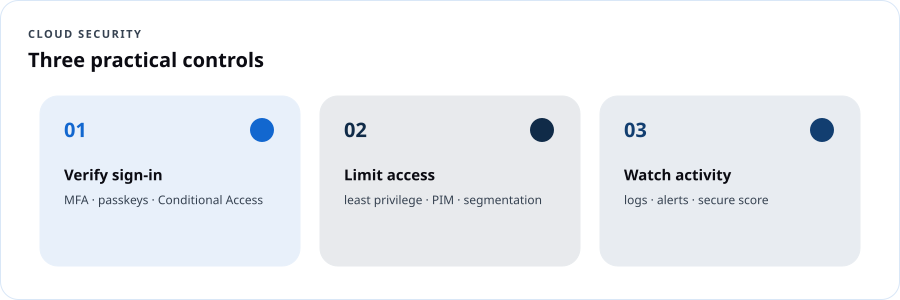
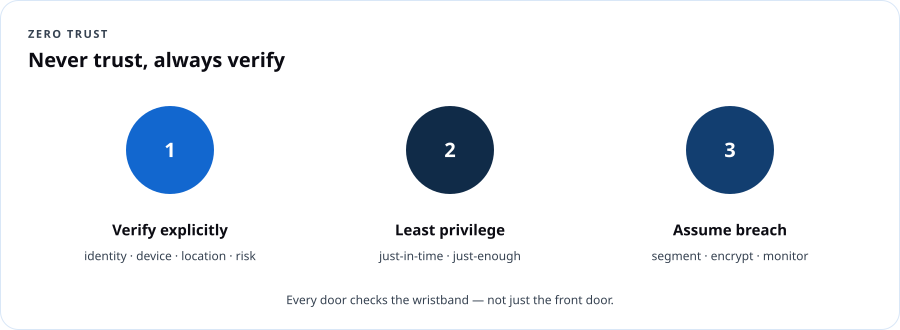
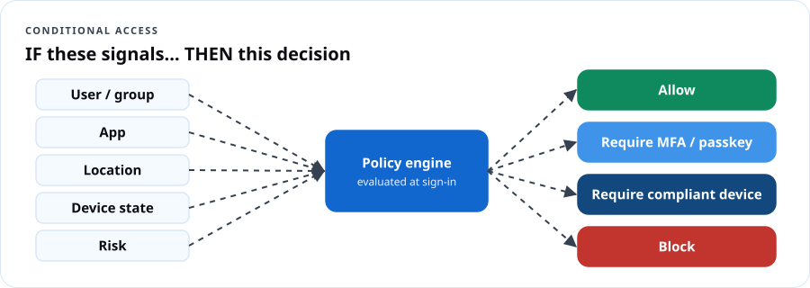

# Cloud Security — Verify, Limit, Watch

## Course overview

Most cloud breaches don't start with movie-style hacking. They start with **a stolen password, an account with too much access, or activity nobody was watching.** DCT's Cloud Security program is built around three controls:



1. **Verify sign-in** — every person and app proves who they are, strongly.
2. **Limit access** — least privilege, just-in-time, segmented networks, protected data.
3. **Watch activity** — logs, alerts, posture scores and a plan for when something goes wrong.

You'll practice each in Microsoft Entra, Azure and Microsoft Purview, and finish ready for **SC-900: Microsoft Security, Compliance, and Identity Fundamentals.**

### Certification alignment

| SC-900 domain (as of July 28, 2026) | Weight | DCT module |
|---|---|---|
| Concepts of security, compliance and identity | 10–15% | 1 |
| Capabilities of Microsoft Entra | 25–30% | 2, 3 |
| Capabilities of Microsoft security solutions | 35–40% | 4, 5 |
| Capabilities of Microsoft compliance solutions | 20–25% | 6 |

**Where this leads:** SC-500 *Cloud and AI Security Engineer Associate* (replaced AZ-500, which retired August 31, 2026), SC-200 (Security Operations Analyst), SC-300 (Identity and Access Administrator). Existing AZ-500 holders keep their credential until it expires but cannot renew it — they must pass SC-500 to stay current.

### Learning outcomes

1. Explain shared responsibility, defense in depth, Zero Trust, encryption vs. hashing, and GRC.
2. Configure MFA, passwordless methods and Conditional Access; protect emergency ("break glass") accounts.
3. Apply least privilege with RBAC, PIM and access reviews.
4. Describe and use Azure network and infrastructure protections: NSGs, Firewall, WAF, DDoS, Bastion, Key Vault.
5. Read a Defender for Cloud secure score; explain Defender XDR and Microsoft Sentinel.
6. Describe Purview: sensitivity labels, DLP, retention, insider risk, eDiscovery, audit, Compliance Manager.
7. Run a basic incident response tabletop.

### Lab environment

A free Azure subscription plus a **Microsoft Entra ID P2 / Microsoft 365 E5 trial** (or a Microsoft 365 Developer Program sandbox if eligible) to try Conditional Access, PIM and Purview. **Never practice on your employer's production tenant.**

---

## Module 1 — Security concepts that never change

### 1.1 Shared responsibility

The provider secures the cloud; you secure what you put in it. **Data, devices, accounts and identities are always yours** (see AZ-900 Lesson 1).

### 1.2 Defense in depth

Layers: physical → identity & access → perimeter → network → compute → application → data. Each layer buys time and limits damage.

### 1.3 Zero Trust



- **Verify explicitly** — use every signal: user, device health, location, risk.
- **Use least-privilege access** — just-in-time and just-enough.
- **Assume breach** — segment, encrypt, monitor, and limit blast radius.

> **Dope Translation:** Old-school security was the club with one bouncer at the front door — get past him and you can go anywhere, VIP included. Zero Trust puts a check at *every* door inside, and the wristband expires at midnight.

### 1.4 Encryption and hashing

| | Encryption | Hashing |
|---|---|---|
| Reversible? | Yes, with a key | No (one-way) |
| Use | Protect data at rest and in transit | Store passwords, verify integrity |
| Types | **Symmetric** (one shared key, e.g., AES) · **Asymmetric** (public/private key pair, e.g., RSA, ECC) | SHA-256 etc., with **salting** for passwords |

### 1.5 Governance, risk and compliance (GRC)

- **Governance:** the rules and who owns decisions.
- **Risk:** what could go wrong × how likely × how bad.
- **Compliance:** meeting laws, regulations and standards (e.g., NIST SP 800-53, FedRAMP, HIPAA, FERPA, CJIS, PCI DSS). Also: **data residency, data sovereignty, data privacy**.

### 1.6 Identity concepts

Authentication vs. authorization; **identity providers** (IdP) like Microsoft Entra ID; **directory services** (Active Directory); **federation** (trust between IdPs so one sign-in works across organizations).

```quiz
Q: Which Zero Trust principle drives network segmentation and limiting blast radius?
- [ ] Verify explicitly
- [ ] Use least-privilege access
- [x] Assume breach
- [ ] Federation
E: Assume breach designs for containment.

Q: Passwords should be stored as:
- [ ] Encrypted text with the key in the same database
- [x] Salted hashes
- [ ] Plain text
- [ ] Base64
E: One-way salted hashes protect stored passwords.

Q: Asymmetric encryption uses:
- [ ] One shared key
- [x] A public and private key pair
- [ ] No keys
- [ ] Hashing only
E: Public/private key pairs.

Q: A trust relationship that lets users from one organization sign in to another's apps with their own identity is:
- [x] Federation
- [ ] Hashing
- [ ] Defense in depth
- [ ] Data residency
E: Federation establishes trust between identity providers.
```

---

## Module 2 — Verify sign-in (Microsoft Entra)

### 2.1 Identity types

- **Users:** members and guests.
- **Workload identities:** **service principals**, **managed identities** (system- or user-assigned), and now **agent identities** for AI agents.
- **Devices:** registered, joined, hybrid joined.
- **Hybrid identity:** sync on-prem AD to Entra (Entra Connect / Cloud Sync) using password hash sync, pass-through auth or federation.

### 2.2 Authentication methods (strongest at top)

| Strength | Methods |
|---|---|
| **Phishing-resistant** | Passkeys (FIDO2 security keys, passkeys in Microsoft Authenticator), Windows Hello for Business, certificate-based authentication |
| Strong | Microsoft Authenticator push with number matching, OATH TOTP codes |
| Weaker | SMS, voice call |
| Weakest | Password alone |

**Password protection:** Entra blocks known weak passwords plus a custom banned list (e.g., your org's name + "2026!"), and **smart lockout** slows brute force.

> **Real Talk:** Microsoft now enforces MFA for anyone signing in to the Azure portal, CLI and admin centers. Attackers responded with *phishing kits that steal MFA sessions in real time* — which is exactly why passkeys (phishing-resistant) are the goal, not just "any MFA."

### 2.3 Conditional Access



**Signals** (user/group, app, location, device, sign-in and user risk) → **decision** (block, grant with requirements: MFA, authentication strength, compliant device, terms of use) → **session controls**.

Baseline policies every tenant should have:
1. Require MFA (or phishing-resistant strength) for all users.
2. Require phishing-resistant MFA for admins.
3. Block legacy authentication.
4. Require compliant or hybrid-joined devices for sensitive apps.
5. Block or require MFA for high sign-in risk (ID Protection, P2).

**Always deploy new policies in Report-only mode first**, and exclude your emergency access accounts.

### 2.4 Break glass: emergency access accounts

When every admin is locked out — a bad Conditional Access policy, an MFA outage, a federation failure — who has the spare key?

Microsoft's guidance:
- Create **two or more** emergency access accounts that are **cloud-only** (use the `*.onmicrosoft.com` domain), not tied to any person, with the **Global Administrator** role permanently assigned.
- Protect them with **phishing-resistant authentication** (FIDO2 passkeys or certificate-based auth), stored securely and separately.
- **Exclude at least one** from Conditional Access policies that could lock everyone out, and use different methods for each account.
- **Monitor** every sign-in with an alert (Log Analytics / Sentinel), and **test** them on a schedule.

> **Dope Translation:** It's the spare key in the lockbox at grandma's house. Two keys, two lockboxes, nobody uses them for everyday stuff, and if that lockbox ever opens, *everybody's phone rings.*

Read the full guidance: [Manage emergency access accounts in Microsoft Entra ID](https://learn.microsoft.com/entra/identity/role-based-access-control/security-emergency-access).

### Lab 2 — Lock the front door (90 min)

1. Entra admin center → **Protection → Authentication methods**: enable **Passkey (FIDO2)** and **Microsoft Authenticator** (number matching is on by default).
2. Register a passkey for your test admin.
3. Create emergency account `bg-admin1@<tenant>.onmicrosoft.com`; assign Global Administrator; register its own passkey; document storage.
4. **Conditional Access:** create *"CA01 – Require MFA – All users"* (exclude `bg-admin1`) in **Report-only**. Sign in as a test user and read the sign-in log's *Report-only* tab.
5. Create *"CA02 – Block legacy authentication"*.
6. Add custom banned passwords: your org name, local sports teams, "Password", the current year.

```quiz
Q: Which method is phishing-resistant?
- [ ] SMS code
- [ ] Voice call
- [x] FIDO2 passkey
- [ ] Email code
E: Passkeys are bound to the legitimate site.

Q: Before enforcing a new Conditional Access policy, you should:
- [x] Run it in Report-only mode and exclude emergency access accounts
- [ ] Apply it to all users immediately including break-glass accounts
- [ ] Disable MFA
- [ ] Delete the sign-in logs
E: Report-only shows impact without blocking.

Q: Emergency access accounts should use which domain?
- [ ] A federated on-prem domain
- [x] The tenant's onmicrosoft.com domain (cloud-only)
- [ ] A personal Gmail
- [ ] Any shared mailbox
E: Cloud-only accounts avoid federation dependencies.

Q: A managed identity is a type of:
- [ ] Guest user
- [x] Workload identity
- [ ] Device
- [ ] Conditional Access policy
E: Managed identities and service principals are workload identities.
```

---

## Module 3 — Limit access

### 3.1 Least privilege in practice

- **Azure RBAC** for resources; **Entra roles** for directory admin. Prefer built-in, narrowly scoped roles (Helpdesk Administrator, not Global Administrator).
- Keep Global Administrators to **fewer than five** (Microsoft recommendation), plus break-glass accounts.

### 3.2 Privileged Identity Management (PIM)

**Eligible** instead of **active** assignments. Users **activate** a role for a limited time, with MFA, justification, optional approval, and notifications. Applies to Entra roles, Azure roles and groups.

> **Dope Translation:** PIM is the temporary God-mode from our AZ-104 page — you check out the master key with a reason, a manager signs, it comes back by itself in two hours, and there's a record.

### 3.3 Microsoft Entra ID Governance

- **Access reviews:** owners recertify who still needs access (quarterly is common).
- **Entitlement management / access packages:** request → approve → time-bound access → automatic removal.
- **Lifecycle workflows:** joiner/mover/leaver automation.

### 3.4 Microsoft Entra ID Protection

Detects **user risk** (leaked credentials) and **sign-in risk** (unfamiliar location, impossible travel, anonymous IP, password spray) and feeds Conditional Access.

### Lab 3 — Shrink the blast radius (60 min)

1. Count your Global Administrators. Reduce to the minimum.
2. **PIM:** make your test admin **eligible** for *User Administrator* (max 2 hours, require justification + approval). Activate it, then watch it expire.
3. Create an **access review** for a guest group, reviewer = group owner, every 90 days.
4. Review **ID Protection → Risky sign-ins** (empty in a new tenant; read the risk types).

```quiz
Q: Users should hold admin roles only when needed, for a limited time, with approval. Use:
- [x] Privileged Identity Management
- [ ] Access keys
- [ ] Resource locks
- [ ] Password writeback
E: PIM provides JIT activation.

Q: Which feature periodically asks owners to confirm who still needs access?
- [ ] Smart lockout
- [x] Access reviews
- [ ] DDoS Protection
- [ ] Sensitivity labels
E: Access reviews recertify membership.

Q: Leaked credentials found on the dark web raise:
- [x] User risk
- [ ] Sign-in risk only
- [ ] Device compliance
- [ ] Secure score
E: Leaked credentials is a user risk detection.
```

---

## Module 4 — Protect the infrastructure

| Service | What it protects against |
|---|---|
| **Network security groups** | Unwanted traffic to subnets/NICs (allow/deny rules) |
| **Azure Firewall** | Centralized, stateful filtering, threat intelligence, FQDN rules; Premium adds TLS inspection and IDPS |
| **Web Application Firewall (WAF)** | OWASP-style attacks (SQL injection, XSS) on web apps, on Application Gateway or Front Door |
| **Azure DDoS Protection** | Volumetric and protocol attacks on public IPs |
| **Azure Bastion** | RDP/SSH exposure — admin access without public IPs |
| **Azure Key Vault** | Exposed secrets, keys and certificates |
| **Private endpoints** | PaaS data exposed on the public internet |

> **Dope Translation:** NSGs are locks on each door. Firewall is the guard at the front gate checking every car. WAF is the guard who also checks the *packages* for anything sketchy. DDoS protection keeps a mob from blocking the street. Bastion is the staff-only entrance with a camera. Key Vault is the safe.

### Lab 4 — Close the open doors (60 min)

1. Create a VM *without* a public IP; reach it only through **Bastion (Developer SKU** where available, or Basic — delete after).
2. Create a Key Vault (RBAC model, purge protection on); store a secret; grant a managed identity *Key Vault Secrets User*.
3. Check **Defender for Cloud → Recommendations** for "Management ports should be closed" before and after.

```quiz
Q: Which service inspects HTTP traffic for SQL injection and cross-site scripting?
- [ ] NSG
- [x] Web Application Firewall
- [ ] Bastion
- [ ] Key Vault
E: WAF protects web apps at layer 7.

Q: Admins need SSH to VMs without exposing port 22 to the internet. Use:
- [x] Azure Bastion
- [ ] A public IP with password auth
- [ ] DDoS Protection
- [ ] Sentinel
E: Bastion provides browser-based access.

Q: Where should an app's database password live?
- [ ] In the source code
- [x] Azure Key Vault (accessed with a managed identity)
- [ ] In a public storage container
- [ ] In an email
E: Key Vault + managed identity avoids exposed secrets.
```

---

## Module 5 — Watch activity

### 5.1 Microsoft Defender for Cloud

- **CSPM (posture):** continuous assessment, **secure score**, recommendations, attack path analysis (Defender CSPM plan), regulatory compliance dashboards.
- **CWP (workload protection):** Defender for Servers, Storage, SQL, Containers, App Service, Key Vault, APIs, AI services.
- Multicloud: Azure, AWS, GCP; hybrid via Azure Arc.

### 5.2 Microsoft Defender XDR

Unified incidents across **Defender for Endpoint** (devices), **Defender for Office 365** (email/collaboration), **Defender for Identity** (on-prem AD), **Defender for Cloud Apps** (SaaS/CASB), plus **Defender Vulnerability Management** and **Defender Threat Intelligence**.

### 5.3 Microsoft Sentinel

Cloud-native **SIEM** (collect and correlate logs, analytics rules, incidents) + **SOAR** (playbooks automate response). Data connectors, workbooks, hunting with KQL, UEBA. Sentinel is now managed in the Microsoft Defender portal alongside XDR.


> **Dope Translation:** Defender for Cloud is the building inspector with a checklist and a grade. Defender XDR is the security guards on every floor sharing one radio channel. Sentinel is the control room with every camera feed, the incident board, and a playbook binder that can lock doors automatically.

### 5.4 Detect break-glass use (KQL)

```kusto
SigninLogs
| where UserPrincipalName in~ ("bg-admin1@contoso.onmicrosoft.com", "bg-admin2@contoso.onmicrosoft.com")
| project TimeGenerated, UserPrincipalName, IPAddress, Location, ResultType, AppDisplayName
```
Turn this into a **log search alert** (or Sentinel analytics rule) that pages the whole admin team.

### Lab 5 — Turn on the cameras (75 min)

1. Send Entra **sign-in and audit logs** to a Log Analytics workspace (Diagnostic settings).
2. Create the break-glass alert above with an action group; sign in as `bg-admin1` to test.
3. Defender for Cloud: record your secure score; fix two recommendations; record it again.
4. Optional: enable a Sentinel trial on the workspace; add the Entra ID connector; open the *Identity & Access* workbook.

```quiz
Q: A cloud-native SIEM with SOAR playbooks is:
- [ ] Defender for Endpoint
- [x] Microsoft Sentinel
- [ ] Azure Policy
- [ ] Microsoft Purview
E: Sentinel = SIEM + SOAR.

Q: Which Defender product protects email from phishing and malicious attachments?
- [x] Defender for Office 365
- [ ] Defender for Identity
- [ ] Defender for Servers
- [ ] Defender for Cloud Apps
E: MDO protects Exchange Online, Teams, SharePoint links and attachments.

Q: Secure score in Defender for Cloud measures:
- [x] Security posture based on implemented recommendations
- [ ] Monthly spend
- [ ] Exam readiness
- [ ] Network latency
E: Higher score = more recommendations addressed.

Q: Which product monitors on-premises Active Directory signals for attacks like pass-the-hash?
- [ ] Defender for Office 365
- [x] Defender for Identity
- [ ] Defender for Storage
- [ ] Key Vault
E: Defender for Identity watches AD domain controllers.
```

---

## Module 6 — Protect the data (Microsoft Purview)

| Capability | What it does |
|---|---|
| **Service Trust Portal** | Microsoft's audit reports, certifications, compliance documents |
| **Compliance Manager** | Assessments against regulations, **compliance score**, improvement actions |
| **Data classification** | Sensitive information types (SSN, credit card), trainable classifiers, content explorer |
| **Sensitivity labels** | Classify and protect (encrypt, watermark, restrict) documents, emails, sites, Teams |
| **Data loss prevention (DLP)** | Stop sensitive data leaving via email, Teams, endpoints, browsers and AI apps |
| **Data lifecycle & records management** | Retention policies/labels; declare records |
| **Insider risk management** | Detect risky user activity (data theft before departure, leaks) |
| **eDiscovery & Audit** | Find, hold and export content for legal cases; search audit logs |
| **DSPM for AI** | See and control sensitive data used with Copilot and other AI apps |

Microsoft's **privacy principles**: control, transparency, security, strong legal protections, no content-based targeting, benefits to you.

> **Real Talk:** A school district labels student records *Confidential – FERPA*. DLP blocks those files from being emailed outside the district or pasted into unapproved AI tools; retention keeps them the required years; audit shows who opened them.

### Lab 6 — Label it, guard it (60 min)

1. Purview portal → **Information protection** → create labels *Public, Internal, Confidential*. Publish to your test users.
2. Create a **DLP policy** for U.S. Social Security numbers in Exchange and OneDrive in **simulation mode**.
3. Open **Compliance Manager** and review the default data protection baseline score.

```quiz
Q: Where do you find Microsoft's SOC and ISO audit reports?
- [x] Service Trust Portal
- [ ] Azure Advisor
- [ ] Defender XDR
- [ ] Entra admin center
E: The Service Trust Portal publishes compliance documentation.

Q: Which Purview capability prevents SSNs from being emailed outside the organization?
- [ ] Sensitivity labels alone
- [x] Data loss prevention
- [ ] eDiscovery
- [ ] Compliance Manager
E: DLP enforces data-handling rules.

Q: Compliance Manager provides:
- [x] A compliance score and improvement actions mapped to regulations
- [ ] Firewall rules
- [ ] MFA prompts
- [ ] VM backups
E: It measures progress toward regulatory requirements.

Q: Which capability places legal holds and exports content for litigation?
- [ ] DLP
- [x] eDiscovery
- [ ] Insider risk
- [ ] Sensitivity labels
E: eDiscovery supports legal cases.
```

---

## Capstone — Incident tabletop: "The Friday Night Text"

**Scenario:** 9:47 p.m. Friday. A county program coordinator reports a text: *"Your M365 password expires tonight — verify here."* She clicked and entered her password and MFA code. At 10:02 p.m., an inbox rule forwarding all mail to an outside address appears. At 10:15 p.m., someone downloads 600 files from a SharePoint site labeled *Confidential*.

**Your team must produce:**
1. **Timeline** of attacker actions and which logs prove each (sign-in logs, audit logs, Defender XDR incident, Purview audit).
2. **Containment:** revoke sessions, reset credentials, remove inbox rule, block sign-in, isolate device.
3. **Eradication & recovery:** passkey registration, CA policy for phishing-resistant MFA, DLP rule, user training.
4. **Communication:** who you notify (leadership, legal, possibly affected residents — follow your jurisdiction's breach law).
5. **Lessons learned:** three controls that would have stopped it at each stage: *verify, limit, watch.*

**Rubric:** accuracy of investigation 30 · containment speed & order 25 · prevention controls 25 · communication 10 · clarity 10.

## Practice exam (SC-900 style, 30 questions)

```quiz
Q: In the shared responsibility model, which is always the customer's?
- [x] Data and identities
- [ ] Physical hosts
- [ ] Datacenter network
- [ ] Hypervisor
E: Customers always own data, devices and identities.

Q: Which is a GRC element describing laws and standards an organization must meet?
- [ ] Governance
- [ ] Risk
- [x] Compliance
- [ ] Federation
E: Compliance = meeting external and internal requirements.

Q: Data residency refers to:
- [x] Where data is physically stored
- [ ] Who owns the data
- [ ] How data is encrypted
- [ ] Data classification labels
E: Residency is about physical location.

Q: Which identity type represents an application or service?
- [ ] Guest
- [x] Service principal
- [ ] Member
- [ ] Device
E: Service principals are app identities.

Q: Hybrid identity method that syncs password hashes to the cloud:
- [x] Password hash synchronization
- [ ] Federation with AD FS
- [ ] Pass-through authentication
- [ ] Guest invitation
E: PHS syncs a hash of the hash.

Q: Which Entra feature blocks commonly used weak passwords?
- [x] Password protection (global and custom banned lists)
- [ ] PIM
- [ ] Access reviews
- [ ] B2B
E: Banned password lists.

Q: Conditional Access policies are evaluated:
- [x] After first-factor authentication completes
- [ ] Only once a year
- [ ] Before the user types a username
- [ ] Never for admins
E: CA evaluates after primary authentication to decide grant controls.

Q: Which license tier is required for risk-based Conditional Access with ID Protection?
- [ ] Free
- [ ] P1
- [x] P2
- [ ] Basic
E: ID Protection risk policies require P2.

Q: Which is a benefit of PIM?
- [x] Time-bound, approval-based role activation with auditing
- [ ] Unlimited permanent admin access
- [ ] Faster VMs
- [ ] Free licenses
E: PIM minimizes standing privilege.

Q: Entitlement management access packages are used to:
- [x] Bundle resources users can request with approval and expiration
- [ ] Encrypt disks
- [ ] Scan email
- [ ] Route network traffic
E: Access packages govern request-based access.

Q: Which Azure service protects against volumetric network attacks?
- [ ] WAF
- [x] DDoS Protection
- [ ] Key Vault
- [ ] Bastion
E: DDoS Protection mitigates floods.

Q: Which service stores and controls access to cryptographic keys?
- [x] Azure Key Vault
- [ ] Azure Firewall
- [ ] Sentinel
- [ ] Purview
E: Key Vault manages keys, secrets and certificates.

Q: Which is a stateful, managed network firewall service?
- [x] Azure Firewall
- [ ] NSG
- [ ] Application Insights
- [ ] Defender for Office 365
E: Azure Firewall is fully stateful with threat intelligence.

Q: CSPM stands for:
- [x] Cloud security posture management
- [ ] Cloud system password manager
- [ ] Central security policy monitor
- [ ] Cyber standard practice model
E: Posture management assesses configuration.

Q: Which Defender product protects endpoints like laptops and servers?
- [x] Defender for Endpoint
- [ ] Defender for Identity
- [ ] Defender for Office 365
- [ ] Defender Threat Intelligence
E: MDE is endpoint detection and response.

Q: Shadow IT SaaS discovery is a capability of:
- [ ] Defender for Endpoint
- [x] Defender for Cloud Apps
- [ ] Azure Bastion
- [ ] Key Vault
E: Defender for Cloud Apps is the CASB.

Q: SOAR in Sentinel is implemented with:
- [x] Playbooks (Logic Apps-based automation)
- [ ] Sensitivity labels
- [ ] Access reviews
- [ ] NSGs
E: Playbooks automate response.

Q: Which language queries Sentinel data?
- [ ] SQL
- [x] KQL
- [ ] Python only
- [ ] JSON
E: Kusto Query Language.

Q: Sensitivity labels can:
- [x] Classify and apply protection such as encryption and watermarks
- [ ] Block DDoS attacks
- [ ] Reset passwords
- [ ] Replace MFA
E: Labels classify and protect content.

Q: Retention policies help organizations:
- [x] Keep content for required periods and delete it when no longer needed
- [ ] Speed up email
- [ ] Assign admin roles
- [ ] Filter web traffic
E: Data lifecycle management.

Q: Insider risk management detects:
- [x] Risky activities by users inside the organization, such as data theft before departure
- [ ] External DDoS attacks
- [ ] Expired certificates
- [ ] Network latency
E: Insider risk uses activity signals.

Q: Which records who did what across Microsoft 365 services for investigations?
- [x] Audit (Purview)
- [ ] Compliance score
- [ ] Bastion
- [ ] Secure score
E: Audit logs capture user and admin activities.

Q: Which is NOT one of Microsoft's privacy principles?
- [ ] Control
- [ ] Transparency
- [x] Content-based ad targeting
- [ ] Strong legal protections
E: Microsoft commits to no content-based targeting.

Q: Where would you see attack paths that chain misconfigurations to a sensitive asset?
- [x] Defender CSPM in Defender for Cloud
- [ ] Azure Advisor cost tab
- [ ] Service Trust Portal
- [ ] Storage Explorer
E: Attack path analysis is a Defender CSPM feature.

Q: Which method is weakest?
- [ ] Passkey
- [ ] Windows Hello for Business
- [ ] Authenticator with number matching
- [x] SMS one-time code
E: SMS is vulnerable to SIM swap and phishing.

Q: Defense in depth's outermost layer is:
- [x] Physical security
- [ ] Data
- [ ] Application
- [ ] Compute
E: Physical security is the outer layer.

Q: Hashing is best described as:
- [x] A one-way function producing a fixed-length value
- [ ] Reversible encryption
- [ ] A network protocol
- [ ] A type of firewall
E: Hashes can't be reversed.

Q: Which Purview tool helps you see sensitive data flowing into AI apps like Copilot?
- [x] DSPM for AI
- [ ] Azure Bastion
- [ ] Defender for Identity
- [ ] Access reviews
E: DSPM for AI provides visibility and controls.

Q: Which product correlates alerts across email, endpoints, identities and cloud apps into incidents?
- [x] Microsoft Defender XDR
- [ ] Azure Policy
- [ ] Azure Monitor metrics
- [ ] Microsoft Purview Compliance Manager
E: XDR unifies detection and response.

Q: Microsoft recommends keeping Global Administrators to:
- [x] Fewer than five, plus emergency access accounts
- [ ] At least 20
- [ ] Everyone in IT
- [ ] Exactly one
E: Minimize standing high privilege.
```

## Instructor notes

- **The break-glass comic** on the DCT Programs page is the perfect opener for Module 2. Read it aloud, then open Microsoft's guidance.
- **Veterans:** map Zero Trust to "trust but verify" checkpoints and need-to-know; map incident response to after-action reviews.
- **Agencies:** add your jurisdiction's breach notification law and records retention schedule to Module 6.
- **Keep it current:** Microsoft renames security products often (e.g., Sentinel moved into the Defender portal; AZ-500 → SC-500). Recheck the SC-900 study guide before each cohort.

## Resources

- [SC-900 study guide](https://learn.microsoft.com/credentials/certifications/resources/study-guides/sc-900)
- [SC-500 study guide](https://learn.microsoft.com/credentials/certifications/resources/study-guides/sc-500)
- [Microsoft Zero Trust](https://learn.microsoft.com/security/zero-trust/)
- [Emergency access accounts](https://learn.microsoft.com/entra/identity/role-based-access-control/security-emergency-access)
- [CISA Secure Cloud Business Applications (SCuBA) baselines](https://www.cisa.gov/resources-tools/services/secure-cloud-business-applications-scuba-project)
