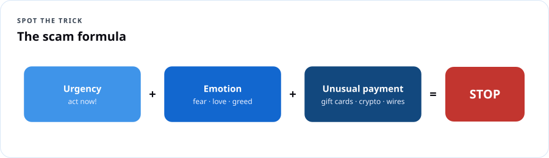
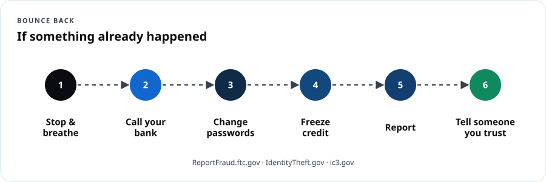

# Cyber Basics — Stay Safer Online

## Course overview

Criminals don't need to be geniuses. They need you to be **rushed, scared, or excited** for ten seconds. This workshop teaches the habits that stop most attacks on regular people — and a calm plan for what to do if something already happened.

### You'll leave able to

1. Spot phishing emails, texts (smishing) and calls (vishing) — including AI voice clones.
2. Create strong passphrases and use a password manager.
3. Turn on MFA and passkeys for email, banking and social media.
4. Update devices and back up what matters.
5. Lock down social media and home Wi-Fi.
6. Follow a step-by-step recovery plan if you're hacked or scammed.

### Session plan

| Session | Theme | Hands-on |
|---|---|---|
| 1 | **Spot the trick** — phishing, scams, AI fakes | "Real or Scam?" card game |
| 2 | **Lock the doors** — passwords, passkeys, MFA, updates | Turn on MFA on your own email, live |
| 3 | **Protect your stuff & bounce back** — privacy, Wi-Fi, backups, recovery | Build your personal recovery card |

---

## Session 1 — Spot the trick

### 1.1 The scam formula



**Urgency + Emotion + Unusual payment = STOP.**

| Ingredient | Sounds like |
|---|---|
| Urgency | "Act within 24 hours or your account will be closed." |
| Emotion | Fear ("warrant for your arrest"), love ("Grandma, I'm in trouble"), greed ("you've won"), shame |
| Secrecy | "Don't tell anyone." "Don't hang up." |
| Unusual payment | Gift cards, wire transfers, cryptocurrency, payment apps to strangers, cash couriers, gold bars |

> **Dope Translation:** Every scam is a hustle with the same three moves: rush you, rattle you, and get paid in a way you can't take back. Real banks, real government, real family — none of them need gift cards.

### 1.2 Phishing, smishing, vishing

**Red flags:**
- Sender address doesn't match the company (`support@paypa1-secure.co`).
- Links that don't go where they say — on a computer, hover; on a phone, press and hold to preview.
- Requests for passwords, codes, PINs, or ID numbers.
- Package-delivery, toll-road, bank-fraud, and "your account is locked" texts.
- **Any one-time code you didn't request** — someone is trying to log in as you. **Never read a code to anyone.**

**The golden rule:** Don't use the contact info in the message. **Go to the real app, website, or the number on the back of your card.**

### 1.3 Common scams right now

| Scam | How it works | Defense |
|---|---|---|
| **Grandparent / voice-clone** | AI copies a relative's voice from social media clips | Family code word; call back on a known number |
| **Government impostor** | "IRS / Social Security / police — pay now or be arrested" | Agencies don't demand gift cards or threaten arrest by phone |
| **Tech support** | Pop-up says your computer is infected, call this number | Close the browser (force quit); never let strangers remote in |
| **Romance** | Online sweetheart who can't meet, then needs money | Never send money to someone you haven't met in person |
| **Investment / crypto** | Guaranteed returns, "AI trading," new friend who's a crypto expert | Guaranteed = scam; check [Investor.gov](https://www.investor.gov/) |
| **Job scams** | Easy remote job, they send you a check, you send some back | Real employers don't pay you to buy equipment from them |
| **Toll / package texts** | "Unpaid toll" or "delivery failed" with a link | Check the real E-ZPass / USPS / UPS site yourself |
| **QR code scams** | Fake QR stickers on parking meters or flyers | Type the official website yourself |

### Activity — Real or Scam? (30 min)

Tables get 12 printed message cards (emails, texts, call scripts). Sort into **Real**, **Scam**, **Check first**. Each table explains one card's red flags. (Facilitator key in the notes.)

```quiz
Q: A text says your bank account is locked and gives a link. What's the safest move?
- [ ] Click the link quickly
- [ ] Reply STOP
- [x] Open your bank's official app or call the number on your card
- [ ] Forward it to friends
E: Use contact info you already trust, never the message's.

Q: Someone calls saying they're from your bank and asks for the code just texted to you. You should:
- [ ] Read them the code
- [x] Hang up — never share one-time codes
- [ ] Give half the code
- [ ] Ask them to text it back
E: A code you didn't request means someone is trying to get into your account.

Q: Which payment method is a big red flag?
- [x] Gift cards
- [ ] A check to your utility company from your own bank
- [ ] Paying your rent through the landlord's official portal
- [ ] Autopay you set up yourself
E: Scammers demand gift cards, wires, crypto because they're hard to reverse.

Q: Your "grandson" calls in a panic needing bail money and says not to tell his parents. Best response?
- [x] Hang up and call him or his parents on a number you know; use your family code word
- [ ] Send the money fast
- [ ] Ask for his birthday
- [ ] Send half now
E: AI voice cloning makes voices convincing; verify independently.
```

---

## Session 2 — Lock the doors

### 2.1 Passphrases and password managers

- **Long beats complicated:** four or more random words — `copper-harbor-tulip-rhythm`. Length makes it hard to crack.
- **Never reuse** passwords. One breach shouldn't open every door.
- **Password manager:** one strong master passphrase protects all the others. Options: built into your phone/browser (Apple Passwords, Google Password Manager, Microsoft Edge) or dedicated apps (Bitwarden, 1Password).
- **Check breaches:** [haveibeenpwned.com](https://haveibeenpwned.com/).

> **Dope Translation:** Reusing one password is using the same key for your house, your car, your mailbox, and your safe. Lose it once, lose everything. A password manager is a key ring locked in a safe — you only have to remember the safe's combination.

### 2.2 MFA and passkeys

| Option | Strength |
|---|---|
| **Passkey** (Face ID, fingerprint, or PIN on your device) | Strongest and easiest — can't be phished |
| **Authenticator app** (Microsoft Authenticator, Google Authenticator) | Strong |
| **Text message code** | Better than nothing; vulnerable to SIM swap |
| **Password only** | Weak |

**Turn it on first for:** email (it resets everything else), banking, phone carrier account (add a **port-out/transfer PIN**), social media, Social Security account, health portal.

### 2.3 Updates and devices

- Turn on **automatic updates** for phone, computer, browser and apps. Updates fix holes criminals already know about.
- Use a **screen lock** (6-digit PIN or more, plus face/fingerprint).
- Turn on **Find My** (iPhone) / **Find My Device** (Android).
- Only install apps from official app stores; review app permissions.

### Activity — Turn on MFA live (35 min)

Facilitators help each person:
1. Turn on 2-step verification for their **email** (Gmail, Outlook, Yahoo, iCloud).
2. Add a **passkey** where offered.
3. Save **backup codes** somewhere safe (printed, in a locked drawer).
4. Check that phone and computer updates are on.

```quiz
Q: Which is the strongest password?
- [ ] P@ssw0rd!
- [ ] Your dog's name and birth year
- [x] copper-harbor-tulip-rhythm
- [ ] 123456789
E: Long random-word passphrases beat short complex ones.

Q: Which account should get MFA first because it can reset your other accounts?
- [x] Email
- [ ] A game
- [ ] A recipe site
- [ ] A weather app
E: Email is the key to password resets.

Q: Why install updates promptly?
- [x] They fix security holes attackers already know about
- [ ] They always add games
- [ ] They slow down hackers' Wi-Fi
- [ ] They're optional decoration
E: Patches close known vulnerabilities.

Q: What protects you from a SIM-swap takeover of your phone number?
- [x] A port-out / account PIN with your mobile carrier and app-based MFA instead of SMS
- [ ] Turning off Wi-Fi
- [ ] A new phone case
- [ ] Posting your number publicly
E: Carrier PINs and non-SMS MFA reduce SIM-swap risk.
```

---

## Session 3 — Protect your stuff and bounce back

### 3.1 Privacy on social media

- Set accounts to **private / friends only**; review who can see your posts, phone, email, birthday.
- Don't post: travel while you're away, full birth date, address, kids' school and schedule, boarding passes, ID cards, check images.
- Short public videos of your voice can feed voice clones — another reason for a family code word.
- Quizzes like "your first car + street you grew up on = your rapper name" harvest security-question answers.

### 3.2 Home and public Wi-Fi

- Change the router's **default admin password**; use **WPA3** (or WPA2) with a strong Wi-Fi password; update router firmware; set up a **guest network** for visitors and smart devices.
- On public Wi-Fi, stick to sites with HTTPS and your official apps; use your phone's hotspot for banking if unsure.

### 3.3 Backups: the 3-2-1 rule

**3** copies of important files, on **2** different kinds of storage, with **1** off-site (cloud). Turn on iCloud/Google Photos/OneDrive backup for photos and documents. Backups beat ransomware and broken phones.

### 3.4 Kids, teens and families

- Talk early and often: "If anything online makes you feel scared or weird, you won't be in trouble for telling me."
- **Sextortion warning for teens:** criminals pose as peers, get images, then threaten. *Stop replying, don't pay, save evidence, tell a trusted adult,* and report to the [NCMEC CyberTipline](https://report.cybertip.org/) or 1-800-843-5678. NCMEC's [Take It Down](https://takeitdown.ncmec.org/) helps remove images of minors.
- Use built-in parental controls (Apple Screen Time, Google Family Link, Microsoft Family Safety) as guardrails, not replacements for conversation.

### 3.5 If something already happened — the recovery plan



1. **Stop and breathe.** Don't send more money. Stop talking to the scammer.
2. **Call your bank / card company** using the number on your card. Ask to stop or reverse payments; freeze cards.
3. **Change passwords** starting with email; turn on MFA; sign out of all sessions.
4. **Freeze your credit** — free at all three bureaus: [Equifax](https://www.equifax.com/personal/credit-report-services/), [Experian](https://www.experian.com/freeze/), [TransUnion](https://www.transunion.com/credit-freeze).
5. **Report:**
   - Scams and fraud: [ReportFraud.ftc.gov](https://reportfraud.ftc.gov/)
   - Identity theft recovery plan: [IdentityTheft.gov](https://www.identitytheft.gov/)
   - Internet crime: FBI [ic3.gov](https://www.ic3.gov/)
   - Gift card scam: call the card company's number on the back of the card right away
   - Local police (you may need a report for banks)
6. **Check your accounts and credit reports** — free weekly at [AnnualCreditReport.com](https://www.annualcreditreport.com/).
7. **Tell someone you trust.** Scams happen to smart people. Shame is the scammer's best friend.

**Seniors:** AARP Fraud Watch Network Helpline **877-908-3360**. **Veterans:** VA and military-specific scams can be reported to the VA OIG and the [Military Consumer](https://www.militaryconsumer.gov/) program.

### Activity — My recovery card (20 min)

Fill in a wallet card: bank fraud number, card company numbers, carrier support number, your family code word hint, and the three report websites.

```quiz
Q: What does the 3-2-1 backup rule mean?
- [x] 3 copies, 2 different storage types, 1 off-site
- [ ] 3 passwords, 2 phones, 1 computer
- [ ] Back up every 3 days, 2 times, 1 week
- [ ] 3 apps, 2 accounts, 1 cloud
E: Multiple copies across media and locations.

Q: You sent money to a scammer by debit card an hour ago. First call?
- [ ] The scammer
- [x] Your bank, using the number on your card
- [ ] A friend on social media
- [ ] Nobody — it's too late
E: Speed matters; banks may stop or reverse payments.

Q: Freezing your credit at the three bureaus costs:
- [x] Nothing — it's free by law
- [ ] $10 each
- [ ] $100 total
- [ ] It's only for businesses
E: Credit freezes and thaws are free.

Q: A teen is being threatened after sending a photo to someone online. What's the right first advice?
- [x] Stop replying, don't pay, save evidence, tell a trusted adult and report to NCMEC
- [ ] Pay so it goes away
- [ ] Delete everything and tell no one
- [ ] Send more photos
E: Paying rarely ends it; reporting and support do.

Q: Which site gives a personalized identity theft recovery plan?
- [ ] haveibeenpwned.com
- [x] IdentityTheft.gov
- [ ] Any social media site
- [ ] The scammer's site
E: The FTC's IdentityTheft.gov builds a recovery plan.
```

---

## Take-home checklist

- [ ] Family code word set
- [ ] MFA or passkey on email, bank, phone carrier, social media
- [ ] Carrier port-out PIN set
- [ ] Password manager in use; no reused passwords
- [ ] Automatic updates on (phone, computer, browser, apps)
- [ ] Social media set to private
- [ ] Router admin password changed; WPA2/WPA3
- [ ] Photos and documents backed up
- [ ] Credit frozen at all three bureaus
- [ ] Recovery card in wallet

## Facilitator guide

- **Real or Scam? key:** include 4 real (bank app alert with no link, pharmacy pickup reminder from a saved contact, school closure from district site, 2FA code you requested), 6 scam (toll text, "Grandma help", Geek Squad renewal, Social Security suspension, crypto mentor, fake job check), 2 check-first (package from a store you did order from, a friend's "can you buy gift cards" message).
- **Tone:** never shame. Many in the room have been targeted; some have lost money. Invite stories only if offered.
- **Accessibility:** print in 16-pt or larger; have readers; leave time for device settings.
- **Partners:** invite a local bank's fraud team, police community liaison, or AARP volunteer for Q&A.
- **Follow-up:** a 30-day text/email check-in: "Did you set your family code word?"

## Resources

- [FTC Consumer Advice](https://consumer.ftc.gov/) · [ReportFraud.ftc.gov](https://reportfraud.ftc.gov/) · [IdentityTheft.gov](https://www.identitytheft.gov/)
- [FBI IC3](https://www.ic3.gov/) · [CISA Secure Our World](https://www.cisa.gov/secure-our-world)
- [AARP Fraud Watch Network](https://www.aarp.org/money/scams-fraud/)
- [NCMEC CyberTipline](https://report.cybertip.org/) · [Take It Down](https://takeitdown.ncmec.org/)
